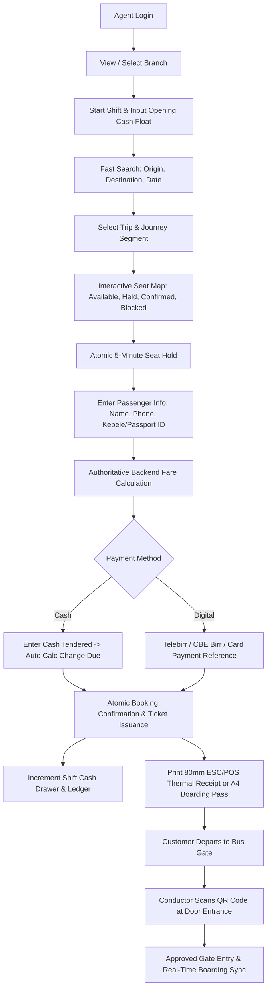
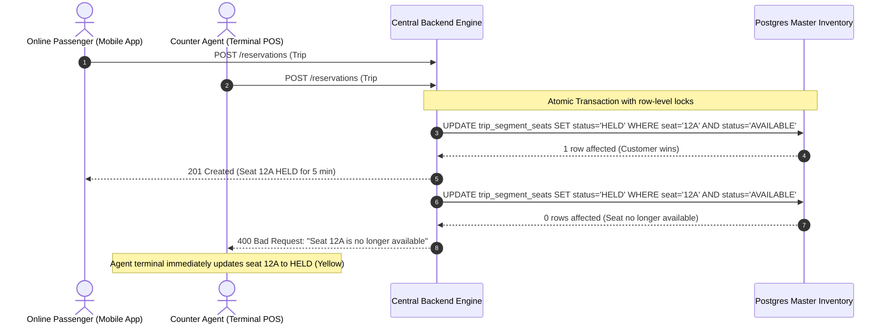

# Agent & Terminal System — Production Architecture & Engineering Specification

> **Master Principle**: *An agent is another sales channel, not another booking system.*  
> Counter terminals, passenger mobile apps, and public web portals operate on the **exact same central backend engine** and **single live seat inventory**.

---

## 1. Unified Omnichannel Ecosystem

```text
       ┌────────────────────────┐   ┌────────────────────────┐   ┌────────────────────────┐
       │     Passenger App      │   │     Public Website     │   │   Counter POS Agent    │
       │    (Flutter/Dart)      │   │    (Next.js/React)     │   │   (Staff Terminal)     │
       └───────────┬────────────┘   └───────────┬────────────┘   └───────────┬────────────┘
                   │                            │                            │
                   └──────────────────┬─────────┴────────────────────────────┘
                                      │  REST / WebSocket
                                      ▼
                   ┌─────────────────────────────────────────┐
                   │       CENTRAL BACKEND PLATFORM          │
                   │           (NestJS / TypeScript)         │
                   └──────────────────┬──────────────────────┘
                                      │
                                      ▼
                   ┌─────────────────────────────────────────┐
                   │        SINGLE MASTER INVENTORY          │
                   │  Trips · Segments · Seats · Holds       │
                   └──────────────────┬──────────────────────┘
                                      │
                   ┌──────────────────┴──────────────────────┐
                   │           Transactional Engine          │
                   │  Bookings · Payments · Shifts · Tickets │
                   └─────────────────────────────────────────┘
```

---

## 2. Counter Agent Workflow

Counter transactions must be rapid and error-free:



---

## 3. High-Speed Counter UI & Dashboard

The agent starts their day on an operational terminal displaying branch context and immediate statistics:

```text
┌────────────────────────────────────────────────────────────────────────┐
│  BRANCH: ADDIS ABABA CENTRAL TERMINAL                                  │
│  Counter Agent: Hana Bekele (Staff #AG-104)      Status: SHIFT OPEN    │
├────────────────────────────────────────────────────────────────────────┤
│  TODAY'S DRAWER SUMMARY                                                │
│  Opening Float:     ETB 2,500.00     Tickets Sold:            46       │
│  Cash Collected:    ETB 21,000.00    Passengers:              61       │
│  Digital Sales:     ETB 27,200.00    Refunds Paid:      ETB 1,500.00   │
│  Expected Cash:     ETB 22,000.00    Net Sales:        ETB 46,700.00   │
├────────────────────────────────────────────────────────────────────────┤
│  UPCOMING DEPARTURES                                                   │
│  [05:00] Addis Ababa -> Bahir Dar (Bus SB-023)    18 seats available   │
│  [06:00] Addis Ababa -> Jimma     (Bus SB-014)    12 seats available   │
│  [07:00] Addis Ababa -> Hawassa   (Bus SB-088)    23 seats available   │
├────────────────────────────────────────────────────────────────────────┤
│  [⚡ NEW COUNTER BOOKING]    [🔍 SEARCH BOOKINGS]    [💵 END SHIFT]     │
└────────────────────────────────────────────────────────────────────────┘
```

---

## 4. Segment-Based Booking & Bus Seat Configuration

Physical buses operate on segmented routes (e.g., Addis Ababa $\to$ Debre Sina $\to$ Dessie). The agent selects the passenger's boarding and dropoff stations; the backend calculates the required segment seat inventory.

### Bus Seat Layout (`SeatMap`):
```text
           FRONT DECK
      ┌─────────────────┐
      │     DRIVER      │
      └─────────────────┘
       01A  01B   01C  01D
       02A  02B   02C  02D
       03A  03B   03C  03D
       ...
       11A  11B   11C  11D
       12A  [REAR ROW]
```

### Authoritative Seat Statuses:
| Status | Meaning | Agent Action |
| :--- | :--- | :--- |
| `AVAILABLE` | Free on all traversed journey segments | Click to hold (green) |
| `HELD` | Temporarily locked (5 min) by online user or another agent | Disabled (yellow) |
| `CONFIRMED` | Confirmed paid booking with issued ticket | Disabled (red/gray) |
| `BLOCKED` | Staff / driver reserve or maintenance block | Disabled with lock icon |

---

## 5. Authoritative Fare Calculation & Zero-Client-Trust

Fares are calculated strictly on the backend based on:
1. Traversed route segments.
2. Bus class (Standard, Luxury VIP with WiFi/AC).
3. Active promotional codes or approved branch discounts.

$$\text{Total Amount} = \sum (\text{Segment Base Fares}) - \text{Authorized Discounts} + \text{Terminal Service Fees}$$

Counter agents **cannot** modify ticket prices directly, preventing cash discrepancies and unauthorized discounts.

---

## 6. Cash Shift & Drawer Float Management

Cash handling requires tight reconciliation between physical currency in the drawer and system transactions.

### Shift Lifecycle:
1. **Open Shift**: Agent inputs starting cash float (e.g., `ETB 2,500.00`).
2. **Active Operations**: Every cash sale automatically increments `cashSalesETB` and `ticketsCount`; approved refunds increment `refundsETB`.
3. **End Shift**: Agent performs a blind or counted physical cash drawer audit, submitting `actualCashETB`.
4. **Variance Analysis**:
   $$\text{Expected Cash} = \text{Opening Float} + \text{Cash Sales} - \text{Cash Refunds}$$
   $$\text{Difference} = \text{Actual Cash} - \text{Expected Cash}$$
   - $\text{Difference} = 0 \implies \mathbf{BALANCED}$
   - $\text{Difference} > 0 \implies \mathbf{OVERAGE}$
   - $\text{Difference} < 0 \implies \mathbf{SHORTAGE}$

---

## 7. Ticket Printing (Thermal POS 80mm & A4 Boarding Pass)

Terminals support instant thermal receipt printing via ESC/POS formatting:

```text
          Abyssinia Bus S.C.          
       INTERCITY BUS TRANSPORTATION      
           TICKET RECEIPT (POS)          
----------------------------------------
BOOKING REF : BK-20261005-00125
DATE        : 2026-10-05 | 05:00 AM
ROUTE       : Addis Ababa -> Bahir Dar
BUS PLATE   : 3-A99102 ET (SB-023)
AGENT       : Hana Bekele (Addis Branch)
----------------------------------------
PASSENGER(S) & SEATS:
 * Seat 12A  : John Smith (TKT-322525)
----------------------------------------
TOTAL FARE  : ETB 850.00
PAY METHOD  : CASH
CASH TENDER : ETB 1000.00
CHANGE DUE  : ETB 150.00
----------------------------------------
      Scan QR Code on Door Boarding     
        Safe Travels with Abyssinia!
```

---

## 8. Gate QR Verification & Conductor Boarding

Every ticket generates a cryptographically signed QR code with payload:
$$\text{QR Token} = \text{HMAC-SHA256}(\text{ticketNumber} : \text{bookingRef} : \text{seatNumber} : \text{tripId})$$

When the conductor scans the QR code at the bus door:
1. **Valid Scan**: Matches ticket, verifies correct trip, confirms status `ISSUED`. Boarding record created, ticket transitions to `BOARDED`.
2. **Duplicate Scan Prevention**: If scanned a second time, the gate scanner instantly flags:
   `[DUPLICATE] Ticket already scanned and boarded at 05:46 PM`.
3. **Invalid Trip**: If scanned at the wrong bus gate, flags trip mismatch.

---

## 9. Existing Booking Search, Rescheduling, & Refunds

### Powerful Multi-Criteria Search:
- Booking Reference (e.g., `BK-20260927-EA410D`)
- Ticket Number (e.g., `TKT-356908`)
- Passenger Full Name or Phone Number
- Kebele National ID / Passport Number

### Policy-Based Rescheduling:
1. Select new departure date / trip.
2. Select new seat.
3. Automatically computes price variance:
   $$\text{Price Variance} = \text{New Trip Fare} - \text{Original Fare}$$
4. Re-allocates inventory atomically, updates ticket seat, issues updated boarding pass, logs audit entry.

### Policy-Based Cancellation:
- Validates departure time against cancellation tiers (e.g., >24h = 90% refund, 12-24h = 80%, <2h = non-refundable).
- Frees segment seats back to `AVAILABLE` status across inventory.
- Records refund in agent shift and ledger.

---

## 10. Concurrency & Omnichannel Integrity



**Zero double sales guaranteed** by serializable database transactions across all channels.

---

## 11. Core Agent APIs

```text
GET    /api/v1/agent/trips/today              Today's branch departures & availability
GET    /api/v1/agent/trips/:id/seats          Bus layout & seat statuses (AVAILABLE/HELD/CONFIRMED/BLOCKED)
POST   /api/v1/reservations                   Atomic 5-minute seat hold
POST   /api/v1/bookings                       Complete booking & cash tender processing
GET    /api/v1/bookings/:id                   Detailed booking manifest & tickets
GET    /api/v1/bookings/search                Multi-parameter passenger & booking query
POST   /api/v1/bookings/:id/cancel            Policy-based ticket cancellation & refund
POST   /api/v1/bookings/:id/reschedule        Seat / departure rescheduling
POST   /api/v1/boarding/scan                  Conductor gate ticket verification & check-in
POST   /api/v1/shifts/start                   Open agent cash drawer with initial float
POST   /api/v1/shifts/end                     Close cash drawer & reconcile variance
GET    /api/v1/agent/sales                    Agent daily cash & digital sales metrics
GET    /api/v1/agent/settlement               Branch daily consolidated financial settlement
```

---

## 12. Verification & Test Matrix

The complete test suite verifies the end-to-end agent workflow:
1. `test:phase1` — Route, schedule, and foundation lifecycle.
2. `test:engine` — Segment-based seat inventory engine.
3. `test:agent` — Cash float, counter sale, thermal POS receipt, gate QR boarding, duplicate check, reschedule, shift closure, and branch settlement.
4. `test:e2e:booking` — Concurrency defense and race condition elimination.
5. `test:booking:service` — Webhook idempotency and payment lifecycle.
6. `test:mobile` — Flutter customer booking flow and Riverpod state.

**100% Pass Rate across all 6 test suites.**

---

## 13. Transition to Next Major Component

With the **Agent & Terminal System** fully operational and united with the **Passenger App** and **Web Portal** on a single inventory, the system is ready for:

### **Operations & Dispatch Center**
- Trip dispatching & bus manifest signoff.
- Bus & driver assignment.
- Real-time GPS vehicle tracking.
- Delay notifications & passenger alerts.
- En-route breakdown management & bus substitution.
