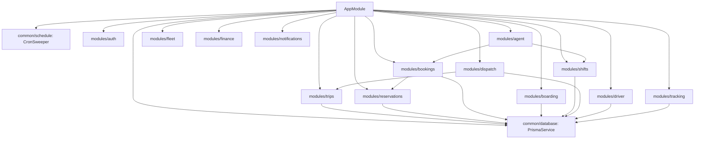

# Abyssinia Bus S.C. — Backend Implementation Blueprint
**Document Version:** 1.0.0  
**Status:** Approved Master Engineering Implementation Blueprint  
**Architecture:** Modular Monolith in TypeScript  
**Framework:** NestJS 10, PostgreSQL 16 (Prisma 5.22), Redis 7, Socket.IO, BullMQ

---

## Table of Contents
1. [Core Architectural Philosophy](#1-core-architectural-philosophy)
2. [Master NestJS Module Graph & Dependency Injection](#2-master-nestjs-module-graph--dependency-injection)
3. [The Standardized Layered Module Pattern](#3-the-standardized-layered-module-pattern)
4. [Authentication, Granular RBAC & Branch Isolation](#4-authentication-granular-rbac--branch-isolation)
5. [Prisma ACID Transaction & Concurrency Patterns](#5-prisma-acid-transaction--concurrency-patterns)
6. [Redis Distributed Caching, Locks & BullMQ Queues](#6-redis-distributed-caching-locks--bullmq-queues)
7. [WebSocket Real-Time Gateway Architecture](#7-websocket-real-time-gateway-architecture)
8. [Domain Event Driven Decoupling](#8-domain-event-driven-decoupling)
9. [Production Error Mapping & Response Interceptors](#9-production-error-mapping--response-interceptors)
10. [Sprint 1 Execution Order & Deliverables](#10-sprint-1-execution-order--deliverables)

---

# 1. Core Architectural Philosophy

### A. Modular Monolith Over Microservices
For an intercity bus enterprise, a **modular monolith** provides the optimal balance of engineering velocity, transactional integrity, and operational simplicity:
- **No Distributed Transactions (2PC):** Bookings, seat inventory, cash shifts, and financial records reside in a single PostgreSQL database, allowing atomic rollbacks via standard `prisma.$transaction`.
- **Zero Network Latency Between Modules:** Internal calls between `BookingsService` and `ReservationsService` occur in-process via fast TypeScript method calls rather than HTTP/gRPC roundtrips.
- **Strict Module Boundaries:** Modules communicate through public service interfaces, never by querying another module's internal database tables directly.

```text
┌────────────────────────────────────────────────────────────────────────┐
│                      MODULAR MONOLITH (apps/api)                       │
├─────────────────┬─────────────────┬──────────────────┬─────────────────┤
│  Auth & Users   │ Trips & Route   │ Inventory & Hold │ Bookings & Tck  │
├─────────────────┼─────────────────┼──────────────────┼─────────────────┤
│ Boarding & Scan │ Dispatch & Fleet│ Driver & Telemet │ Finance & Shifts│
└─────────────────┴─────────────────┴──────────────────┴─────────────────┘
                                   │
                    ACID Transactions / Shared Models
                                   │
                                   ▼
                      PostgreSQL 16 Enterprise DB
```

---

# 2. Master NestJS Module Graph & Dependency Injection

The application root module `AppModule` coordinates infrastructure and business domain modules:



---

# 3. The Standardized Layered Module Pattern

Every domain module adheres to a strict 6-tier directory structure:

```text
modules/bookings/
├── bookings.module.ts              # NestJS Module definition, imports, providers, exports
├── bookings.controller.ts          # HTTP Route Handlers, @UseGuards, @Roles, DTO validation
├── bookings.service.ts             # Business logic orchestration, transactions, invariants
├── dto/
│   ├── create-booking.dto.ts       # Inbound JSON validation schema (class-validator)
│   ├── cancel-booking.dto.ts       # Cancellation reason & parameters
│   └── reschedule-booking.dto.ts   # New journey parameters
├── policies/
│   ├── cancellation.policy.ts      # Pure functions: compute refund % based on departure time
│   └── fare-calculation.policy.ts  # Pure functions: calculate distance, tax, promos
├── events/
│   ├── booking-created.event.ts    # Domain event payload
│   └── booking-cancelled.event.ts  # Domain event payload
└── tests/
    ├── bookings.service.spec.ts    # Unit test suite
    └── bookings.e2e.spec.ts        # End-to-end integration test
```

### Separation of Concerns Invariant
1. **Controllers** only parse requests, invoke service methods, and return response data. No SQL queries or business rules in controllers.
2. **Services** execute business logic, acquire row locks, execute Prisma transactions, and emit domain events.
3. **Policies** are deterministic pure functions (no database access) that calculate pricing, refund percentages, and eligibility rules.

---

# 4. Authentication, Granular RBAC & Branch Isolation

### A. JWT Bearer Token Payload
```typescript
export interface JwtPayload {
  sub: string;           // User CUID
  email: string;
  fullName: string;
  role: string;          // SUPER_ADMIN | BRANCH_MANAGER | TICKET_AGENT | DISPATCHER, etc.
  branchId?: string;     // Nullable for head-office roles
  companyId: string;
}
```

### B. Declarative Role Decorator & Guard
```typescript
// Usage in Controllers:
@Post('dispatch/clearance')
@UseGuards(JwtAuthGuard, RolesGuard)
@Roles('SUPER_ADMIN', 'OPERATIONS_MGR', 'DISPATCHER')
async issueClearance(@Body() dto: IssueClearanceDto) { ... }
```

### C. Branch Data Isolation Guard
For physical terminal agents and branch managers:
```typescript
@Injectable()
export class BranchIsolationGuard implements CanActivate {
  canActivate(context: ExecutionContext): boolean {
    const request = context.switchToHttp().getRequest();
    const user = request.user;
    if (user.role === 'SUPER_ADMIN' || user.role === 'COMPANY_OWNER') {
      return true; // Head office bypass
    }
    const requestedBranchId = request.body.branchId || request.params.branchId || request.query.branchId;
    if (requestedBranchId && user.branchId !== requestedBranchId) {
      throw new ForbiddenException({
        code: 'BRANCH_ACCESS_DENIED',
        message: 'You are not authorized to view or transact for another branch.',
      });
    }
    return true;
  }
}
```

---

# 5. Prisma ACID Transaction & Concurrency Patterns

### A. The Atomic Booking Confirmation Pattern
```typescript
@Injectable()
export class BookingsService {
  constructor(
    private readonly prisma: PrismaService,
    private readonly eventEmitter: EventEmitter2,
  ) {}

  async createBooking(dto: CreateBookingDto, user: AuthenticatedUser) {
    return await this.prisma.$transaction(async (tx) => {
      // 1. Verify reservation status under lock
      const reservation = await tx.reservation.findUnique({
        where: { id: dto.reservationId },
        include: { trip: true, seats: true },
      });

      if (!reservation || reservation.status !== 'ACTIVE' || reservation.expiresAt < new Date()) {
        throw new UnprocessableEntityException({
          code: 'HOLD_EXPIRED',
          message: 'Seat hold timer has expired. Please select your seats again.',
        });
      }

      // 2. Validate agent active cash drawer if counter cash sale
      if (dto.paymentMethod === 'CASH') {
        const activeShift = await tx.cashShift.findFirst({
          where: { agentId: user.id, status: 'OPEN' },
        });
        if (!activeShift) {
          throw new ConflictException({
            code: 'NO_OPEN_SHIFT',
            message: 'You must open a cash shift drawer before selling tickets.',
          });
        }
        await tx.cashShift.update({
          where: { id: activeShift.id },
          data: {
            cashSalesETB: { increment: dto.totalAmountETB },
            ticketsCount: { increment: dto.passengers.length },
          },
        });
      }

      // 3. Insert Booking Record
      const booking = await tx.booking.create({
        data: {
          bookingReference: this.generateBookingReference(),
          tripId: reservation.tripId,
          reservationId: reservation.id,
          customerName: dto.passengers[0].fullName,
          customerPhone: dto.passengers[0].phone,
          channel: dto.channel || 'COUNTER',
          bookedByUserId: user.id,
          branchId: user.branchId,
          totalAmountETB: dto.totalAmountETB,
          paymentStatus: 'PAID',
        },
      });

      // 4. Issue Tickets with HMAC-SHA256 Signatures
      const tickets = [];
      for (const pax of dto.passengers) {
        const ticketNum = this.generateTicketNumber();
        const qrHash = this.signTicketQr(ticketNum, pax.seatNumber, reservation.tripId);
        const ticket = await tx.ticket.create({
          data: {
            ticketNumber: ticketNum,
            bookingId: booking.id,
            tripId: reservation.tripId,
            seatNumber: pax.seatNumber,
            passengerName: pax.fullName,
            passengerPhone: pax.phone,
            passengerIdNumber: pax.idNumber,
            fareETB: reservation.trip.price,
            qrHash,
            status: 'ISSUED',
          },
        });
        tickets.push(ticket);
      }

      // 5. Update Inventory Matrix
      await tx.tripSegmentSeat.updateMany({
        where: { reservationId: reservation.id },
        data: { status: 'BOOKED', heldUntil: null },
      });

      await tx.reservation.update({
        where: { id: reservation.id },
        data: { status: 'CONFIRMED' },
      });

      // 6. Emit Asynchronous Domain Event
      this.eventEmitter.emit('booking.confirmed', new BookingConfirmedEvent(booking, tickets));

      return { booking, tickets };
    });
  }
}
```

---

# 6. Redis Distributed Caching, Locks & BullMQ Queues

### A. Distributed Seat Mutex Pattern
```typescript
@Injectable()
export class RedisLockService {
  constructor(@Inject('REDIS_CLIENT') private readonly redis: Redis) {}

  async acquireLock(key: string, ttlMs: number = 10000): Promise<string | null> {
    const token = crypto.randomUUID();
    const result = await this.redis.set(`lock:${key}`, token, 'PX', ttlMs, 'NX');
    return result === 'OK' ? token : null;
  }

  async releaseLock(key: string, token: string): Promise<boolean> {
    const luaScript = `
      if redis.call("get", KEYS[1]) == ARGV[1] then
        return redis.call("del", KEYS[1])
      else
        return 0
      end
    `;
    const result = await this.redis.eval(luaScript, 1, `lock:${key}`, token);
    return result === 1;
  }
}
```

### B. BullMQ Asynchronous Queues
```typescript
// Enqueueing Background Tasks:
await this.smsQueue.add('send-ticket-sms', {
  phone: passenger.phone,
  message: `Abyssinia Bus: Booking ${booking.bookingReference} confirmed for Seat ${ticket.seatNumber}.`,
}, { attempts: 3, backoff: { type: 'exponential', delay: 2000 } });
```

---

# 7. WebSocket Real-Time Gateway Architecture

Real-time telemetry and seat state broadcasts use NestJS WebSockets (`@nestjs/websockets` + Socket.IO):

```typescript
@WebSocketGateway({ cors: { origin: '*' }, namespace: '/telemetry' })
export class TelemetryGateway implements OnGatewayConnection {
  @WebSocketServer()
  server: Server;

  // Passenger & Dispatcher client joins trip tracking room:
  @SubscribeMessage('join:trip')
  handleJoinTrip(@ConnectedSocket() client: Socket, @MessageBody() tripId: string) {
    client.join(`trip:${tripId}`);
  }

  // Driver GPS ping triggers immediate room broadcast:
  broadcastLocation(tripId: string, location: GpsLocationDto) {
    this.server.to(`trip:${tripId}`).emit('gps:location_updated', location);
  }

  // Real-time seat hold broadcast to active counter screens:
  broadcastSeatHeld(tripId: string, seatNumber: string) {
    this.server.to(`trip:${tripId}`).emit('seat:held', { seatNumber });
  }
}
```

---

# 8. Domain Event Driven Decoupling

Using `@nestjs/event-emitter`, operations that do not affect the database transaction boundary are completely decoupled:

```typescript
@Injectable()
export class BookingNotificationListener {
  constructor(private readonly smsService: SmsService) {}

  @OnEvent('booking.confirmed', { async: true })
  async handleBookingConfirmed(event: BookingConfirmedEvent) {
    // 1. Send SMS ticket confirmation
    await this.smsService.sendBookingSms(event.booking, event.tickets);
    // 2. Offload PDF ticket rendering
    // 3. Trigger Analytics telemetry
  }
}
```

---

# 9. Production Error Mapping & Response Interceptors

### Global HTTP Exception Filter (`src/common/filters/http-exception.filter.ts`)
Standardizes all system errors into an unambiguous machine-readable structure:
```json
{
  "success": false,
  "error": {
    "code": "SEAT_ALREADY_RESERVED",
    "message": "Seat 12A was just locked by another customer.",
    "statusCode": 409,
    "timestamp": "2026-10-05T08:15:30.124Z",
    "path": "/api/v1/reservations"
  }
}
```

---

# 10. Sprint 1 Execution Order & Deliverables

With the architecture locked, we execute the remaining core backend services in the following exact order:

```text
┌────────────────────────────────────────────────────────────────────────┐
│                   SPRINT 1 BACKEND IMPLEMENTATION PLAN                 │
├──────┬──────────────────────┬──────────────────────────────────────────┤
│ Task │ Module Target        │ Key Files & Endpoints                    │
├──────┼──────────────────────┼──────────────────────────────────────────┤
│ 1.1  │ modules/dispatch     │ dispatch.controller.ts, dispatch.service │
│      │                      │ • GET /dispatch/board/today              │
│      │                      │ • POST /dispatch/trips/:id/assign        │
│      │                      │ • POST /dispatch/trips/:id/clearance     │
│      │                      │ • POST /dispatch/trips/:id/emergency-swap│
├──────┼──────────────────────┼──────────────────────────────────────────┤
│ 1.2  │ modules/driver       │ driver.controller.ts, driver.service     │
│      │                      │ • GET /driver/duty/today                 │
│      │                      │ • POST /driver/inspection                │
│      │                      │ • POST /trips/:id/incidents              │
├──────┼──────────────────────┼──────────────────────────────────────────┤
│ 1.3  │ modules/tracking     │ tracking.controller.ts, tracking.service │
│      │                      │ • POST /trips/:id/gps (60s telemetry)    │
│      │                      │ • GET /trips/:id/gps/live                │
├──────┼──────────────────────┼──────────────────────────────────────────┤
│ 1.4  │ app.module.ts        │ Register Dispatch, Driver, Tracking      │
├──────┼──────────────────────┼──────────────────────────────────────────┤
│ 1.5  │ E2E Integration Test │ Full test suite: Schedule → Departure   │
│      │                      │ Clearance → GPS Ping → Incident Report   │
└──────┴──────────────────────┴──────────────────────────────────────────┘
```
