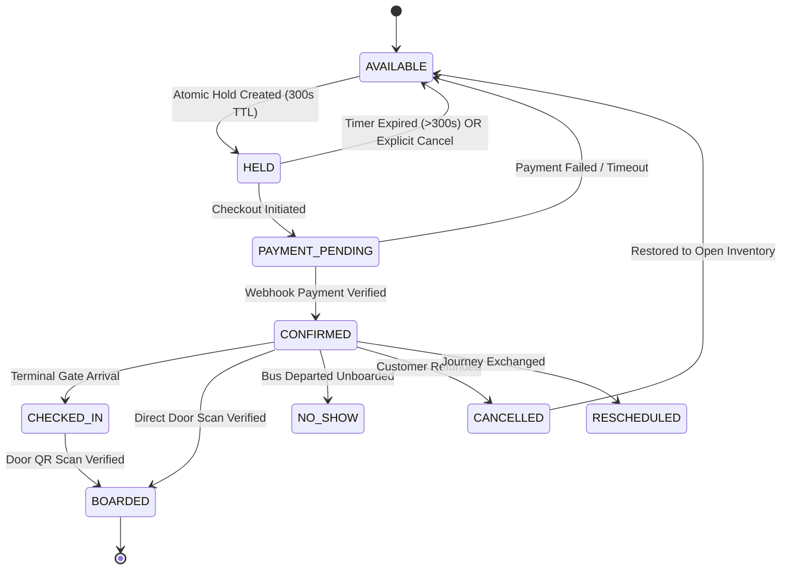
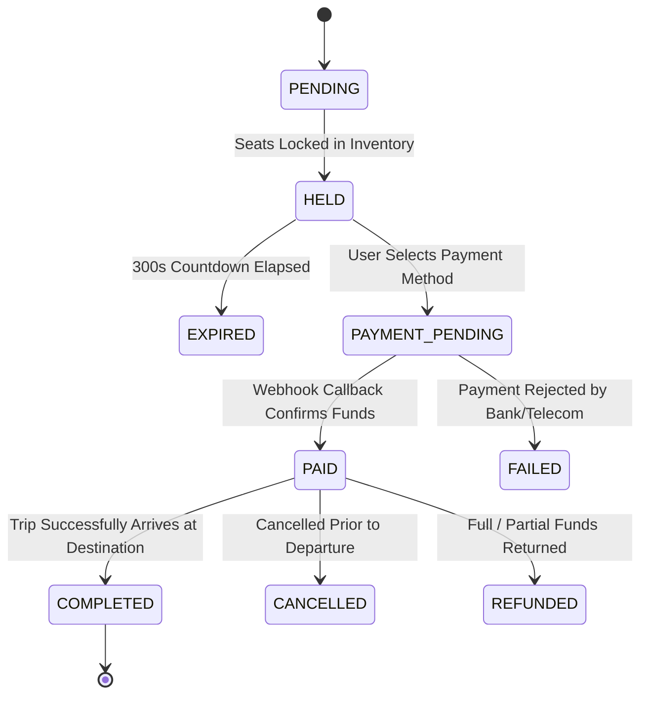
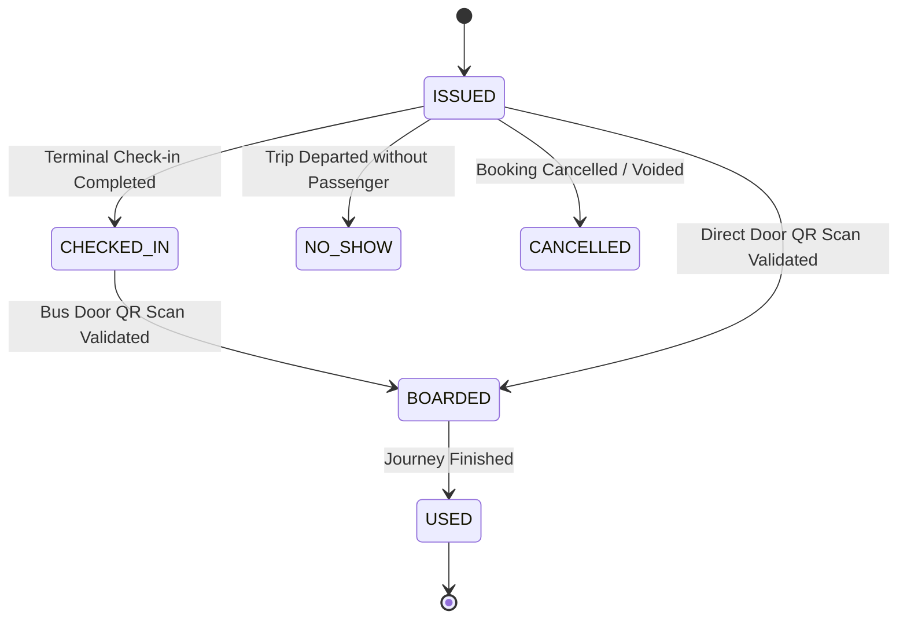

# Abyssinia Bus S.C. — Master Booking Engine Specification
**Document Version:** 1.0.0  
**Status:** Approved Master Technical Specification  
**Architecture:** Multi-Hop Segment Inventory & High-Concurrency Transaction Engine  
**Implementation Target:** NestJS 10, TypeScript 5.6, PostgreSQL 16 (Serializable Transactions), Redis 7

---

## Table of Contents
1. [Core Principles & System Invariants](#1-core-principles--system-invariants)
2. [Finite State Machines (Seats, Bookings, Tickets)](#2-finite-state-machines)
3. [The 11-Step End-to-End Booking Lifecycle](#3-the-11-step-end-to-end-booking-lifecycle)
4. [Deep Dive: Resolving the 8 Critical Difficult Cases](#4-deep-dive-resolving-the-8-critical-difficult-cases)
   - [Case 1: Simultaneous Seat Selection (Race Condition)](#case-1-simultaneous-seat-selection-race-condition)
   - [Case 2: Payment Gateway Timeout & Abandonment](#case-2-payment-gateway-timeout--abandonment)
   - [Case 3: Expired Seat Holds & Two-Tier Sweeper](#case-3-expired-seat-holds--two-tier-sweeper)
   - [Case 4: Partial-Route Multi-Segment Inventory](#case-4-partial-route-multi-segment-inventory)
   - [Case 5: Tiered Cancellation & Refund Ledger](#case-5-tiered-cancellation--refund-ledger)
   - [Case 6: Emergency Bus Replacement & Seat Re-Mapping](#case-6-emergency-bus-replacement--seat-re-mapping)
   - [Case 7: Trip Cancellation by Operator (Force Majeure)](#case-7-trip-cancellation-by-operator-force-majeure)
   - [Case 8: Passenger No-Show & Mid-Route Seat Release](#case-8-passenger-no-show--mid-route-seat-release)
5. [Production NestJS / Prisma Transaction Patterns](#5-production-nestjs--prisma-transaction-patterns)

---

# 1. Core Principles & System Invariants

The booking engine is the heartbeat of the entire transportation enterprise. Every line of code must strictly adhere to four non-negotiable invariants:

1. **Zero Double Bookings (Strict Invariant):**
   It must be mathematically impossible for two passengers on any sales channel (Mobile App, Website, Counter POS, Travel Agency) to confirm or hold the same physical seat for overlapping segments of the same trip.
2. **PostgreSQL as Sole Authoritative Truth:**
   Redis, memory caches, and client state are disposable performance accelerators. The definitive state of any seat, booking, or financial ledger exists solely within PostgreSQL 16 ACID transactions.
3. **Pessimistic Segment-Span Locking:**
   When reserving seats across multi-stop journeys, all required segment rows must be locked inside a single transaction using `SELECT ... FOR UPDATE` ordered consistently to eliminate database deadlocks.
4. **Decoupled Asynchronous Processing:**
   Time-consuming tasks (PDF rendering, QR signing, SMS dispatch, telemetry logging) must never block customer checkout. They are dispatched to background worker queues upon transaction commit.

---

# 2. Finite State Machines

### A. Physical Segment Seat State Machine (`TripSegmentSeat`)



---

### B. Commercial Booking State Machine (`Booking`)



---

### C. Travel Ticket State Machine (`Ticket`)



---

# 3. The 11-Step End-to-End Booking Lifecycle

```text
1. SEARCH ──► 2. AVAILABILITY ──► 3. ATOMIC HOLD ──► 4. PASSENGER INFO ──► 5. FARE CALC
                                                                                  │
7. TICKET ISSUANCE ◄── 6. PAYMENT CONFIRMATION ◄── WEBHOOK / CASH TENDER ◄────────┘
        │
        ├──► 8. BOARDING SCAN (Conductor sub-100ms verification)
        ├──► 9. CANCELLATION & REFUND (Tiered penalty deduction)
        └──► 10. RESCHEDULING (Date swap + fare delta calculation)
```

### Detailed Lifecycle Steps

1. **Step 1: Search:**
   - Passenger inputs `originStopId`, `destinationStopId`, `date`, and `passengers`.
   - Engine identifies all valid master routes and queries `OPEN` trips on that date.
2. **Step 2: Segment-Span Availability Evaluation:**
   - For each trip, the engine calculates the subset of `TripSegment` records spanning the journey.
   - A seat is classified `AVAILABLE` only if its status is `AVAILABLE` across **every** segment in the span.
3. **Step 3: Atomic 300-Second Hold:**
   - Passenger selects up to 5 seats.
   - Backend acquires Redis distributed mutex, then runs PostgreSQL `SELECT ... FOR UPDATE`.
   - Creates a `Reservation` with `expiresAt = NOW() + 300s`; updates segment seats to `HELD`.
4. **Step 4: Passenger Information Registration:**
   - Captures legal name, phone number, and mandatory Ethiopian identification (Kebele ID, National ID, or Passport).
5. **Step 5: Dynamic Fare Calculation:**
   - Multiplies segment distance by base rate per km, applies terminal fees, and validates promotional discount codes.
6. **Step 6: Payment Dispatch:**
   - Digital: Initiates USSD push (Telebirr) or opens bank payment gateway (CBE Birr / Chapa).
   - Counter: Ticket agent inputs cash tendered; system computes exact change due in ETB.
7. **Step 7: Verification & Confirmation:**
   - Payment webhook arrives $\to$ signature verified $\to$ booking marked `PAID`.
   - Segment seats transition from `HELD` $\to$ `BOOKED`.
8. **Step 8: Cryptographic Ticket Generation:**
   - Generates signed QR hash string: `HMAC-SHA256(ticketNumber + seatNumber + tripId, SecretKey)`.
   - Generates thermal receipt format and dispatches background SMS confirmation.
9. **Step 9: Boarding Scan:**
   - Conductor scans QR code at bus door. In $<100\text{ms}$, system verifies signature, checks trip match, marks `BOARDED`, and rejects duplicate attempts.
10. **Step 10: Cancellation & Refund:**
    - Passenger or agent triggers cancellation; system applies tiered policy based on departure countdown.
11. **Step 11: Rescheduling:**
    - Transfers passenger to a future departure on the same corridor, adjusting fare difference.

---

# 4. Deep Dive: Resolving the 8 Critical Difficult Cases

### Case 1: Simultaneous Seat Selection (Race Condition)

#### The Problem
Two customers (e.g., an online passenger in Addis and a walk-up counter customer in Bahir Dar) tap **Seat 12A** on Trip #501 at the exact same millisecond. If not handled, both could be issued the same seat.

#### The Architecture Solution: Two-Tier Concurrency Barrier

```text
Incoming Request A (Seat 12A)           Incoming Request B (Seat 12A)
            │                                       │
            ▼                                       ▼
┌────────────────────────────────────────────────────────────────────────┐
│                      TIER 1: REDIS DISTRIBUTED MUTEX                   │
│ Key: "lock:seat:trip_501:12A" | Command: SET key token NX PX 10000     │
├───────────────────────────────────┬────────────────────────────────────┤
│ Request A: ACQUIRED (OK)          │ Request B: REJECTED (Nil)          │
│ Proceeds to Database              │ Immediately returns 409 Conflict   │
└─────────────────┬─────────────────┴────────────────────────────────────┘
                  │
                  ▼
┌────────────────────────────────────────────────────────────────────────┐
│                    TIER 2: POSTGRESQL ROW LOCK                         │
│ SELECT * FROM "TripSegmentSeat"                                        │
│ WHERE "tripSegmentId" IN (...) AND "busSeatId" = 'seat_12A'            │
│ FOR UPDATE;                                                            │
│                                                                        │
│ Verifies status == 'AVAILABLE'; mutates to 'HELD'; commits.            │
└────────────────────────────────────────────────────────────────────────┘
```

#### Invariant Guarantee
Even if Redis fails or restarts, PostgreSQL's `SELECT ... FOR UPDATE` inside `SERIALIZABLE` or `READ COMMITTED` transactions provides an unbreakable guarantee. Exactly one request succeeds; all concurrent requests receive `409 SEAT_ALREADY_RESERVED` in under 15ms.

---

### Case 2: Payment Gateway Timeout & Abandonment

#### The Problem
Customer initiates checkout via Telebirr or CBE Birr. The telecom provider experiences latency, network drops, or the customer ignores the USSD PIN prompt on their handset.

#### The Architectural Solution
1. **Strict 300-Second Hold TTL:** The seat hold is strictly time-bounded (`expiresAt = NOW() + 300s`).
2. **Asynchronous Polling & Webhook Race:**
   - If the payment provider webhook never arrives, the reservation expires.
   - If the webhook arrives **after** 300 seconds:
     ```text
     Webhook arrives late (Telebirr confirmed payment)
                      │
                      ▼
     Check seat state in PostgreSQL
                      │
         ┌────────────┴────────────┐
         ▼                         ▼
     [ Seat Still Free ]       [ Seat Taken by Someone Else ]
     Confirm booking & issue    Trigger automated reverse refund
     ticket to customer         API to Telebirr + send apology SMS
     ```

---

### Case 3: Expired Seat Holds & Two-Tier Sweeper

#### The Problem
Thousands of users browse routes and abandon seat selections, potentially clogging inventory with stale `HELD` seats.

#### The Architectural Solution: Two-Tier Hybrid Sweeper

```text
┌────────────────────────────────────────────────────────────────────────┐
│                      1. PASSIVE / LAZY EVALUATION                      │
│ When any user queries GET /trips/:id/seats:                            │
│ The SQL query automatically treats any seat with:                      │
│   status = 'HELD' AND heldUntil < NOW()                                │
│ as AVAILABLE in real time. Stale holds never block real buyers.        │
└────────────────────────────────────────────────────────────────────────┘
                                   │
                                   ▼
┌────────────────────────────────────────────────────────────────────────┐
│                     2. ACTIVE BACKGROUND CRON SWEEPER                  │
│ Scheduled worker runs every 30 seconds via BullMQ / NestJS Schedule:  │
│                                                                        │
│ 1. Identifies all expired reservations:                                │
│    SELECT id FROM "Reservation"                                        │
│    WHERE status = 'ACTIVE' AND "expiresAt" < NOW();                    │
│ 2. Atomic Batch Update:                                                │
│    UPDATE "TripSegmentSeat" SET status = 'AVAILABLE',                  │
│      "reservationId" = NULL, "heldUntil" = NULL                        │
│    WHERE "reservationId" IN (...);                                     │
│ 3. Marks Reservation records as EXPIRED.                               │
└────────────────────────────────────────────────────────────────────────┘
```

---

### Case 4: Partial-Route Multi-Segment Inventory

#### The Problem
A bus travels from **Addis Ababa ($S_1$) $\to$ Debre Sina ($S_2$) $\to$ Dessie ($S_3$) $\to$ Bahir Dar ($S_4$)**.
- Total Route Distance: 565 km.
- Intermediate Segments:
  - **Segment 1 ($Seg_1$):** Addis Ababa $\to$ Debre Sina ($S_1 \to S_2$)
  - **Segment 2 ($Seg_2$):** Debre Sina $\to$ Dessie ($S_2 \to S_3$)
  - **Segment 3 ($Seg_3$):** Dessie $\to$ Bahir Dar ($S_3 \to S_4$)

If Passenger A buys a ticket from **Addis Ababa to Dessie** ($Seg_1 + Seg_2$), physical **Seat 12A** becomes vacant from **Dessie to Bahir Dar** ($Seg_3$).

#### The Segment-Span Mathematical Rule
Let a customer request journey from stop sequence $i$ to stop sequence $j$ ($i < j$):
$$\text{RequiredSegments} = \{ \text{Segment}_k \mid i \le k < j \}$$

A seat is available for this journey **if and only if**:
$$\forall k \in [i, j-1]: \text{SeatStatus}(\text{Segment}_k, \text{Seat}_X) = \text{'AVAILABLE'}$$

```text
Physical Seat: 12A
Journey 1: Addis -> Dessie (Locks Seg 1 & Seg 2)
Journey 2: Dessie -> Bahir Dar (Locks Seg 3)

┌──────────────────────┬──────────────────────┬──────────────────────┐
│  Segment 1: ADD->DS  │  Segment 2: DS->DES  │  Segment 3: DES->BHR │
├──────────────────────┼──────────────────────┼──────────────────────┤
│ BOOKED (Passenger A) │ BOOKED (Passenger A) │ AVAILABLE            │
│                      │                      │   │                  │
│                      │                      │   ▼                  │
│                      │                      │ BOOKED (Passenger B) │
└──────────────────────┴──────────────────────┴──────────────────────┘
```
**Outcome:** Both bookings succeed without conflict on the exact same physical bus seat. Bus seat occupancy is maximized to 100%.

---

### Case 5: Tiered Cancellation & Refund Ledger

#### The Problem
Passengers cancel trips due to schedule changes. The platform must enforce strict, transparent cancellation rules compliant with Ethiopian Federal Transport regulations.

#### The Policy Matrix & Deduction Rules

```text
Scheduled Departure: T_dep | Current Time: T_now | Delta = T_dep - T_now
```

| Time to Departure ($\Delta$) | Policy Window | Refund Percentage | Cancellation Fee Retained | Seat Action |
| :--- | :--- | :---: | :---: | :--- |
| **$\Delta > 24\text{ Hours}$** | Advance Notice | **90% Refund** | 10% Administrative Fee | Immediate release to `AVAILABLE` |
| **$12 \le \Delta \le 24\text{ Hours}$** | Standard Window | **75% Refund** | 25% Cancellation Fee | Immediate release to `AVAILABLE` |
| **$2 \le \Delta < 12\text{ Hours}$** | Emergency Window | **50% Refund** | 50% Late Penalty Fee | Immediate release to `AVAILABLE` |
| **$\Delta < 2\text{ Hours}$** | Lockout Period | **0% Refund** | 100% Forfeited | Held until departure |
| **Post-Departure** | No-Show | **0% Refund** | 100% Forfeited | Released at intermediate stop |

#### Financial Ledger Posting
When a 850 ETB ticket is cancelled $>24$ hours prior:
1. `Refund` record created: `amountETB = 765.00`, `status = 'PENDING'`.
2. `Payment` record updated: `status = 'PARTIALLY_REFUNDED'`.
3. If originally paid by Telebirr $\to$ triggers automated B2C reverse payout.
4. If originally paid at counter cash $\to$ agent shift logs cash refund voucher (`refundsETB += 765.00`).
5. All traversed `TripSegmentSeat` records reset to `AVAILABLE`.

---

### Case 6: Emergency Bus Replacement & Seat Re-Mapping

#### The Problem
Bus `SB-023` (45-seat Luxury) experiences an engine failure 45 minutes prior to departure. Dispatcher assigns backup Bus `SB-088`.

#### The Automated Re-Mapping Algorithm

```text
1. Dispatcher selects Trip #501 and executes Emergency Bus Swap to Bus SB-088.
2. System acquires global write lock on Trip #501.
3. Verifies Bus SB-088 capacity >= Bus SB-023 capacity (e.g., 45 seats).
4. Executes Atomic Database Migration:
   a. Updates Trip.busId = "bus_sb088".
   b. Queries all Seat records on Bus SB-088.
   c. Iterates all confirmed BookingPassenger records on Trip #501:
      - Maps old seat "12A" to new seat "12A" on Bus SB-088.
      - Updates TripSegmentSeat rows to point to new busSeatId.
   d. Regenerates Ticket QR hash signatures.
5. Async Broadcast:
   - Queues high-priority SMS broadcast to all 45 passengers:
     "Abyssinia Bus Alert: Your bus for Trip #501 has been upgraded to Bus SB-088. 
      Your seat 12A remains unchanged. Please board at Gate 4."
```

---

### Case 7: Trip Cancellation by Operator (Force Majeure)

#### The Problem
A major highway is impassable due to severe weather, security checkpoint closure, or bridge damage. Management cancels Trip #501 entirely.

#### The Automated Mass Compensation Engine
1. Dispatcher updates `Trip.status = 'CANCELLED'`.
2. Database triggers cancellation cascade:
   - All `TripSegmentSeat` records set to `BLOCKED`.
   - All associated `Booking` records transition to `CANCELLED`.
   - All `Ticket` records transition to `CANCELLED`.
3. Financial Processing:
   - Generates **100% full refund** (0% fee deducted) for every confirmed passenger.
   - Digital payments: Batch queue triggers automated Telebirr/CBE refund payouts.
   - Counter cash tickets: Generates unique 12-digit Cash Refund Voucher redeemable at any company branch nationwide within 30 days.
4. High-Priority Mass Alert:
   - Dispatches bilingual SMS (Amharic & English) explaining the force majeure cancellation and refund voucher code.

---

### Case 8: Passenger No-Show & Mid-Route Seat Release

#### The Problem
Passenger booked Addis Ababa $\to$ Bahir Dar on Seat 12A. The bus departs Addis Ababa at 05:00 AM, but the passenger never arrived at the terminal gate. Seat 12A remains physically empty while walk-up passengers are waiting at intermediate stations.

#### The Operational Workflow
1. At scheduled departure $+15\text{ minutes}$, Conductor closes terminal boarding.
2. System marks unboarded ticket as `NO_SHOW`.
3. Standby Release Rule:
   - Seat 12A for Segment 1 (Addis $\to$ Debre Sina) remains marked `NO_SHOW`.
   - When bus reaches Debre Sina station, Conductor taps **"Release No-Show Seats"**.
   - Seat 12A for remaining segments (Debre Sina $\to$ Dessie $\to$ Bahir Dar) is restored to `AVAILABLE`.
   - Intermediate branch agent can immediately sell Seat 12A to waiting walk-up travelers.

---

# 5. Production NestJS / Prisma Transaction Patterns

Below are the exact production TypeScript methods implemented in `apps/api/src/modules/bookings/bookings.service.ts` and `reservations.service.ts`:

### A. Atomic Seat Hold Transaction
```typescript
async holdSeats(dto: CreateReservationDto): Promise<ReservationResult> {
  const { tripId, fromStopId, toStopId, seatNumbers, phone } = dto;

  // 1. Identify all required intermediate segments
  const segments = await this.prisma.tripSegment.findMany({
    where: { tripId },
    orderBy: { sequenceNumber: 'asc' },
  });
  const requiredSegmentIds = this.calculateSegmentSpan(segments, fromStopId, toStopId);

  // 2. Execute atomic serializable transaction
  return await this.prisma.$transaction(async (tx) => {
    // Acquire ordered pessimistic row locks
    const targetSeats = await tx.seat.findMany({
      where: { bus: { trips: { some: { id: tripId } } }, seatNumber: { in: seatNumbers } },
      orderBy: { seatNumber: 'asc' },
    });

    const segmentSeats = await tx.tripSegmentSeat.findMany({
      where: {
        tripSegmentId: { in: requiredSegmentIds },
        busSeatId: { in: targetSeats.map((s) => s.id) },
      },
    });

    // Verify all seats are available
    for (const segSeat of segmentSeats) {
      const isExpired = segSeat.status === 'HELD' && segSeat.heldUntil && segSeat.heldUntil < new Date();
      if (segSeat.status !== 'AVAILABLE' && !isExpired) {
        throw new ConflictException({
          code: 'SEAT_ALREADY_RESERVED',
          message: `Seat is currently unavailable on segment.`,
        });
      }
    }

    const expiresAt = new Date(Date.now() + 300 * 1000); // 5 minutes TTL

    // Create reservation record
    const reservation = await tx.reservation.create({
      data: { tripId, status: 'ACTIVE', expiresAt },
    });

    // Lock all segment seats
    await tx.tripSegmentSeat.updateMany({
      where: { id: { in: segmentSeats.map((s) => s.id) } },
      data: { status: 'HELD', reservationId: reservation.id, heldUntil: expiresAt },
    });

    return { reservationId: reservation.id, expiresAt, heldSeats: seatNumbers };
  });
}
```

---

### B. Booking Confirmation & Payment Atomic Transaction
```typescript
async confirmBooking(dto: ConfirmBookingDto): Promise<BookingResult> {
  const { reservationId, paymentMethod, cashTenderedETB, passengers } = dto;

  return await this.prisma.$transaction(async (tx) => {
    // 1. Verify reservation active
    const reservation = await tx.reservation.findUnique({
      where: { id: reservationId },
      include: { trip: true, seats: true },
    });

    if (!reservation || reservation.status !== 'ACTIVE' || reservation.expiresAt < new Date()) {
      throw new UnprocessableEntityException({
        code: 'HOLD_EXPIRED',
        message: 'Seat hold timer has expired. Please select your seats again.',
      });
    }

    // 2. Compute total fare
    const totalAmountETB = reservation.trip.price * passengers.length;
    const bookingRef = `BK-${new Date().toISOString().slice(0,10).replace(/-/g,'')}-${Math.random().toString(36).substring(2,7).toUpperCase()}`;

    // 3. Create Booking
    const booking = await tx.booking.create({
      data: {
        bookingReference: bookingRef,
        tripId: reservation.tripId,
        reservationId: reservation.id,
        customerName: passengers[0].fullName,
        customerPhone: passengers[0].phone,
        totalAmountETB,
        paymentStatus: 'PAID',
      },
    });

    // 4. Create Payment
    await tx.payment.create({
      data: {
        bookingId: booking.id,
        amountETB: totalAmountETB,
        paymentMethod,
        cashTenderedETB,
        changeReturnedETB: cashTenderedETB ? cashTenderedETB - totalAmountETB : 0,
        status: 'COMPLETED',
      },
    });

    // 5. Issue Tickets with HMAC-SHA256 Signatures
    const tickets = [];
    for (const pax of passengers) {
      const ticketNum = `TCK-${Math.floor(100000 + Math.random() * 900000)}`;
      const qrHash = crypto.createHmac('sha256', process.env.JWT_SECRET || 'secret')
        .update(`${ticketNum}:${pax.seatNumber}:${reservation.tripId}`)
        .digest('hex');

      const ticket = await tx.ticket.create({
        data: {
          ticketNumber: ticketNum,
          bookingId: booking.id,
          tripId: reservation.tripId,
          seatNumber: pax.seatNumber,
          passengerName: pax.fullName,
          passengerPhone: pax.phone,
          passengerIdNumber: pax.idNumber,
          fareETB: reservation.trip.price,
          qrHash,
          status: 'ISSUED',
        },
      });
      tickets.push(ticket);
    }

    // 6. Transition segment seats to BOOKED & close reservation
    await tx.tripSegmentSeat.updateMany({
      where: { reservationId: reservation.id },
      data: { status: 'BOOKED', heldUntil: null },
    });

    await tx.reservation.update({
      where: { id: reservation.id },
      data: { status: 'CONFIRMED' },
    });

    return { bookingReference: bookingRef, totalAmountETB, tickets };
  });
}
```
