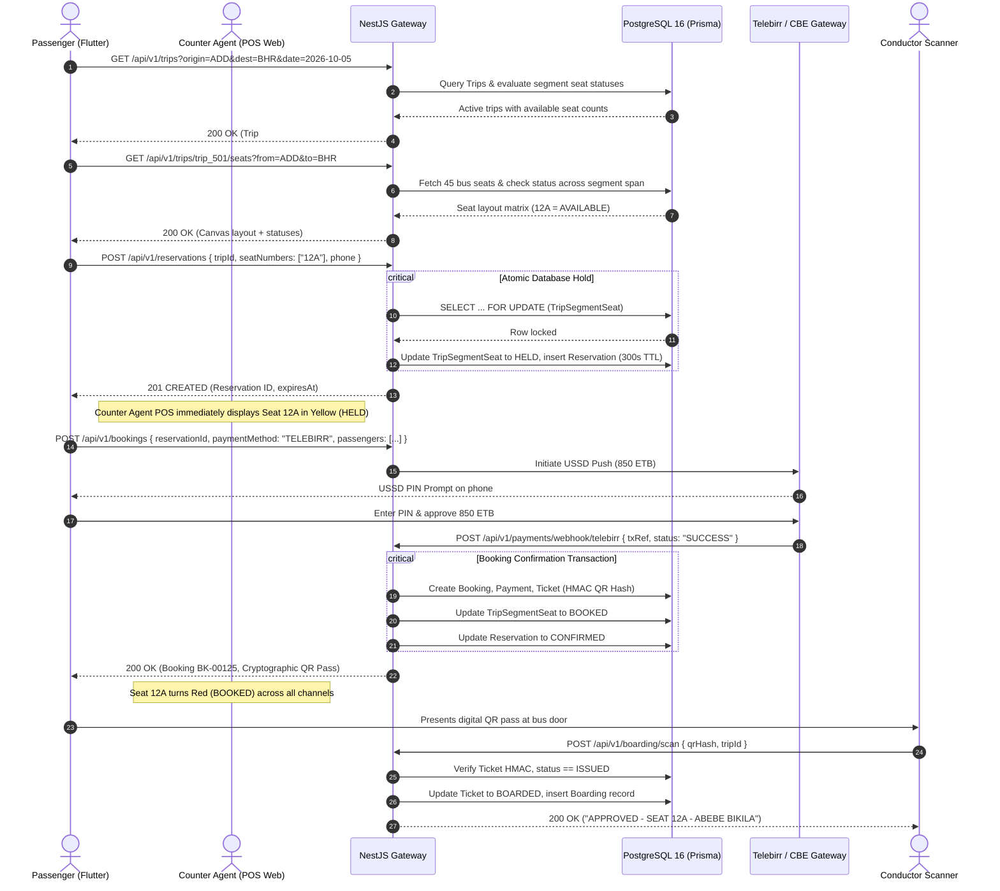

# Abyssinia Bus S.C. — Complete API Architecture & Contract Specification
**Document Version:** 1.0.0  
**Status:** Approved Master API Contract  
**Protocol:** RESTful JSON over HTTPS | WebSockets / SSE for Real-Time Telemetry  
**API Base URL:** `https://api.abyssiniabus.com/api/v1`  
**Target Clients:** Flutter Mobile (Passenger, Driver, Conductor), Next.js 14 Staff Web (Counter POS, Dispatch, Fleet, Finance, Executive)

---

## Table of Contents
1. [Core Architectural Standards & Envelopes](#1-core-architectural-standards--envelopes)
2. [End-to-End Sequence Diagram (Search to Boarding & Settlement)](#2-end-to-end-sequence-diagram)
3. [Module 1: Authentication & Identity Management](#module-1-authentication--identity-management)
4. [Module 2: Network, Stops & Master Routes](#module-2-network-stops--master-routes)
5. [Module 3: Trip Search & Real-Time Seat Availability](#module-3-trip-search--real-time-seat-availability)
6. [Module 4: Atomic Seat Reservations & Holds (300s TTL)](#module-4-atomic-seat-reservations--holds-300s-ttl)
7. [Module 5: Omnichannel Booking & Passenger Registration](#module-5-omnichannel-booking--passenger-registration)
8. [Module 6: Payment Processing & Gateway Webhooks](#module-6-payment-processing--gateway-webhooks)
9. [Module 7: Cryptographic Ticketing & PDF Generation](#module-7-cryptographic-ticketing--pdf-generation)
10. [Module 8: Conductor Boarding & Duplicate-Proof QR Scanner](#module-8-conductor-boarding--duplicate-proof-qr-scanner)
11. [Module 9: Driver Duty, Live GPS Telemetry & Incident Logging](#module-9-driver-duty-live-gps-telemetry--incident-logging)
12. [Module 10: Dispatch Operations & Master Departure Board](#module-10-dispatch-operations--master-departure-board)
13. [Module 11: Agent Cash Shifts & Branch Settlement](#module-11-agent-cash-shifts--branch-settlement)
14. [Module 12: Fleet Maintenance & Workshop Work Orders](#module-12-fleet-maintenance--workshop-work-orders)
15. [Module 13: Financial Audits & Executive KPI Reports](#module-13-financial-audits--executive-kpi-reports)
16. [Comprehensive Error Code Dictionary](#16-comprehensive-error-code-dictionary)

---

# 1. Core Architectural Standards & Envelopes

### A. Base URL & Versioning
All API routes are versioned using the path prefix `/api/v1`.

### B. Standard Request Headers
```http
Content-Type: application/json
Accept: application/json
Authorization: Bearer <JWT_ACCESS_TOKEN>
X-Client-Platform: FLUTTER_MOBILE | WEB_POS | WEB_ADMIN
X-Client-Version: 1.0.0
Idempotency-Key: <UUIDv4> -- Mandatory for POST /reservations, /bookings, /payments, /cancel
```

### C. Standard Success Response Envelope
All successful requests return HTTP `200 OK` or `201 CREATED` with the canonical envelope:
```json
{
  "success": true,
  "data": { ... },
  "meta": {
    "timestamp": "2026-10-05T08:15:30.124Z",
    "requestId": "req_clx99201928"
  }
}
```

### D. Standard Error Response Envelope
All failed requests return appropriate HTTP status codes (`400`, `401`, `403`, `404`, `409`, `422`, `500`):
```json
{
  "success": false,
  "error": {
    "code": "SEAT_ALREADY_RESERVED",
    "message": "Seat 12A was just reserved by another customer.",
    "details": {
      "seatNumber": "12A",
      "conflictingSegmentId": "seg_add_dej_01"
    },
    "timestamp": "2026-10-05T08:15:30.124Z",
    "path": "/api/v1/reservations"
  }
}
```

---

# 2. End-to-End Sequence Diagram



---

# Module 1: Authentication & Identity Management

### 1.1 Staff Email/Password Login: `POST /api/v1/auth/login`
* **Target Clients:** Agent POS, Dispatcher, Fleet, Finance, Admin Web Portals.
* **Access:** Public.
* **Request Headers:** `Content-Type: application/json`
* **Request Body:**
```json
{
  "email": "hana.kebede@abyssiniabus.com",
  "password": "SecurePassword#2026"
}
```
* **Validation Rules:**
  - `email`: Required, valid email format.
  - `password`: Required, string, min 8 characters.
* **Business Logic:**
  1. Finds `User` where `email` equals input.
  2. Compares password against `passwordHash` using bcrypt.
  3. Verifies `user.active == true`.
  4. Signs JWT access token (12-hour expiry) containing `sub`, `email`, `role`, `branchId`, `companyId`.
  5. Updates `User.lastLoginAt = NOW()`.
* **Success Response (200 OK):**
```json
{
  "success": true,
  "data": {
    "accessToken": "eyJhbGciOiJIUzI1NiIsInR5cCI6IkpXVCJ9...",
    "expiresIn": 43200,
    "user": {
      "id": "usr_clx001928",
      "fullName": "Hana Kebede",
      "email": "hana.kebede@abyssiniabus.com",
      "role": "TICKET_AGENT",
      "branchId": "br_addis_hq",
      "branchName": "Addis Ababa Central Terminal"
    }
  }
}
```
* **Errors:** `401 INVALID_CREDENTIALS`, `403 ACCOUNT_DISABLED`.

---

### 1.2 Passenger SMS OTP Request: `POST /api/v1/auth/passenger/otp/send`
* **Target Clients:** Flutter Passenger Mobile App.
* **Request Body:**
```json
{
  "phone": "+251911223344"
}
```
* **Validation:** Valid Ethiopian phone prefix (`+2519...` or `+2517...`), 13 characters.
* **Business Logic:** Generates 6-digit cryptographically secure OTP, stores in Redis with 180s TTL, sends via Ethio Telecom SMS API.
* **Success Response (200 OK):**
```json
{
  "success": true,
  "data": {
    "message": "OTP verification code dispatched via SMS.",
    "retryAfterSeconds": 60
  }
}
```

---

### 1.3 Passenger OTP Verification: `POST /api/v1/auth/passenger/otp/verify`
* **Request Body:**
```json
{
  "phone": "+251911223344",
  "code": "481920",
  "fullName": "Abebe Bikila"
}
```
* **Business Logic:** Validates OTP against Redis. Upserts `Passenger` and `User` records. Signs passenger JWT token (30-day expiry).
* **Success Response (200 OK):** Returns `{ accessToken, passenger: { id, fullName, phone } }`.

---

# Module 2: Network, Stops & Master Routes

### 2.1 List Active Stops: `GET /api/v1/stops`
* **Access:** Public.
* **Query Params:** `city` (optional), `type` (optional: `TERMINAL`, `REST_STOP`).
* **Success Response (200 OK):**
```json
{
  "success": true,
  "data": [
    {
      "id": "stop_add_01",
      "code": "ADD-AT",
      "name": "Addis Ababa (Autobus Tera)",
      "city": "Addis Ababa",
      "type": "TERMINAL",
      "latitude": 9.0345000,
      "longitude": 38.7422000
    },
    {
      "id": "stop_bhr_01",
      "code": "BHR-CT",
      "name": "Bahir Dar Central Terminal",
      "city": "Bahir Dar",
      "type": "TERMINAL",
      "latitude": 11.5936000,
      "longitude": 37.3908000
    }
  ]
}
```

---

### 2.2 List Master Routes: `GET /api/v1/routes`
* **Success Response (200 OK):** Returns route catalog with origin stop, destination stop, total distance in km, and intermediate route stops with sequence numbers.

---

# Module 3: Trip Search & Real-Time Seat Availability

### 3.1 Search Trips: `GET /api/v1/trips`
* **Query Parameters:**
  - `originStopId` (string, required): Departure terminal ID.
  - `destinationStopId` (string, required): Arrival terminal ID.
  - `date` (string, required, YYYY-MM-DD): Journey date.
  - `passengers` (integer, optional, default: 1): Minimum contiguous seats needed.
* **Business Logic:**
  1. Finds all Routes connecting `originStopId` to `destinationStopId` in sequential order (`originSeq < destSeq`).
  2. Queries all `Trip` records matching those routes on `date` with `status IN ('SCHEDULED', 'OPEN')`.
  3. Evaluates segment span: A seat is counted as available only if it is `AVAILABLE` on every intermediate segment.
* **Success Response (200 OK):**
```json
{
  "success": true,
  "data": [
    {
      "tripId": "trip_clx501",
      "route": {
        "code": "RT-ADD-BHR",
        "originName": "Addis Ababa (Autobus Tera)",
        "destinationName": "Bahir Dar Central"
      },
      "bus": {
        "sideNumber": "SB-023",
        "plateNumber": "ET-3-A99102",
        "model": "Yutong ZK6122H",
        "busType": "LUXURY_2X2",
        "amenities": ["AC", "WiFi", "Charging Ports", "Reclining Seats"]
      },
      "driver": {
        "fullName": "Dawit Mengistu"
      },
      "scheduledDeparture": "2026-10-05T05:30:00.000Z",
      "scheduledArrival": "2026-10-05T14:30:00.000Z",
      "fareETB": 850.00,
      "availableSeats": 18,
      "totalSeats": 45,
      "status": "OPEN"
    }
  ]
}
```

---

### 3.2 Real-Time Seat Layout & Status: `GET /api/v1/trips/:id/seats`
* **Query Parameters:** `fromStopId` (string, required), `toStopId` (string, required).
* **Business Logic:**
  1. Finds all `TripSegment` records between `fromStopId` and `toStopId`.
  2. Retrieves all 45 physical `Seat` records for the bus.
  3. Checks `TripSegmentSeat` records across the segment span:
     - If `status == 'AVAILABLE'` across all segments $\to$ Returns `AVAILABLE`.
     - If any segment is `HELD` $\to$ Returns `HELD` with remaining countdown seconds.
     - If any segment is `BOOKED` $\to$ Returns `BOOKED`.
     - If any segment is `BLOCKED` $\to$ Returns `BLOCKED`.
* **Success Response (200 OK):**
```json
{
  "success": true,
  "data": {
    "tripId": "trip_clx501",
    "layout": {
      "busType": "LUXURY_2X2",
      "rows": 11,
      "columns": ["A", "B", "C", "D"],
      "driverSide": "FRONT_LEFT",
      "doorSide": "FRONT_RIGHT"
    },
    "seats": [
      {
        "seatNumber": "01A",
        "row": 1,
        "col": 1,
        "isWindow": true,
        "status": "AVAILABLE",
        "fareETB": 850.00
      },
      {
        "seatNumber": "01B",
        "row": 1,
        "col": 2,
        "isAisle": true,
        "status": "BOOKED"
      },
      {
        "seatNumber": "12A",
        "row": 3,
        "col": 1,
        "isWindow": true,
        "status": "HELD",
        "heldSecondsRemaining": 214
      }
    ]
  }
}
```

---

# Module 4: Atomic Seat Reservations & Holds (300s TTL)

### 4.1 Create Atomic Seat Hold: `POST /api/v1/reservations`
* **Target Clients:** Passenger App, Public Web, Agent Counter POS.
* **Headers:** `Idempotency-Key: <UUID>`
* **Request Body:**
```json
{
  "tripId": "trip_clx501",
  "fromStopId": "stop_add_01",
  "toStopId": "stop_bhr_01",
  "seatNumbers": ["12A", "12B"],
  "contactPhone": "+251911223344"
}
```
* **Validation:** Max 5 seats per request. Seats must exist on bus.
* **Step-by-Step Business Logic & Database Lock:**
  1. Evaluates all intermediate `TripSegment` IDs for the journey span.
  2. Executes inside a strict PostgreSQL transaction:
     ```sql
     -- Acquire row-level lock ordered to prevent deadlocks
     SELECT tss.* FROM "TripSegmentSeat" tss
     JOIN "Seat" s ON tss."busSeatId" = s.id
     WHERE tss."tripSegmentId" IN ($1, $2)
       AND s."seatNumber" IN ('12A', '12B')
     ORDER BY s."seatNumber" ASC, tss."tripSegmentId" ASC
     FOR UPDATE;
     ```
  3. Verifies that **every** selected seat row currently has `status == 'AVAILABLE'`.
  4. If any seat is not available, transaction aborts immediately with `409 SEAT_ALREADY_RESERVED`.
  5. Inserts `Reservation` record (`expiresAt = NOW() + INTERVAL '300 SECONDS'`).
  6. Updates `TripSegmentSeat` records to `status = 'HELD'`, `reservationId = res.id`, `heldUntil = res.expiresAt`.
* **Success Response (201 Created):**
```json
{
  "success": true,
  "data": {
    "reservationId": "res_clx881928",
    "tripId": "trip_clx501",
    "heldSeats": ["12A", "12B"],
    "expiresAt": "2026-10-05T08:20:30.000Z",
    "holdDurationSeconds": 300,
    "totalFareETB": 1700.00
  }
}
```
* **Error Response (409 Conflict):**
```json
{
  "success": false,
  "error": {
    "code": "SEAT_ALREADY_RESERVED",
    "message": "Seat 12A was just locked by another customer. Please choose another seat.",
    "details": { "conflictingSeat": "12A" }
  }
}
```

---

### 4.2 Release Seat Hold: `DELETE /api/v1/reservations/:id`
* **Purpose:** Immediately frees held seats back to available inventory if passenger abandons checkout or taps back.
* **Business Logic:** Mutates `Reservation.status = 'CANCELLED'`. Resets associated `TripSegmentSeat` records to `AVAILABLE`.

---

# Module 5: Omnichannel Booking & Passenger Registration

### 5.1 Create Booking from Reservation: `POST /api/v1/bookings`
* **Target Clients:** Passenger App (Digital Payment Intent), Counter POS (Cash).
* **Headers:** `Idempotency-Key: <UUID>`
* **Request Body:**
```json
{
  "reservationId": "res_clx881928",
  "channel": "COUNTER",
  "branchId": "br_addis_hq",
  "paymentMethod": "CASH",
  "cashTenderedETB": 2000.00,
  "passengers": [
    {
      "seatNumber": "12A",
      "fullName": "Abebe Bikila",
      "phone": "+251911223344",
      "idNumber": "ETH-KB-991823",
      "nationality": "Ethiopian"
    },
    {
      "seatNumber": "12B",
      "fullName": "Derartu Tulu",
      "phone": "+251911556677",
      "idNumber": "ETH-KB-882711",
      "nationality": "Ethiopian"
    }
  ]
}
```
* **Step-by-Step Business Logic:**
  1. Validates `Reservation` exists, `status == 'ACTIVE'`, and `expiresAt > NOW()`.
  2. Generates canonical Booking Reference: `BK-YYYYMMDD-XXXXX`.
  3. If `channel == 'COUNTER'` and `paymentMethod == 'CASH'`:
     - Verifies active agent has an `OPEN` `CashShift`.
     - Calculates change: `2000.00 - 1700.00 = 300.00 ETB`.
     - Increments `CashShift.cashSalesETB += 1700.00`, `ticketsCount += 2`.
     - Creates `Payment` record with `status = 'COMPLETED'`.
     - Transitions `TripSegmentSeat` records to `status = 'BOOKED'`.
     - Generates 2 `Ticket` records with cryptographic HMAC-SHA256 signatures.
  4. If `channel == 'PASSENGER_APP'`:
     - Creates `Booking` with `paymentStatus = 'PENDING'`.
     - Generates payment intent with external provider.
* **Success Response (201 Created):**
```json
{
  "success": true,
  "data": {
    "bookingReference": "BK-20261005-00125",
    "totalAmountETB": 1700.00,
    "cashTenderedETB": 2000.00,
    "changeReturnedETB": 300.00,
    "paymentStatus": "PAID",
    "tickets": [
      {
        "ticketNumber": "TCK-20261005-0125-01",
        "seatNumber": "12A",
        "passengerName": "Abebe Bikila",
        "qrHash": "9a8b7c6d5e4f3a2b1c0d9e8f7a6b5c4d3e2f1a0b",
        "qrPayload": "ABYSSINIA:TCK-20261005-0125-01:12A:9a8b7c6d"
      },
      {
        "ticketNumber": "TCK-20261005-0125-02",
        "seatNumber": "12B",
        "passengerName": "Derartu Tulu",
        "qrHash": "1a2b3c4d5e6f7a8b9c0d1e2f3a4b5c6d7e8f9a0b",
        "qrPayload": "ABYSSINIA:TCK-20261005-0125-02:12B:1a2b3c4d"
      }
    ]
  }
}
```

---

### 5.2 Universal Booking Lookup: `GET /api/v1/bookings/search`
* **Access:** Agent, Support, Admin.
* **Query Params:** `query` (Searches Booking Ref, Ticket #, Phone, Name, or ID).
* **Success Response (200 OK):** Returns matching booking details, customer profile, payment log, and ticket statuses.

---

### 5.3 Booking Cancellation & Refund: `POST /api/v1/bookings/:id/cancel`
* **Request Body:** `{ "reason": "Travel plan changed" }`
* **Business Logic:**
  1. Calculates departure countdown: $\Delta t = \text{Trip.scheduledDeparture} - \text{NOW()}$.
  2. Evaluates refund policy:
     - $>24\text{ hours}$: $90\%$ refund ($10\%$ admin fee).
     - $12 \text{ to } 24\text{ hours}$: $75\%$ refund.
     - $2 \text{ to } 12\text{ hours}$: $50\%$ refund.
     - $<2\text{ hours}$: $0\%$ refund.
  3. Releases `TripSegmentSeat` records back to `AVAILABLE`.
  4. Marks `Booking.paymentStatus = 'REFUNDED'`.
  5. Updates agent `CashShift.refundsETB` if cash refund.
* **Success Response (200 OK):** Returns `{ originalAmountETB: 850, refundAmountETB: 765, cancellationFeeETB: 85 }`.

---

# Module 6: Payment Processing & Gateway Webhooks

### 6.1 Telebirr Webhook Handler: `POST /api/v1/payments/webhook/telebirr`
* **Headers:** `X-Telebirr-Signature: <RSA_OR_HMAC_SIG>`
* **Request Body:**
```json
{
  "outTradeNo": "BK-20261005-00125",
  "transactionNo": "TEL-20261005-99881122",
  "totalAmount": "850.00",
  "tradeStatus": "Completed",
  "paymentTime": "2026-10-05 08:16:42"
}
```
* **Business Logic:**
  1. Validates webhook signature using Telebirr Public Key.
  2. Idempotency check: Verifies transaction hasn't already been marked `SUCCESS`.
  3. Finds matching `Booking` by `outTradeNo`.
  4. Executes atomic transaction:
     - Creates `Payment` record (`amountETB = 850.00`, `method = 'TELEBIRR'`).
     - Inserts `PaymentEvent` audit row with raw telecom payload.
     - Marks `Booking.paymentStatus = 'PAID'`.
     - Changes `TripSegmentSeat` to `BOOKED`.
     - Issues `Ticket` records and triggers asynchronous SMS notification.
* **Success Response (200 OK):** `{"code": 0, "message": "success"}`

---

# Module 7: Cryptographic Ticketing & PDF Generation

### 7.1 Stream Ticket PDF: `GET /api/v1/tickets/:id/pdf`
* **Response Headers:** `Content-Type: application/pdf`, `Content-Disposition: inline; filename="ticket-BK00125.pdf"`
* **Payload:** Generates PDF containing company logo, tax invoice details, trip date/time, seat number, and vector 2D QR code.

---

# Module 8: Conductor Boarding & Duplicate-Proof QR Scanner

### 8.1 Validate Boarding QR Code: `POST /api/v1/boarding/scan`
* **Target Clients:** Conductor Android Mobile App.
* **Request Body:**
```json
{
  "qrHash": "9a8b7c6d5e4f3a2b1c0d9e8f7a6b5c4d3e2f1a0b",
  "tripId": "trip_clx501",
  "terminalLocation": "Autobus Tera Gate 4"
}
```
* **Performance Requirement:** Execution under 100 milliseconds.
* **Business Logic:**
  1. Queries `Ticket` by `qrHash`.
  2. If not found $\to$ `404 TICKET_NOT_FOUND`.
  3. If `ticket.tripId != request.tripId` $\to$ `400 WRONG_TRIP ("Ticket is for Trip #504")`.
  4. If `ticket.status == 'BOARDED'` $\to$ `409 TICKET_ALREADY_BOARDED ("Already scanned at 05:12 AM")`.
  5. If `ticket.status == 'CANCELLED'` $\to$ `400 TICKET_CANCELLED`.
  6. Executes atomic update:
     - Updates `Ticket.status = 'BOARDED'`, `Ticket.boardedAt = NOW()`.
     - Inserts `Boarding` record with `conductorId = user.id`.
* **Success Response (200 OK):**
```json
{
  "success": true,
  "data": {
    "status": "APPROVED",
    "passenger": {
      "name": "Abebe Bikila",
      "seatNumber": "12A",
      "ticketNumber": "TCK-20261005-0125-01",
      "destinationStop": "Bahir Dar Central"
    },
    "boardedAt": "2026-10-05T05:14:02.100Z"
  }
}
```

---

# Module 9: Driver Duty, Live GPS Telemetry & Incident Logging

### 9.1 High-Frequency GPS Telemetry Ping: `POST /api/v1/trips/:id/gps`
* **Target Clients:** Driver App / In-Vehicle Cellular GPS Hardware.
* **Request Body:**
```json
{
  "latitude": 9.6841000,
  "longitude": 39.2905000,
  "speedKmH": 74.5,
  "headingDeg": 348.0,
  "currentMilestone": "Debre Sina"
}
```
* **Business Logic:**
  1. Updates `Trip` live fields: `currentLatitude`, `currentLongitude`, `currentSpeedKmH`, `currentMilestone`, `lastGpsPingAt = NOW()`.
  2. Inserts row into partitioned `GpsPing` table.
  3. If `speedKmH > 80.0`: Triggers operations speed violation alert.
* **Success Response (200 OK):** `{"success": true, "acknowledged": true}`

---

### 9.2 Highway Incident Reporting: `POST /api/v1/trips/:id/incidents`
* **Request Body:**
```json
{
  "incidentType": "CHECKPOINT",
  "severity": "MEDIUM",
  "description": "Federal police security inspection checkpoint before Dejen gorge.",
  "estimatedDelayMinutes": 30,
  "latitude": 10.1524000,
  "longitude": 38.1402000
}
```
* **Business Logic:** Inserts `IncidentReport`. Updates `Trip.delayMinutes += 30`. Dispatches automated SMS broadcast to downstream passengers.

---

# Module 10: Dispatch Operations & Master Departure Board

### 10.1 Terminal Master Departure Board: `GET /api/v1/dispatch/board/today`
* **Success Response (200 OK):** Returns all departures for terminal today with bus side number, plate, driver, total booked, total boarded, and clearance state.

---

### 10.2 Issue Departure Clearance: `POST /api/v1/dispatch/trips/:id/clearance`
* **Business Logic:** Verifies pre-trip inspection passed, seals manifest, updates `Trip.status = 'BOARDING'` $\to$ `IN_TRANSIT`.

---

# Module 11: Agent Cash Shifts & Branch Settlement

### 11.1 Open Cash Drawer: `POST /api/v1/shifts/start`
* **Request Body:** `{ "openingCashETB": 10000.00 }`
* **Business Logic:** Ensures agent has no active open shift. Inserts `CashShift` with `status = 'OPEN'`.

---

### 11.2 Close Shift & Reconcile: `POST /api/v1/shifts/end`
* **Request Body:**
```json
{
  "shiftId": "sh_clx00192",
  "countedCashETB": 44850.00,
  "notes": "Drawer balanced. Handed over to night supervisor."
}
```
* **Business Logic:** Computes expected cash:
  $$\text{Expected} = \text{OpeningCash} + \text{CashSales} - \text{CashRefunds}$$
  Calculates `differenceETB = countedCash - expected`. Flags discrepancy if non-zero. Closes shift.

---

# Module 12: Fleet Maintenance & Workshop Work Orders

### 12.1 Create Maintenance Work Order: `POST /api/v1/fleet/work-orders`
* **Request Body:**
```json
{
  "busId": "bus_023",
  "jobType": "BRAKE_REPAIR",
  "priority": "HIGH",
  "defectDescription": "Front right brake noise reported by driver upon return from Bahir Dar.",
  "odometerAtJob": 184815
}
```
* **Business Logic:** Inserts `MaintenanceJob`. Sets `Bus.status = 'MAINTENANCE'`. Removes bus from dispatch availability.

---

# Module 13: Financial Audits & Executive KPI Reports

### 13.1 Executive Real-Time Dashboard: `GET /api/v1/reports/executive/today`
* **Access:** `COMPANY_OWNER`, `SUPER_ADMIN`.
* **Success Response (200 OK):**
```json
{
  "success": true,
  "data": {
    "grossRevenueETB": 482500.00,
    "cashRevenueETB": 210000.00,
    "digitalRevenueETB": 272500.00,
    "totalTicketsSold": 711,
    "totalPassengersMoved": 642,
    "fleetLoadFactorPercentage": 88.4,
    "activeTripsCount": 18,
    "delayedTripsCount": 2,
    "activeBusesCount": 26,
    "maintenanceBusesCount": 3
  }
}
```

---

# 16. Comprehensive Error Code Dictionary

| HTTP Code | Error Code Enum | Meaning & Remediation |
| :---: | :--- | :--- |
| `400` | `INVALID_TRIP_DATE` | Requested travel date is in the past. |
| `400` | `WRONG_TRIP_SCAN` | Ticket presented belongs to a different bus departure. |
| `401` | `INVALID_CREDENTIALS` | Incorrect password or unverified phone number. |
| `401` | `TOKEN_EXPIRED` | JWT bearer token has expired; client must refresh. |
| `403` | `BRANCH_ACCESS_DENIED` | Agent attempted to view or sell from an unauthorized branch. |
| `404` | `TRIP_NOT_FOUND` | Specified trip ID does not exist or has been cancelled. |
| `409` | `SEAT_ALREADY_RESERVED` | Target seat was locked by another customer during checkout. |
| `409` | `TICKET_ALREADY_BOARDED` | Passenger QR scanned previously; potential duplicate fraud. |
| `409` | `ACTIVE_SHIFT_EXISTS` | Agent must close their existing cash shift before opening a new one. |
| `422` | `HOLD_EXPIRED` | 300-second checkout timer elapsed; seat returned to open inventory. |
| `500` | `PAYMENT_GATEWAY_TIMEOUT`| Upstream telecom provider failed to respond; transaction rolled back. |
