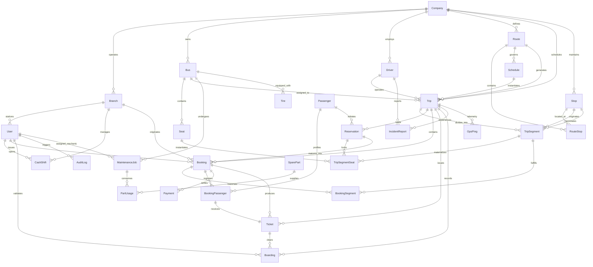

# Abyssinia Bus S.C. — Complete Database & ERD Specification
**Document Version:** 1.0.0  
**Status:** Approved Master Data Architecture  
**Database Engine:** PostgreSQL 16 Enterprise  
**ORM / Data Access:** Prisma ORM 5.22 / TypeScript  
**Scope:** Complete Relational Data Model for Ethiopian Intercity Transport Network

---

## Table of Contents
1. [The Core Lifecycle: From Physical Seat to Boarded Passenger](#1-the-core-lifecycle-from-physical-seat-to-boarded-passenger)
2. [Master Entity Relationship Diagram (Mermaid ERD)](#2-master-entity-relationship-diagram-mermaid-erd)
3. [Domain-by-Domain Table & Field Specifications](#3-domain-by-domain-table--field-specifications)
   - [Domain 1: Multi-Tenant & Organization (Company, Branch)](#domain-1-multi-tenant--organization)
   - [Domain 2: Identity, Access Control & Audit (User, AuditLog)](#domain-2-identity-access-control--audit)
   - [Domain 3: Fleet & Maintenance Assets (Bus, Seat, Driver, Maintenance, Tires)](#domain-3-fleet--maintenance-assets)
   - [Domain 4: Network & Scheduling (Stop, Route, RouteStop, Schedule)](#domain-4-network--scheduling)
   - [Domain 5: Master Inventory Engine (Trip, TripSegment, TripSegmentSeat, SeatLock)](#domain-5-master-inventory-engine)
   - [Domain 6: Reservation & Omnichannel Booking (Reservation, Booking, Passengers)](#domain-6-reservation--omnichannel-booking)
   - [Domain 7: Payment, Ticketing & Boarding (Payment, Ticket, Boarding)](#domain-7-payment-ticketing--boarding)
   - [Domain 8: Operations, Cash Shifts & Telemetry (CashShift, Incident, GPS, Support)](#domain-8-operations-cash-shifts--telemetry)
4. [Enumerations & State Machines](#4-enumerations--state-machines)
5. [Segment-Hop Inventory & Availability Proof](#5-segment-hop-inventory--availability-proof)
6. [Concurrency, Distributed Locking & Deadlock Prevention](#6-concurrency-distributed-locking--deadlock-prevention)
7. [Financial Balancing Invariants & Cash Audit Model](#7-financial-balancing-invariants--cash-audit-model)
8. [Data Retention, Indexing & Partitioning Strategy](#8-data-retention-indexing--partitioning-strategy)

---

# 1. The Core Lifecycle: From Physical Seat to Boarded Passenger

To understand the relational architecture, consider the fundamental journey:

> **How exactly does one seat belong to one bus, become available for one trip, get booked by one passenger, receive one payment, produce one ticket, and eventually become boarded?**

```text
┌─────────────┐
│     BUS     │  Plate: ET-3-A99102 | Side: SB-023 | Capacity: 45
└──────┬──────┘
       │ 1-to-Many
       ▼
┌─────────────┐
│    SEAT     │  Seat: "12A" | Row: 3 | Col: 1 | Window: TRUE
└──────┬──────┘
       │ Materialized across Route Segments (Addis → Dejen, Dejen → Dessie, Dessie → Bahir Dar)
       ▼
┌──────────────────┐
│ TRIP_SEGMENT_SEAT│ Status: AVAILABLE
└──────┬───────────┘
       │ Passenger initiates checkout (Atomic DB Lock for 300 seconds)
       ▼
┌──────────────────┐
│   RESERVATION    │ Status: ACTIVE | expiresAt: NOW() + 300s
│ TRIP_SEGMENT_SEAT│ Status: HELD   | heldUntil: NOW() + 300s
└──────┬───────────┘
       │ Customer pays 850 ETB via Telebirr / CBE Birr / Cash
       ▼
┌──────────────────┐
│     BOOKING      │ Ref: "BK-20261005-00125" | Status: PAID
│     PAYMENT      │ Method: TELEBIRR | Amount: 850 ETB | Status: COMPLETED
│ TRIP_SEGMENT_SEAT│ Status: BOOKED
└──────┬───────────┘
       │ System issues cryptographic QR Boarding Pass
       ▼
┌──────────────────┐
│     TICKET       │ Number: "TCK-00125-01" | Status: ISSUED | qrHash: SHA256(...)
└──────┬───────────┘
       │ Conductor scans QR Code at terminal bus door gate
       ▼
┌──────────────────┐
│    BOARDING      │ ScannedAt: 05:12 AM | Status: APPROVED
│     TICKET       │ Status: BOARDED
└──────────────────┘
```

### The Exact Foreign Key & State Trace

1. **Step 1: Physical Existence:** A row exists in `Bus` (`id = "bus_023"`). Cascade-inserted into `Seat` are 45 rows, one of which is `Seat` (`id = "seat_12a"`, `seatNumber = "12A"`, `busId = "bus_023"`).
2. **Step 2: Operational Trip Creation:** Dispatcher schedules `Trip` (`id = "trip_501"`, `busId = "bus_023"`, `routeId = "route_add_bhr"`). The route contains 3 stops ($S_1 \to S_2 \to S_3$), creating 2 consecutive `TripSegment` records: `seg_1` (Addis $\to$ Dejen) and `seg_2` (Dejen $\to$ Bahir Dar).
3. **Step 3: Inventory Materialization:** The engine creates rows in `TripSegmentSeat`. For Seat 12A, two records are generated:
   - `{ id: "tss_1", tripSegmentId: "seg_1", busSeatId: "seat_12a", status: "AVAILABLE" }`
   - `{ id: "tss_2", tripSegmentId: "seg_2", busSeatId: "seat_12a", status: "AVAILABLE" }`
4. **Step 4: 5-Minute Atomic Hold:** Passenger on mobile app requests Seat 12A from Addis to Bahir Dar. Both segments are locked inside a `SERIALIZABLE` transaction:
   - A `Reservation` row (`id = "res_991"`, `expiresAt = NOW() + 5 min`) is created.
   - `TripSegmentSeat` records `tss_1` and `tss_2` mutate to `status = "HELD"`, `reservationId = "res_991"`, `heldUntil = NOW() + 5 min`.
5. **Step 5: Booking & Payment Authorization:** Payment webhook confirms transaction. Inside an atomic transaction:
   - `Booking` row created (`id = "bk_00125"`, `bookingReference = "BK-20261005-00125"`, `totalAmountETB = 850.00`, `paymentStatus = "PAID"`).
   - `BookingPassenger` created (`id = "bp_01"`, `bookingId = "bk_00125"`, `seatNumber = "12A"`, `passengerName = "Abebe Bikila"`).
   - `Payment` row created (`bookingId = "bk_00125"`, `amountETB = 850.00`, `paymentMethod = "TELEBIRR"`, `status = "COMPLETED"`).
   - `TripSegmentSeat` rows `tss_1` and `tss_2` mutate to `status = "BOOKED"`.
   - `Reservation` `res_991` status mutates to `CONFIRMED`.
6. **Step 6: Cryptographic Ticket Generation:**
   - `Ticket` row created (`id = "tck_77"`, `ticketNumber = "TCK-20261005-0125-01"`, `bookingId = "bk_00125"`, `bookingPassengerId = "bp_01"`, `tripId = "trip_501"`, `seatNumber = "12A"`, `status = "ISSUED"`, `qrHash = HMAC_SHA256("TCK-20261005-0125-01", SecretKey)`).
7. **Step 7: Boarding Verification:**
   - Conductor scans QR on mobile device.
   - Endpoint `/api/v1/boarding/scan` matches `qrHash`.
   - Inserts `Boarding` row (`ticketId = "tck_77"`, `tripId = "trip_501"`, `conductorId = "user_kassahun"`, `scannedAt = NOW()`, `status = "APPROVED"`).
   - `Ticket` row mutates to `status = "BOARDED"`, `boardedAt = NOW()`.
   - Re-scanning the same ticket detects `status == "BOARDED"` and immediately rejects with `409 Conflict`.

---

# 2. Master Entity Relationship Diagram (Mermaid ERD)



---

# 3. Domain-by-Domain Table & Field Specifications

### Domain 1: Multi-Tenant & Organization

#### Table: `Company`
The root legal operating entity (e.g., Abyssinia Bus S.C.).
```sql
CREATE TABLE "Company" (
    "id"                  TEXT PRIMARY KEY,              -- CUID
    "legalName"           TEXT NOT NULL,                 -- e.g. "Abyssinia Bus Share Company"
    "legalNameAm"         TEXT NOT NULL,                 -- e.g. "አቢሲኒያ አውቶቡስ አ.ማ."
    "tradeName"           TEXT NOT NULL,                 -- e.g. "Abyssinia Bus"
    "tinNumber"           TEXT UNIQUE NOT NULL,          -- Ethiopian Tax Identification Number (10 digits)
    "commercialRegNo"     TEXT NOT NULL,                 -- Ministry of Trade Registration No.
    "headquartersAddress" TEXT NOT NULL,                 -- e.g. "Bole Subcity, Woreda 03, Addis Ababa"
    "headquartersPhone"   TEXT NOT NULL,                 -- e.g. "+251116670000"
    "supportEmail"        TEXT NOT NULL,                 -- e.g. "support@abyssiniabus.com"
    "websiteUrl"          TEXT,                          -- e.g. "https://abyssiniabus.com"
    "logoUrl"             TEXT,
    "createdAt"           TIMESTAMP(3) NOT NULL DEFAULT CURRENT_TIMESTAMP,
    "updatedAt"           TIMESTAMP(3) NOT NULL
);
```

#### Table: `Branch`
Physical ticket offices, stations, and passenger terminals across Ethiopia.
```sql
CREATE TABLE "Branch" (
    "id"           TEXT PRIMARY KEY,
    "companyId"    TEXT NOT NULL REFERENCES "Company"("id") ON DELETE RESTRICT,
    "nameEn"       TEXT NOT NULL,                     -- e.g. "Addis Ababa Central Terminal"
    "nameAm"       TEXT NOT NULL,                     -- e.g. "አዲስ አበባ ዋና ተርሚናል (አውቶቡስ ተራ)"
    "city"         TEXT NOT NULL,                     -- e.g. "Addis Ababa", "Bahir Dar", "Hawassa"
    "terminalArea" TEXT NOT NULL,                     -- e.g. "Autobus Tera", "Meskel Square", "Kality"
    "phone"        TEXT NOT NULL,
    "address"      TEXT NOT NULL,
    "latitude"     DECIMAL(10, 7),
    "longitude"    DECIMAL(10, 7),
    "managerName"  TEXT,
    "createdAt"    TIMESTAMP(3) NOT NULL DEFAULT CURRENT_TIMESTAMP,
    "updatedAt"    TIMESTAMP(3) NOT NULL DEFAULT CURRENT_TIMESTAMP
);
CREATE INDEX "idx_branch_company" ON "Branch"("companyId");
```

---

### Domain 2: Identity, Access Control & Audit

#### Table: `User`
System actors across all operational levels.
```sql
CREATE TABLE "User" (
    "id"           TEXT PRIMARY KEY,
    "email"        TEXT UNIQUE NOT NULL,
    "passwordHash" TEXT NOT NULL,
    "fullName"     TEXT NOT NULL,
    "phone"        TEXT NOT NULL,
    "role"         TEXT NOT NULL,                     -- SUPER_ADMIN | BRANCH_MANAGER | TICKET_AGENT | DISPATCHER | CONDUCTOR | DRIVER | FLEET_MANAGER | MECHANIC | FINANCE_OFFICER | ACCOUNTANT | CUSTOMER_SUPPORT | COMPANY_OWNER | PASSENGER
    "branchId"     TEXT REFERENCES "Branch"("id") ON DELETE SET NULL, -- Enforces branch data isolation
    "active"       BOOLEAN NOT NULL DEFAULT TRUE,
    "createdAt"    TIMESTAMP(3) NOT NULL DEFAULT CURRENT_TIMESTAMP,
    "updatedAt"    TIMESTAMP(3) NOT NULL
);
CREATE INDEX "idx_user_branch_role" ON "User"("branchId", "role");
```

#### Table: `AuditLog`
Immutable security and administrative ledger recording every critical system mutation.
```sql
CREATE TABLE "AuditLog" (
    "id"          TEXT PRIMARY KEY,
    "userId"      TEXT REFERENCES "User"("id") ON DELETE SET NULL,
    "action"      TEXT NOT NULL,                      -- e.g. "SEAT_LOCK", "BOOKING_ISSUED", "CANCELLATION", "REFUND", "SHIFT_CLOSE"
    "entityName"  TEXT NOT NULL,                      -- e.g. "Booking", "TripSegmentSeat", "CashShift"
    "entityId"    TEXT,
    "detailsJson" TEXT,                               -- JSON representation of previous vs new state
    "ipAddress"   TEXT,
    "createdAt"   TIMESTAMP(3) NOT NULL DEFAULT CURRENT_TIMESTAMP
);
CREATE INDEX "idx_audit_entity" ON "AuditLog"("entityName", "entityId");
CREATE INDEX "idx_audit_timestamp" ON "AuditLog"("createdAt");
```

---

### Domain 3: Fleet & Maintenance Assets

#### Table: `Bus`
Physical intercity coach vehicles.
```sql
CREATE TABLE "Bus" (
    "id"          TEXT PRIMARY KEY,
    "companyId"   TEXT NOT NULL REFERENCES "Company"("id") ON DELETE RESTRICT,
    "plateNumber" TEXT UNIQUE NOT NULL,               -- e.g. "ET-3-A99102"
    "sideNumber"  TEXT UNIQUE NOT NULL,               -- e.g. "SB-023"
    "busModel"    TEXT NOT NULL,                      -- e.g. "Yutong ZK6122H"
    "busType"     TEXT NOT NULL,                      -- LUXURY_2X2 | STANDARD_2X3
    "totalSeats"  INTEGER NOT NULL DEFAULT 45,
    "amenities"   TEXT NOT NULL DEFAULT 'AC,WiFi,Reclining Seats,Charging Ports',
    "status"      TEXT NOT NULL DEFAULT 'AVAILABLE',  -- AVAILABLE | ASSIGNED | MAINTENANCE | OUT_OF_SERVICE
    "odometerKm"  INTEGER NOT NULL DEFAULT 0,
    "insuranceExpiry" TIMESTAMP(3),
    "inspectionExpiry" TIMESTAMP(3),
    "createdAt"   TIMESTAMP(3) NOT NULL DEFAULT CURRENT_TIMESTAMP,
    "updatedAt"   TIMESTAMP(3) NOT NULL DEFAULT CURRENT_TIMESTAMP
);
```

#### Table: `Seat`
Individual physical seats permanently affixed inside a bus.
```sql
CREATE TABLE "Seat" (
    "id"           TEXT PRIMARY KEY,
    "busId"        TEXT NOT NULL REFERENCES "Bus"("id") ON DELETE CASCADE,
    "seatNumber"   TEXT NOT NULL,                     -- e.g. "01A", "12D"
    "row"          INTEGER NOT NULL,                  -- Row 1 to 12
    "column"       INTEGER NOT NULL,                  -- Col 1 to 5
    "columnLetter" TEXT NOT NULL,                     -- "A", "B", "C", "D"
    "isWindow"     BOOLEAN NOT NULL DEFAULT FALSE,
    "isAisle"      BOOLEAN NOT NULL DEFAULT FALSE,
    "isBackRow"    BOOLEAN NOT NULL DEFAULT FALSE,
    "status"       TEXT NOT NULL DEFAULT 'AVAILABLE', -- AVAILABLE | BLOCKED
    "active"       BOOLEAN NOT NULL DEFAULT TRUE,
    CONSTRAINT "uq_bus_seat" UNIQUE ("busId", "seatNumber")
);
CREATE INDEX "idx_seat_bus" ON "Seat"("busId");
```

#### Table: `Driver`
Certified professional intercity bus drivers.
```sql
CREATE TABLE "Driver" (
    "id"              TEXT PRIMARY KEY,
    "companyId"       TEXT NOT NULL REFERENCES "Company"("id") ON DELETE RESTRICT,
    "fullName"        TEXT NOT NULL,
    "phone"           TEXT NOT NULL,
    "licenseNumber"   TEXT UNIQUE NOT NULL,           -- Federal Public Transport Grade 5 License
    "licenseExpiry"   TIMESTAMP(3),
    "experienceYears" INTEGER NOT NULL DEFAULT 5,
    "status"          TEXT NOT NULL DEFAULT 'AVAILABLE', -- AVAILABLE | ON_TRIP | OFF_DUTY | SICK
    "createdAt"       TIMESTAMP(3) NOT NULL DEFAULT CURRENT_TIMESTAMP,
    "updatedAt"       TIMESTAMP(3) NOT NULL DEFAULT CURRENT_TIMESTAMP
);
```

#### Table: `MaintenanceJob`
Workshop repair tickets, inspections, and preventative service orders.
```sql
CREATE TABLE "MaintenanceJob" (
    "id"           TEXT PRIMARY KEY,
    "busId"        TEXT NOT NULL REFERENCES "Bus"("id") ON DELETE CASCADE,
    "mechanicId"   TEXT REFERENCES "User"("id"),
    "jobType"      TEXT NOT NULL,                     -- SERVICE_A_5K | SERVICE_B_15K | BRAKE_REPAIR | ENGINE | ACCIDENT
    "priority"     TEXT NOT NULL DEFAULT 'MEDIUM',    -- LOW | MEDIUM | HIGH | CRITICAL
    "defectDesc"   TEXT NOT NULL,
    "diagnosis"    TEXT,
    "status"       TEXT NOT NULL DEFAULT 'OPEN',      -- OPEN | IN_PROGRESS | WAITING_PARTS | COMPLETED
    "odometerAtJob" INTEGER NOT NULL,
    "costETB"      DOUBLE PRECISION NOT NULL DEFAULT 0,
    "openedAt"     TIMESTAMP(3) NOT NULL DEFAULT CURRENT_TIMESTAMP,
    "completedAt"  TIMESTAMP(3)
);
```

#### Table: `SparePart` & `PartUsage`
Workshop warehouse inventory and parts consumption tracking.
```sql
CREATE TABLE "SparePart" (
    "id"          TEXT PRIMARY KEY,
    "partNumber"  TEXT UNIQUE NOT NULL,               -- e.g. "FLT-OIL-YUTONG-01"
    "name"        TEXT NOT NULL,                      -- e.g. "Engine Oil Filter"
    "quantity"    INTEGER NOT NULL DEFAULT 0,
    "unitCostETB" DOUBLE PRECISION NOT NULL,
    "reorderLevel" INTEGER NOT NULL DEFAULT 5
);

CREATE TABLE "PartUsage" (
    "id"        TEXT PRIMARY KEY,
    "jobId"     TEXT NOT NULL REFERENCES "MaintenanceJob"("id") ON DELETE CASCADE,
    "partId"    TEXT NOT NULL REFERENCES "SparePart"("id"),
    "quantity"  INTEGER NOT NULL DEFAULT 1,
    "unitCost"  DOUBLE PRECISION NOT NULL
);
```

#### Table: `Tire`
Serial number tracking for vehicle tires.
```sql
CREATE TABLE "Tire" (
    "id"           TEXT PRIMARY KEY,
    "busId"        TEXT NOT NULL REFERENCES "Bus"("id") ON DELETE CASCADE,
    "serialNumber" TEXT UNIQUE NOT NULL,
    "position"     TEXT NOT NULL,                     -- FRONT_LEFT | FRONT_RIGHT | REAR_OUTER_LEFT | REAR_INNER_LEFT | REAR_INNER_RIGHT | REAR_OUTER_RIGHT
    "treadDepthMm" DECIMAL(4, 2) NOT NULL,            -- e.g. 12.50 mm
    "installedKm"  INTEGER NOT NULL,
    "status"       TEXT NOT NULL DEFAULT 'ACTIVE'     -- ACTIVE | RETREADED | SCRAPPED
);
```

---

### Domain 4: Network & Scheduling

#### Table: `Stop`
Geographic points of passenger embarkation, rest, or vehicle checkpoint.
```sql
CREATE TYPE "StopType" AS ENUM ('TERMINAL', 'STATION', 'CHECKPOINT', 'REST_STOP');

CREATE TABLE "Stop" (
    "id"        TEXT PRIMARY KEY,
    "companyId" TEXT NOT NULL REFERENCES "Company"("id") ON DELETE RESTRICT,
    "name"      TEXT NOT NULL,                        -- e.g. "Addis Ababa (Autobus Tera)"
    "code"      TEXT NOT NULL,                        -- e.g. "ADD", "BHR", "DS", "HAW"
    "city"      TEXT,
    "address"   TEXT,
    "latitude"  DECIMAL(10, 7),
    "longitude" DECIMAL(10, 7),
    "type"      "StopType" NOT NULL DEFAULT 'TERMINAL',
    "status"    TEXT NOT NULL DEFAULT 'ACTIVE',
    "createdAt" TIMESTAMP(3) NOT NULL DEFAULT CURRENT_TIMESTAMP,
    "updatedAt" TIMESTAMP(3) NOT NULL,
    CONSTRAINT "uq_company_stop_code" UNIQUE ("companyId", "code")
);
```

#### Table: `Route` & `RouteStop`
Master corridor connections and sequential waypoints.
```sql
CREATE TABLE "Route" (
    "id"                   TEXT PRIMARY KEY,
    "companyId"            TEXT NOT NULL REFERENCES "Company"("id") ON DELETE RESTRICT,
    "originStopId"         TEXT NOT NULL REFERENCES "Stop"("id"),
    "destinationStopId"    TEXT NOT NULL REFERENCES "Stop"("id"),
    "routeCode"            TEXT NOT NULL,             -- e.g. "RT-ADD-BHR"
    "distanceKm"           DECIMAL(10, 2),            -- e.g. 565.00 km
    "estimatedDurationMin" INTEGER,                   -- e.g. 540 min (9 hours)
    "status"               TEXT NOT NULL DEFAULT 'ACTIVE',
    "createdAt"            TIMESTAMP(3) NOT NULL DEFAULT CURRENT_TIMESTAMP,
    "updatedAt"            TIMESTAMP(3) NOT NULL,
    CONSTRAINT "uq_company_route_code" UNIQUE ("companyId", "routeCode")
);

CREATE TABLE "RouteStop" (
    "id"             TEXT PRIMARY KEY,
    "routeId"        TEXT NOT NULL REFERENCES "Route"("id") ON DELETE CASCADE,
    "stopId"         TEXT NOT NULL REFERENCES "Stop"("id"),
    "sequenceNumber" INTEGER NOT NULL,                -- 1, 2, 3, 4
    "distanceKm"     DECIMAL(10, 2),
    "durationMin"    INTEGER,
    CONSTRAINT "uq_route_sequence" UNIQUE ("routeId", "sequenceNumber")
);
CREATE INDEX "idx_routestop_lookup" ON "RouteStop"("routeId", "stopId");
```

#### Table: `Schedule`
Recurring timetable templates.
```sql
CREATE TABLE "Schedule" (
    "id"            TEXT PRIMARY KEY,
    "routeId"       TEXT NOT NULL REFERENCES "Route"("id"),
    "departureTime" TEXT NOT NULL,                    -- e.g. "05:30 AM"
    "daysOfWeek"    TEXT NOT NULL DEFAULT 'DAILY',    -- DAILY | WEEKDAYS | MON,WED,FRI
    "status"        TEXT NOT NULL DEFAULT 'ACTIVE',
    "createdAt"     TIMESTAMP(3) NOT NULL DEFAULT CURRENT_TIMESTAMP,
    "updatedAt"     TIMESTAMP(3) NOT NULL
);
```

---

### Domain 5: Master Inventory Engine

#### Table: `Trip`
A concrete scheduled journey instance on a specific calendar date.
```sql
CREATE TABLE "Trip" (
    "id"                 TEXT PRIMARY KEY,
    "companyId"          TEXT NOT NULL REFERENCES "Company"("id"),
    "routeId"            TEXT NOT NULL REFERENCES "Route"("id"),
    "scheduleId"         TEXT REFERENCES "Schedule"("id"),
    "busId"              TEXT NOT NULL REFERENCES "Bus"("id"),
    "driverId"           TEXT REFERENCES "Driver"("id"),
    "tripDate"           TIMESTAMP(3) NOT NULL,
    "scheduledDeparture" TIMESTAMP(3) NOT NULL,
    "scheduledArrival"   TIMESTAMP(3),
    "price"              DOUBLE PRECISION NOT NULL,   -- Base end-to-end fare in ETB
    "status"             TEXT NOT NULL DEFAULT 'SCHEDULED', -- SCHEDULED | OPEN | IN_TRANSIT | COMPLETED | CANCELLED
    "delayReason"        TEXT,
    "delayMinutes"       INTEGER DEFAULT 0,
    "currentLatitude"    FLOAT,
    "currentLongitude"   FLOAT,
    "currentSpeedKmH"    FLOAT,
    "currentMilestone"   TEXT,
    "lastGpsPingAt"      TIMESTAMP(3),
    "createdAt"          TIMESTAMP(3) NOT NULL DEFAULT CURRENT_TIMESTAMP,
    "updatedAt"          TIMESTAMP(3) NOT NULL
);
CREATE INDEX "idx_trip_search" ON "Trip"("companyId", "routeId", "tripDate", "status");
```

#### Table: `TripSegment`
Discrete hops between consecutive intermediate route stops.
```sql
CREATE TABLE "TripSegment" (
    "id"                 TEXT PRIMARY KEY,
    "tripId"             TEXT NOT NULL REFERENCES "Trip"("id") ON DELETE CASCADE,
    "fromStopId"         TEXT NOT NULL REFERENCES "Stop"("id"),
    "toStopId"           TEXT NOT NULL REFERENCES "Stop"("id"),
    "sequenceNumber"     INTEGER NOT NULL,            -- Hop 1, Hop 2, Hop 3
    "scheduledDeparture" TIMESTAMP(3),
    "scheduledArrival"   TIMESTAMP(3),
    CONSTRAINT "uq_trip_segment_seq" UNIQUE ("tripId", "sequenceNumber")
);
CREATE INDEX "idx_tripsegment_lookup" ON "TripSegment"("tripId", "fromStopId", "toStopId");
```

#### Table: `TripSegmentSeat`
The atomic inventory matrix cell representing seat availability on a specific hop.
```sql
CREATE TABLE "TripSegmentSeat" (
    "id"            TEXT PRIMARY KEY,
    "tripSegmentId" TEXT NOT NULL REFERENCES "TripSegment"("id") ON DELETE CASCADE,
    "busSeatId"     TEXT NOT NULL REFERENCES "Seat"("id"),
    "status"        TEXT NOT NULL DEFAULT 'AVAILABLE', -- AVAILABLE | HELD | BOOKED | BLOCKED
    "reservationId" TEXT,
    "heldUntil"     TIMESTAMP(3),
    "createdAt"     TIMESTAMP(3) NOT NULL DEFAULT CURRENT_TIMESTAMP,
    "updatedAt"     TIMESTAMP(3) NOT NULL,
    CONSTRAINT "uq_segment_seat" UNIQUE ("tripSegmentId", "busSeatId")
);
CREATE INDEX "idx_segment_seat_availability" ON "TripSegmentSeat"("tripSegmentId", "status");
CREATE INDEX "idx_segment_seat_helduntil" ON "TripSegmentSeat"("status", "heldUntil");
```

#### Table: `SeatLock`
In-memory / Redis-backed high-speed mutual exclusion table.
```sql
CREATE TABLE "SeatLock" (
    "id"              TEXT PRIMARY KEY,
    "tripId"          TEXT NOT NULL REFERENCES "Trip"("id") ON DELETE CASCADE,
    "seatNumber"      TEXT NOT NULL,
    "lockedBySession" TEXT NOT NULL,
    "expiresAt"       TIMESTAMP(3) NOT NULL,
    "createdAt"       TIMESTAMP(3) NOT NULL DEFAULT CURRENT_TIMESTAMP,
    CONSTRAINT "uq_seat_lock" UNIQUE ("tripId", "seatNumber")
);
CREATE INDEX "idx_seatlock_expiry" ON "SeatLock"("expiresAt");
```

---

### Domain 6: Reservation & Omnichannel Booking

#### Table: `Reservation`
Temporary seat hold issued during customer checkout (300-second TTL).
```sql
CREATE TABLE "Reservation" (
    "id"          TEXT PRIMARY KEY,
    "tripId"      TEXT NOT NULL REFERENCES "Trip"("id"),
    "passengerId" TEXT,
    "status"      TEXT NOT NULL DEFAULT 'ACTIVE',     -- ACTIVE | EXPIRED | CONFIRMED | CANCELLED
    "expiresAt"   TIMESTAMP(3) NOT NULL,
    "createdAt"   TIMESTAMP(3) NOT NULL DEFAULT CURRENT_TIMESTAMP,
    "updatedAt"   TIMESTAMP(3) NOT NULL
);
CREATE INDEX "idx_reservation_expiry" ON "Reservation"("status", "expiresAt");
```

#### Table: `Passenger`
Master traveler directory containing legally required identification.
```sql
CREATE TABLE "Passenger" (
    "id"                    TEXT PRIMARY KEY,
    "fullName"              TEXT NOT NULL,
    "phone"                 TEXT UNIQUE NOT NULL,
    "nationalIdNumber"      TEXT,                     -- Ethiopian Kebele ID / National Fayda ID / Passport
    "emergencyContactName"  TEXT,
    "emergencyContactPhone" TEXT,
    "createdAt"             TIMESTAMP(3) NOT NULL DEFAULT CURRENT_TIMESTAMP
);
```

#### Table: `Booking`
The commercial ticket transaction contract.
```sql
CREATE TABLE "Booking" (
    "id"               TEXT PRIMARY KEY,
    "bookingReference" TEXT UNIQUE NOT NULL,          -- e.g. "BK-20261005-00125"
    "tripId"           TEXT NOT NULL REFERENCES "Trip"("id"),
    "reservationId"    TEXT REFERENCES "Reservation"("id"),
    "customerName"     TEXT NOT NULL,
    "customerPhone"    TEXT NOT NULL,
    "customerEmail"    TEXT,
    "bookedByUserId"   TEXT REFERENCES "User"("id"),  -- Agent User or Passenger User
    "bookedByRole"     TEXT NOT NULL DEFAULT 'PASSENGER', -- PASSENGER | TICKET_AGENT | TRAVEL_AGENCY
    "branchId"         TEXT REFERENCES "Branch"("id"),-- Branch where counter sale was transacted
    "totalAmountETB"   DOUBLE PRECISION NOT NULL,
    "paymentStatus"    TEXT NOT NULL DEFAULT 'PENDING',-- PENDING | PAID | REFUNDED | PARTIALLY_REFUNDED
    "createdAt"        TIMESTAMP(3) NOT NULL DEFAULT CURRENT_TIMESTAMP,
    "updatedAt"        TIMESTAMP(3) NOT NULL
);
CREATE INDEX "idx_booking_ref" ON "Booking"("bookingReference");
CREATE INDEX "idx_booking_customer_phone" ON "Booking"("customerPhone");
```

#### Table: `BookingSegment` & `BookingPassenger`
Link tables defining the exact segment path and passenger allocation.
```sql
CREATE TABLE "BookingSegment" (
    "id"            TEXT PRIMARY KEY,
    "bookingId"     TEXT NOT NULL REFERENCES "Booking"("id") ON DELETE CASCADE,
    "tripSegmentId" TEXT NOT NULL REFERENCES "TripSegment"("id"),
    CONSTRAINT "uq_booking_segment" UNIQUE ("bookingId", "tripSegmentId")
);

CREATE TABLE "BookingPassenger" (
    "id"                TEXT PRIMARY KEY,
    "bookingId"         TEXT NOT NULL REFERENCES "Booking"("id") ON DELETE CASCADE,
    "passengerId"       TEXT REFERENCES "Passenger"("id"),
    "seatNumber"        TEXT NOT NULL,
    "passengerName"     TEXT NOT NULL,
    "passengerPhone"    TEXT NOT NULL,
    "passengerIdNumber" TEXT NOT NULL
);
CREATE INDEX "idx_bp_booking" ON "BookingPassenger"("bookingId");
```

---

### Domain 7: Payment, Ticketing & Boarding

#### Table: `Payment`
Financial transactions and tender reconciliation records.
```sql
CREATE TABLE "Payment" (
    "id"                   TEXT PRIMARY KEY,
    "bookingId"            TEXT NOT NULL REFERENCES "Booking"("id") ON DELETE CASCADE,
    "amountETB"            DOUBLE PRECISION NOT NULL,
    "paymentMethod"        TEXT NOT NULL,             -- CASH | TELEBIRR | CBE_BIRR | AWASH_BIRR | CHAPA_GATEWAY
    "transactionReference" TEXT,                      -- External telecom/bank transaction ID
    "cashTenderedETB"      DOUBLE PRECISION,          -- Cash tendered by customer at ticket window
    "changeReturnedETB"    DOUBLE PRECISION,          -- Change calculated & returned by agent
    "status"               TEXT NOT NULL DEFAULT 'COMPLETED', -- PENDING | COMPLETED | FAILED | REFUNDED
    "paidAt"               TIMESTAMP(3) NOT NULL DEFAULT CURRENT_TIMESTAMP
);
CREATE INDEX "idx_payment_booking" ON "Payment"("bookingId");
CREATE INDEX "idx_payment_txref" ON "Payment"("transactionReference");
```

#### Table: `Ticket`
Official travel document containing cryptographic verification signature.
```sql
CREATE TABLE "Ticket" (
    "id"                 TEXT PRIMARY KEY,
    "ticketNumber"       TEXT UNIQUE NOT NULL,        -- e.g. "TCK-20261005-0125-01"
    "bookingId"          TEXT NOT NULL REFERENCES "Booking"("id"),
    "bookingPassengerId" TEXT UNIQUE REFERENCES "BookingPassenger"("id"),
    "tripId"             TEXT NOT NULL REFERENCES "Trip"("id"),
    "seatNumber"         TEXT NOT NULL,
    "passengerName"      TEXT NOT NULL,
    "passengerPhone"     TEXT NOT NULL,
    "passengerIdNumber"  TEXT NOT NULL,
    "fareETB"            DOUBLE PRECISION NOT NULL,
    "qrHash"             TEXT UNIQUE NOT NULL,        -- Cryptographic HMAC-SHA256 signature
    "status"             TEXT NOT NULL DEFAULT 'ISSUED', -- ISSUED | BOARDED | NO_SHOW | CANCELLED
    "boardedAt"          TIMESTAMP(3),
    "boardingTerminal"   TEXT,
    "dropoffTerminal"    TEXT,
    "createdAt"          TIMESTAMP(3) NOT NULL DEFAULT CURRENT_TIMESTAMP
);
CREATE INDEX "idx_ticket_qrhash" ON "Ticket"("qrHash");
CREATE INDEX "idx_ticket_trip_status" ON "Ticket"("tripId", "status");
```

#### Table: `Boarding`
Individual gate scan validation events.
```sql
CREATE TABLE "Boarding" (
    "id"               TEXT PRIMARY KEY,
    "ticketId"         TEXT NOT NULL REFERENCES "Ticket"("id"),
    "tripId"           TEXT NOT NULL REFERENCES "Trip"("id"),
    "conductorId"      TEXT REFERENCES "User"("id"),
    "scannedAt"        TIMESTAMP(3) NOT NULL DEFAULT CURRENT_TIMESTAMP,
    "terminalLocation" TEXT,
    "status"           TEXT NOT NULL DEFAULT 'APPROVED' -- APPROVED | REJECTED_DUPLICATE | REJECTED_WRONG_TRIP
);
CREATE INDEX "idx_boarding_ticket" ON "Boarding"("ticketId");
```

---

### Domain 8: Operations, Cash Shifts & Telemetry

#### Table: `CashShift`
Physical cash drawer tracking for ticket counter agents.
```sql
CREATE TABLE "CashShift" (
    "id"                    TEXT PRIMARY KEY,
    "agentId"               TEXT NOT NULL REFERENCES "User"("id"),
    "branchId"              TEXT NOT NULL REFERENCES "Branch"("id"),
    "openedAt"              TIMESTAMP(3) NOT NULL DEFAULT CURRENT_TIMESTAMP,
    "closedAt"              TIMESTAMP(3),
    "openingCashETB"        DOUBLE PRECISION NOT NULL DEFAULT 0,
    "cashSalesETB"          DOUBLE PRECISION NOT NULL DEFAULT 0,
    "ticketsCount"          INTEGER NOT NULL DEFAULT 0,
    "cancelledTicketsCount" INTEGER NOT NULL DEFAULT 0,
    "refundsETB"            DOUBLE PRECISION NOT NULL DEFAULT 0,
    "status"                TEXT NOT NULL DEFAULT 'OPEN', -- OPEN | CLOSED | RECONCILED
    "notes"                 TEXT
);
CREATE INDEX "idx_cashshift_agent" ON "CashShift"("agentId", "status");
```

#### Table: `IncidentReport`
Operational disruption reports from highway runs.
```sql
CREATE TABLE "IncidentReport" (
    "id"                 TEXT PRIMARY KEY,
    "tripId"             TEXT NOT NULL REFERENCES "Trip"("id") ON DELETE CASCADE,
    "reportedByDriverId" TEXT REFERENCES "Driver"("id"),
    "driverName"         TEXT NOT NULL,
    "incidentType"       TEXT NOT NULL,               -- CHECKPOINT | BREAKDOWN | ACCIDENT | WEATHER | FLAT_TIRE
    "severity"           TEXT NOT NULL DEFAULT 'MEDIUM', -- LOW | MEDIUM | HIGH | CRITICAL
    "description"        TEXT NOT NULL,
    "locationName"       TEXT,
    "latitude"           FLOAT,
    "longitude"          FLOAT,
    "reportedAt"         TIMESTAMP(3) NOT NULL DEFAULT CURRENT_TIMESTAMP,
    "resolved"           BOOLEAN NOT NULL DEFAULT FALSE
);
```

#### Table: `GpsPing`
High-frequency vehicle telemetry log.
```sql
CREATE TABLE "GpsPing" (
    "id"         TEXT PRIMARY KEY,
    "tripId"     TEXT NOT NULL REFERENCES "Trip"("id") ON DELETE CASCADE,
    "latitude"   FLOAT NOT NULL,
    "longitude"  FLOAT NOT NULL,
    "speedKmH"   FLOAT NOT NULL,
    "headingDeg" FLOAT,
    "recordedAt" TIMESTAMP(3) NOT NULL DEFAULT CURRENT_TIMESTAMP
);
CREATE INDEX "idx_gps_trip_time" ON "GpsPing"("tripId", "recordedAt");
```

---

# 4. Enumerations & State Machines

### 1. Trip Lifecycle State Machine
```text
  [SCHEDULED] ──► [OPEN] ──► [IN_TRANSIT] ──► [COMPLETED]
        │            │              │
        └──► [CANCELLED] ◄──────────┘
```
- `SCHEDULED`: Trip generated from template; bus/driver unassigned.
- `OPEN`: Bus and driver assigned; segment seats materialized; tickets on sale.
- `IN_TRANSIT`: Dispatch clearance granted; driver started trip; GPS active.
- `COMPLETED`: Arrived at destination; post-trip handover submitted.
- `CANCELLED`: Trip terminated due to road closure or emergency.

### 2. Segment Seat State Machine
```text
  [AVAILABLE] ──► [HELD (300s TTL)] ──► [BOOKED] ──► [BOARDED]
       ▲                 │                 │
       │                 ▼                 ▼
       └─────────── [AVAILABLE] ◄──── [CANCELLED]
```
- `AVAILABLE`: Open for customer or agent selection.
- `HELD`: Locked by customer/agent during checkout (Max 300 seconds).
- `BOOKED`: Confirmed with verified payment record.
- `BLOCKED`: Reserved for maintenance, security escort, or emergency standby.

### 3. Ticket Status Transitions
- `ISSUED`: Valid active ticket with QR code.
- `BOARDED`: Passenger verified through gate scanner.
- `NO_SHOW`: Bus departed; ticket never scanned at terminal.
- `CANCELLED`: Booking refunded/cancelled before departure.

---

# 5. Segment-Hop Inventory & Availability Proof

Consider a multi-stop intercity corridor from **Addis Ababa $\to$ Bahir Dar** with intermediate stations:
$$\text{Stops: } S_1 (\text{Addis Ababa}) \longrightarrow S_2 (\text{Dejen}) \longrightarrow S_3 (\text{Dessie}) \longrightarrow S_4 (\text{Bahir Dar})$$

This creates 3 discrete consecutive segments:
- **Segment 1:** $S_1 \to S_2$ ($\text{Seq } 1$)
- **Segment 2:** $S_2 \to S_3$ ($\text{Seq } 2$)
- **Segment 3:** $S_3 \to S_4$ ($\text{Seq } 3$)

### The Multi-Hop Availability Theorem
> A seat $X$ is available for a journey starting at $S_i$ and ending at $S_j$ ($i < j$) **if and only if** seat $X$ is `AVAILABLE` on **every** segment $k$ where $i \le k < j$.

$$\text{SeatAvailable}(X, S_i, S_j) \iff \forall k \in [i, j-1]: \text{TripSegmentSeat}(k, X).\text{status} = \text{'AVAILABLE'}$$

### Example: Non-Overlapping Bookings on the Same Seat
1. **Passenger A** books $S_1 \to S_2$ (Addis Ababa to Dejen). The engine sets `TripSegmentSeat` on Segment 1 to `BOOKED`.
2. **Passenger B** books $S_2 \to S_4$ (Dejen to Bahir Dar). The engine sets `TripSegmentSeat` on Segments 2 and 3 to `BOOKED`.
3. **Result:** Both passengers travel on physical **Seat 12A** without collision. The bus travels full across all segments. Revenue is maximized.

---

# 6. Concurrency, Distributed Locking & Deadlock Prevention

### 1. Two-Tier Concurrency Architecture
To guarantee zero double bookings under heavy checkout spikes (e.g., Ethiopian New Year / Timket ticket releases):

```text
Incoming Hold Request (Seat 12A)
               │
               ▼
[ Tier 1: Distributed Mutex ] ──► Redis / Node Atomic Key: "lock:trip_501:12A" (TTL: 10s)
               │                 (Acquired in < 2ms; Rejects collisions immediately)
               ▼
[ Tier 2: Relational DB Lock] ──► PostgreSQL SELECT ... FOR UPDATE
                                 (Guarantees ACID serializability at database row level)
```

### 2. Deadlock Avoidance Rule
When a passenger reserves multiple seats (e.g., `["12A", "12B", "12C"]`):
> **All rows must be acquired in strictly ascending alphabetical order by `seatNumber` and `tripSegmentId`.**

```sql
-- Prevents cyclic deadlocks across concurrent multi-seat checkouts
SELECT * FROM "TripSegmentSeat"
WHERE "tripSegmentId" IN ($1, $2) AND "busSeatId" IN ($3, $4)
ORDER BY "busSeatId" ASC, "tripSegmentId" ASC
FOR UPDATE;
```

---

# 7. Financial Balancing Invariants & Cash Audit Model

Every financial state transition satisfies strict mathematical accounting invariants:

### Invariant 1: Cash Drawer Balance Invariant
At any point during an agent's active shift:
$$\text{ExpectedCashETB} = \text{OpeningCashETB} + \sum \text{CashSalesETB} - \sum \text{CashRefundsETB}$$

### Invariant 2: Shift Reconciliation Invariant
Upon shift closing:
$$\text{CashVarianceETB} = \text{CountedCashETB} - \text{ExpectedCashETB}$$
- If $\text{Variance} == 0$: Status $\to$ `RECONCILED`.
- If $\text{Variance} \ne 0$: Status $\to$ `DISCREPANCY`; requires mandatory supervisor notes and investigation.

### Invariant 3: Ticket to Payment Equality
For every confirmed booking:
$$\text{Booking.totalAmountETB} = \sum \text{BookingPassenger.fareETB} = \sum \text{Payment.amountETB}$$

---

# 8. Data Retention, Indexing & Partitioning Strategy

1. **High-Frequency Telemetry Partitioning:**
   - Table `GpsPing` is partitioned by month (`RANGE (recordedAt)`). Pings older than 90 days are automatically archived to cold storage.
2. **Composite B-Tree Indexes for Sub-10ms Queries:**
   - `TripSegmentSeat(tripSegmentId, status)`: Accelerates real-time seat map generation.
   - `Trip(companyId, routeId, tripDate, status)`: Accelerates passenger search queries.
   - `Ticket(qrHash)`: Enables sub-50ms gate scanner verification.
   - `Booking(customerPhone, createdAt)`: Enables instant agent customer lookup.
3. **Cascade Deletion Boundaries:**
   - Deleting a `Trip` cascades to its `TripSegment` and `TripSegmentSeat` records, but **NEVER** deletes `Booking`, `Payment`, or `AuditLog` records (financial records remain permanently immutable).
