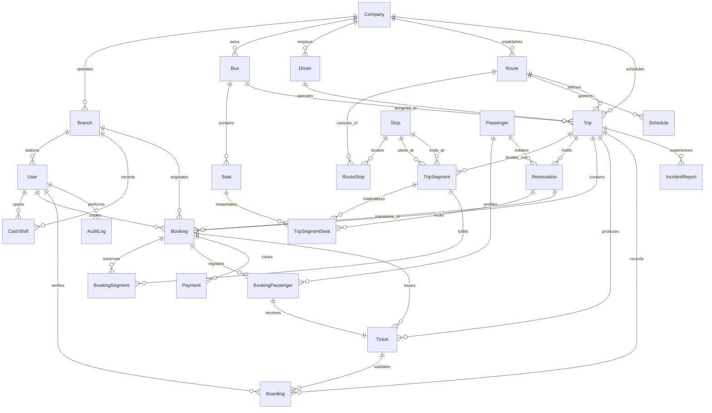
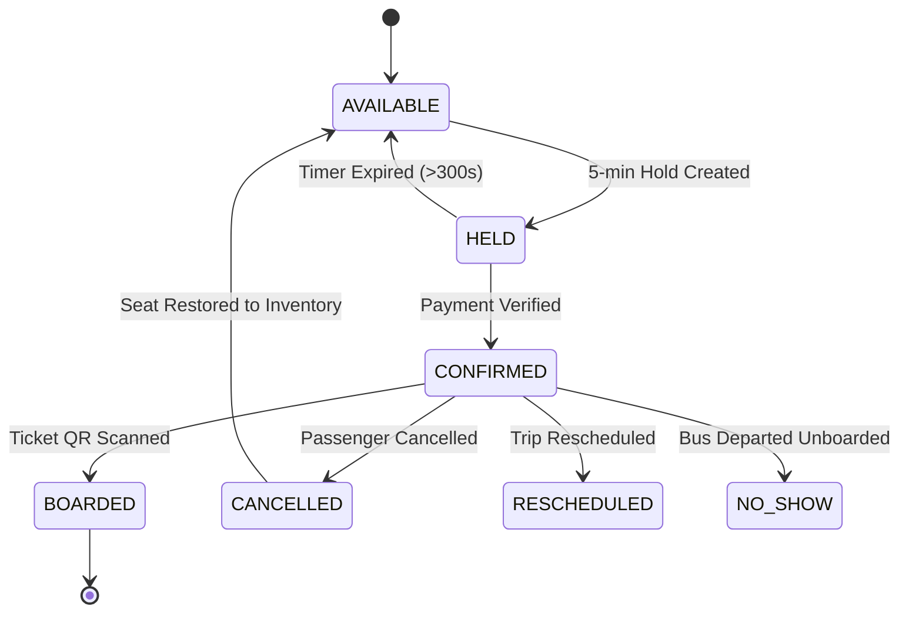

# Abyssinia Bus S.C. — Complete System Blueprint v1
**Version:** 1.0.0  
**Status:** Approved Specification  
**Architecture:** Omnichannel Single-Inventory Intercity Transport Platform  
**Target Market:** Ethiopian Intercity Transport Network (Addis Ababa, Bahir Dar, Gondar, Hawassa, Jimma, Dessie, Mekelle, Dire Dawa)

---

## Table of Contents
1. [Section A: Product Requirements & End-to-End Workflows](#section-a-product-requirements--end-to-end-workflows)
2. [Section B: Comprehensive User Roles & RBAC Matrix](#section-b-comprehensive-user-roles--rbac-matrix)
3. [Section C: Complete Feature List Across 10 Functional Pillars](#section-c-complete-feature-list-across-10-functional-pillars)
4. [Section D: Relational Database Design & Entity Relationship Diagram (ERD)](#section-d-relational-database-design--entity-relationship-diagram-erd)
5. [Section E: Authoritative API Specification](#section-e-authoritative-api-specification)
6. [Section F: Screen-by-Screen UI Structure](#section-f-screen-by-screen-ui-structure)
7. [Section G: Booking Engine & Strict Business Rules](#section-g-booking-engine--strict-business-rules)
8. [Section H: Omnichannel System Architecture & Hardware Specs](#section-h-omnichannel-system-architecture--hardware-specs)
9. [Section I: Release Scope: Production MVP vs. Phase 2/3 Roadmap](#section-i-release-scope-production-mvp-vs-phase-23-roadmap)
10. [Section J: Quality Assurance & Testing Specifications](#section-j-quality-assurance--testing-specifications)

---

# Section A: Product Requirements & End-to-End Workflows

### 1. The Core Principle
> **An agent, mobile app, and public website are different sales channels, NOT different booking systems.**

All channels query, hold, and purchase seats from the exact same central database engine. No sales channel maintains a disconnected local seat quota.

```text
Passenger Mobile App ──┐
Public Website ────────┼───► REST API Gateway ───► Central Inventory Engine ───► PostgreSQL 16
Agent Counter POS ─────┤     (NestJS 10)          (Segment Seat Matrix)         (Single Source of Truth)
Travel Agency Portal ──┘
```

---

### 2. End-to-End Customer Journey (Passenger Workflow)

```text
1. DISCOVERY & SEARCH
   • Passenger opens Mobile App or Website.
   • Selects Origin (e.g., Addis Ababa - Meskel Square Terminal) and Destination (e.g., Bahir Dar).
   • Selects Date of Travel and Number of Passengers (1-5).
   • System queries active scheduled trips with available segment seats.

2. TRIP & BUS SELECTION
   • Displays departure time, estimated arrival, bus type (e.g., Luxury 2x2 with WiFi/AC), and base fare in ETB.
   • Filters: Departure time (Morning 05:00 - 08:00 vs Afternoon), Bus Class, Price.

3. INTERACTIVE SEAT SELECTION
   • Real-time graphical layout of bus (Driver, Door, Row 1-11, Aisle, Window, Back Row).
   • Live status: AVAILABLE (Green), HELD (Yellow), SOLD/CONFIRMED (Red), BLOCKED (Grey).
   • Passenger taps available seat (e.g., Seat 12A).

4. 5-MINUTE ATOMIC SEAT HOLD
   • Backend issues atomic database lock for 300 seconds.
   • Seat turns Yellow across ALL channels instantly.
   • Countdown timer begins on passenger device.

5. PASSENGER INFORMATION CAPTURE
   • Full Name (as per Ethiopian Kebele ID / Passport).
   • Phone Number (+251 9... or +251 7...).
   • National ID / Passport Number (Mandatory for intercity checkpoint manifests).
   • Emergency Contact Name & Phone.

6. DIGITAL PAYMENT CHECKOUT
   • Direct Integration with Ethiopian Payment Providers:
     - Telebirr (In-App SDK / USSD Push / QR)
     - CBE Birr (Commercial Bank of Ethiopia direct API)
     - Chapa Gateway (Awash Bank, Bank of Abyssinia, Telebirr Web, Debit Cards)
   • Webhook / Payment Callback validates transaction reference and exact ETB amount.

7. TICKET ISSUANCE & NOTIFICATION
   • System creates Booking record (`BK-YYYYMMDD-XXXXX`).
   • Generates unique cryptographic QR code containing signed verification hash.
   • Sends SMS ticket confirmation via local SMS Gateway (Ethio Telecom Shortcode).
   • PDF E-Ticket generated for download / offline caching in mobile app.

8. TERMINAL CHECK-IN & BOARDING
   • Passenger arrives at terminal 30 minutes prior to departure.
   • Conductor / Terminal Agent scans QR code using mobile scanner.
   • Ticket marked as `BOARDED`. Passenger luggage tagged with matching luggage receipt.

9. IN-TRANSIT TRACKING & ARRIVAL
   • Bus sends live GPS coordinates every 60 seconds.
   • Passenger views live bus progress, current milestone (e.g., Debre Markos Rest Stop), and updated ETA.
   • Bus arrives at destination terminal; trip marked `COMPLETED`.
```

---

### 3. Internal Operations & Dispatch Workflow

```text
1. SCHEDULE & ROUTE PLANNING (Operations Manager)
   • Define master Routes, intermediate Stops, distance (km), and typical duration.
   • Define Schedules (e.g., Daily 05:30 AM Addis Ababa → Bahir Dar).

2. TRIP INITIALIZATION & INVENTORY MATERIALIZATION (System / Dispatcher)
   • 30 days prior to departure, Trips are automatically created from master Schedules.
   • Bus (Plate & Side Number) and certified Driver are assigned.
   • Inventory Engine auto-materializes all intermediate Trip Segments and Segment Seats.
   • Status changes from `SCHEDULED` to `OPEN` for ticketing.

3. OMNICHANNEL TICKET SALES (Agents & Online)
   • Branch ticket agents open cash drawer shift.
   • Continuous sales across mobile app, website, and physical ticket counter POS.
   • Inventory decreases in real-time.

4. PRE-DEPARTURE DISPATCH & MANIFEST (Dispatcher & Conductor)
   • 45 minutes prior: Dispatcher conducts pre-trip inspection (Tire condition, AC, Emergency kit).
   • Manifest printed/synced to Conductor device (Passenger name, seat, destination stop, luggage count).
   • Driver logs onto Driver Mobile App and conducts vehicle pre-trip checklist.

5. BOARDING & PASSENGER VERIFICATION (Conductor)
   • Conductor scans passenger QR codes at terminal gate.
   • Real-time validation checks: Valid ticket, correct trip ID, not already boarded.
   • Conductor verifies physical ID matches manifest name (Federal Transport Authority regulation).

6. DISPATCH CLEARANCE & DEPARTURE (Dispatcher)
   • Manifest closed. No-show passengers flagged and their seats released if standby passengers present.
   • Dispatcher issues digital Dispatch Clearance.
   • Driver presses "START TRIP". Trip status transitions to `IN_TRANSIT`.

7. EN-ROUTE MONITORING & INCIDENT LOGGING (Dispatcher & Driver)
   • Live GPS telemetry stream plotted on Operations Control Center map.
   • Driver logs rest stops, traffic delays, or mechanical breakdown incidents.
   • Dispatcher manages emergency bus replacement if needed.

8. TRIP COMPLETION & POST-TRIP HANDOVER
   • Bus arrives at destination terminal. Conductor confirms all passengers disembarked.
   • Driver submits ending odometer reading and fuel receipts.
   • Trip status transitions to `COMPLETED`.

9. DAILY SHIFT & BRANCH REVENUE SETTLEMENT (Finance & Branch Manager)
   • Counter agents close cash shift, count physical cash drawer, and report overage/shortage.
   • Branch Manager approves shift reconciliation.
   • Finance Officer performs daily bank deposit reconciliation against digital payment logs.
```

---

# Section B: Comprehensive User Roles & RBAC Matrix

The system enforces strict Role-Based Access Control (RBAC) across 13 distinct user roles.

| Role Code | Role Name | Primary Interface | Scope of Access | Key Responsibilities |
| :--- | :--- | :--- | :--- | :--- |
| `SUPER_ADMIN` | Super Administrator | Head Office Admin Web | Global (All Companies & Branches) | System config, global audits, database management, security policy |
| `COMPANY_OWNER`| Company Owner / CEO | Executive Dashboard Web | Global (Entire Company) | Macro KPIs, revenue, route profitability, fleet ROI, strategic decisions |
| `OPERATIONS_MGR`| Operations Manager | Admin Web Portal | Global (All Routes & Trips) | Route planning, schedule optimization, OTP analysis, capacity management |
| `DISPATCHER` | Terminal Dispatcher | Dispatch Control Web/Tablet | Assigned Branch / Terminal | Bus/driver assignment, pre-trip inspection, departure clearance, incident dispatch |
| `BRANCH_MANAGER`| Branch Manager | Branch Admin Web | Assigned Branch | Branch agent supervision, shift reconciliations, local sales oversight, terminal facilities |
| `TICKET_AGENT` | Counter Ticket Agent | Agent POS Web/Touchscreen | Assigned Branch Counter | Fast ticket sales, cash collection, ticket reprints, rebooking, shift opening/closing |
| `CONDUCTOR` | Bus Conductor | Conductor Mobile App | Assigned Active Trip | Boarding QR verification, passenger manifest verification, luggage tagging |
| `DRIVER` | Bus Driver | Driver Mobile App | Assigned Active Trip | Pre-trip checklist, start/complete trip, live GPS telemetry, incident logging |
| `FLEET_MANAGER` | Fleet Manager | Fleet & Workshop Web | Global Bus Fleet | Bus registry, inspection certifications, service intervals, tire tracking, parts |
| `MECHANIC` | Workshop Mechanic | Workshop Tablet Web | Assigned Maintenance Garage | Repair work orders, vehicle defect inspection, roadworthiness sign-off |
| `FINANCE_OFFICER`| Finance Officer | Finance Portal Web | Global / Regional Finance | Cash drawer audit, bank deposit reconciliation, refund approval, daily settlement |
| `ACCOUNTANT` | Chief Accountant | Finance Portal Web | Global Accounting | General ledger export, revenue recognition, tax (TIN) reports, channel commissions |
| `CUSTOMER_SUPPORT`| Customer Support Agent| Support Desk Web | Global Customer Lookup | Search bookings, resend SMS/PDF tickets, passenger complaints, luggage claims |
| `PASSENGER` | Passenger (Customer) | Mobile App / Public Web | Self Account & Own Bookings | Search trips, hold seats, digital payment, download QR tickets, live tracking |

---

### Detailed Permissions Matrix

```text
[A] = All / Global Scope   [B] = Branch Scope Only   [T] = Assigned Trip Only   [S] = Self / Own Data Only   [-] = No Access
```

| Feature / Action | SUPER ADMIN | OWNER | OPS MGR | DISPATCH | BR MGR | AGENT | COND | DRIVER | FLEET | MECH | FINANCE | ACCT | SUPPORT | PASSENGER |
| :--- | :---: | :---: | :---: | :---: | :---: | :---: | :---: | :---: | :---: | :---: | :---: | :---: | :---: | :---: |
| **Manage Companies & Branches** | [A] | Read | - | - | - | - | - | - | - | - | - | - | - | - |
| **Manage Users & RBAC** | [A] | Read | - | - | [B] | - | - | - | - | - | - | - | - | - |
| **Create Routes & Schedules** | [A] | Read | [A] | - | - | - | - | - | - | - | - | - | - | - |
| **Generate / Open Trips** | [A] | Read | [A] | [B] | - | - | - | - | - | - | - | - | - | - |
| **Assign Bus & Driver** | [A] | Read | [A] | [B] | - | - | - | - | - | - | - | - | - | - |
| **Clear Departure / In-Transit**| [A] | - | [A] | [B] | - | - | - | [T] | - | - | - | - | - | - |
| **View Seat Inventory** | [A] | [A] | [A] | [A] | [B] | [A] | [T] | [T] | - | - | [A] | [A] | [A] | [A] |
| **Create Reservation / Hold** | [A] | - | - | [B] | [B] | [B] | - | - | - | - | - | - | [A] | [S] |
| **Issue Counter Booking (Cash)**| [A] | - | - | - | [B] | [B] | - | - | - | - | - | - | - | - |
| **Issue Online Booking (Digital)**| [A] | - | - | - | - | - | - | - | - | - | - | - | - | [S] |
| **Scan Boarding QR Code** | [A] | - | - | [B] | [B] | [B] | [T] | - | - | - | - | - | - | - |
| **Open / Close Cash Shift** | [A] | - | - | - | [B] | [B] | - | - | - | - | [B] | - | - | - |
| **Approve Shift Reconciliation**| [A] | Read | - | - | [B] | - | - | - | - | - | [A] | [A] | - | - |
| **Process Cancellation / Refund**| [A] | - | - | - | [B] | [B] | - | - | - | - | [A] | [A] | [A] | [S] |
| **Submit Incident / Breakdown** | [A] | - | [A] | [B] | - | - | [T] | [T] | [A] | [A] | - | - | - | - |
| **Manage Bus Maintenance** | [A] | Read | - | - | - | - | - | - | [A] | [A] | - | - | - | - |
| **Live GPS Telemetry** | [A] | [A] | [A] | [A] | [B] | - | [T] | [T] | [A] | - | - | - | [A] | [S] |
| **Audit Log Explorer** | [A] | [A] | Read | - | - | - | - | - | - | - | Read | Read | - | - |

---

# Section C: Complete Feature List Across 10 Functional Pillars

### 1. Inventory & Trip Engine Pillar
* **Segment-Hop Decomposition:** Automatic division of multi-stop routes into discrete consecutive hops.
* **Overlapping Conflict Matrix:** A hold on Hop 1 & 2 locks those hops while leaving Hop 3 available.
* **Automated Materialization:** Generates exact 45/51 physical seat records mapped to every trip segment upon trip creation.
* **Atomic Hold Engine:** High-performance database lock protecting seats during passenger checkout with 300-second expiration cron.
* **Seat Map Customizer:** Support for Luxury 2x2 (45 seats) and Standard 2x3 (51 seats), including designated driver cab, door, and rear bench.

### 2. Omnichannel Booking Pillar
* **Unified Inventory Engine:** Passenger Mobile App, Web Portal, and Agent Counter share 100% identical availability.
* **National ID / Kebele Compliance:** Captures passenger legal name and identification mandatory for Ethiopian domestic travel security.
* **Integrated Payment Gateways:** Telebirr, CBE Birr, Awash Bank, Chapa, and Counter Cash.
* **Instant E-Ticket Generator:** Produces PDF tickets and compressed Base64 QR code strings with SHA-256 cryptographic signatures.
* **Multi-Passenger Booking:** Single booking supporting up to 5 individual passenger tickets with dedicated seat assignments.

### 3. Agent & Terminal Counter POS Pillar
* **Sub-2-Minute Booking Workflow:** Optimized keyboard shortcuts and rapid search designed for busy terminal ticket windows.
* **Cash Drawer Tender Calculator:** Calculates cash received, exact change due in ETB, and prints receipt immediately.
* **ESC/POS Thermal Receipt Printing:** Native 58mm and 80mm thermal receipt output for low-cost, high-speed terminal printing.
* **A4 Formal Ticket Printing:** Standard format with company letterhead, tax invoice details, and passenger terms.
* **Ticket Reprint & Duplicate Safeguards:** Reprints watermarked "DUPLICATE COPY" with supervisor audit logging.

### 4. Dispatch & Terminal Operations Pillar
* **Daily Terminal Departure Board:** Real-time departures board listing bus plate, driver, gate, passenger count, and departure status.
* **Pre-Trip Safety Inspection:** Digital checklist covering tire tread, brakes, fire extinguisher, first aid kit, and speed governor.
* **Bus & Driver Reassignment Engine:** Instant reassignment in case of driver absence or vehicle defect before boarding opens.
* **Departure Clearance Stamp:** Prevents bus from moving without official digital clearance from the terminal dispatcher.
* **Standby Passenger Seat Allocation:** Automatically releases unpaid/no-show seats 15 minutes before departure to waiting standby passengers.

### 5. Conductor Boarding & Luggage Pillar
* **High-Speed Camera QR Scanner:** Validates ticket in under 400 milliseconds on offline-capable Android devices.
* **Duplicate Boarding Prevention:** Instantly triggers audio-visual alarm if a ticket QR is scanned more than once.
* **Passenger Manifest Reconciliation:** Real-time summary showing total booked, total boarded, and missing passengers.
* **Baggage & Luggage Tagging:** Issues alphanumeric luggage tags linked to passenger booking reference with excess luggage fee calculation.

### 6. Driver App & Live Telemetry Pillar
* **Driver Duty Dashboard:** Displays scheduled trips, route milestones, assigned bus details, and terminal contacts.
* **Digital Vehicle Pre-Trip Handover:** Driver confirms vehicle condition before departure.
* **Automated GPS Telemetry:** Streams location, speed, and heading every 60 seconds to operations center.
* **Incident & Delay Reporter:** One-tap logging for police checkpoints, tire punctures, road closures, or mechanical faults.
* **Trip Completion Log:** Final odometer recording, arrival timestamp, and fuel consumption entry.

### 7. Fleet Management & Workshop Maintenance Pillar
* **Master Vehicle Registry:** Side numbers, plate numbers, chassis numbers, insurance expiry, and transport authority permits.
* **Preventative Maintenance Scheduler:** Service interval triggers based on mileage (e.g., oil change every 5,000 km, brake check every 15,000 km).
* **Workshop Work Orders:** Mechanics record defect diagnosis, parts replaced, labor hours, and roadworthiness certification.
* **Tire Lifecycle Tracker:** Serial number tracking for all 6 bus tires measuring tread wear and replacement cycles.

### 8. Cash Drawer & Financial Settlement Pillar
* **Agent Shift Management:** Mandatory opening cash declaration, continuous sales tally, and shift closing cash reconciliation.
* **Cash Discrepancy Auditing:** Automatic calculation of cash overage/shortage with required agent explanation notes.
* **Branch Daily Settlement:** Consolidation of all branch counter drawers into a daily bank deposit slip signed by Branch Manager.
* **Accountant Reconciliation Desk:** Direct cross-matching of Telebirr/CBE payment gateway settlement statements with backend booking records.
* **Tiered Refund & Cancellation Engine:** Automated calculation of cancellation penalties based on departure countdown rules.

### 9. Customer Support & Notification Pillar
* **360-Degree Booking Lookup:** Instant retrieval of customer records by Booking Ref, Ticket Number, Phone, Name, or ID Number.
* **Automated SMS Notifications:** Departure reminders sent 24 hours and 2 hours prior; delay broadcast SMS if departure delayed >30 mins.
* **Lost Luggage Tracking Registry:** Claims management system linking passenger ticket to reported missing baggage items.
* **Rescheduling Desk:** Allows passengers to move their booking to a future date with automatic fare difference calculation.

### 10. Executive Analytics & Security Pillar
* **Executive Performance Dashboard:** Real-time visibility into company-wide gross revenue, load factors, and revenue per kilometer (RPKM).
* **Route Profitability Analysis:** Identifies highest margin corridors (e.g., Addis-Hawassa vs. Addis-Bahir Dar).
* **Immutable Audit Trail:** All critical operations (seat changes, cancellations, manual discounts, refunds) logged with user ID and timestamp.
* **Granular Role-Based Security:** Prevents cross-branch data leaks while allowing Head Office consolidated visibility.

---

# Section D: Relational Database Design & Entity Relationship Diagram (ERD)

### 1. Visual Entity Relationship Diagram (Mermaid)



---

### 2. Comprehensive Data Dictionary & Schema Specification

#### A. Multi-Tenant Core: `Company` & `Branch`
```sql
CREATE TABLE "Company" (
    "id"                  TEXT PRIMARY KEY,
    "legalName"           TEXT NOT NULL,
    "legalNameAm"         TEXT NOT NULL, -- Amharic script name
    "tradeName"           TEXT NOT NULL,
    "tinNumber"           TEXT UNIQUE NOT NULL, -- Ethiopian Tax Identification Number
    "commercialRegNo"     TEXT NOT NULL,
    "headquartersAddress" TEXT NOT NULL,
    "headquartersPhone"   TEXT NOT NULL,
    "supportEmail"        TEXT NOT NULL,
    "websiteUrl"          TEXT,
    "createdAt"           TIMESTAMP(3) NOT NULL DEFAULT CURRENT_TIMESTAMP,
    "updatedAt"           TIMESTAMP(3) NOT NULL
);

CREATE TABLE "Branch" (
    "id"           TEXT PRIMARY KEY,
    "companyId"    TEXT NOT NULL REFERENCES "Company"("id") ON DELETE RESTRICT,
    "nameEn"       TEXT NOT NULL,
    "nameAm"       TEXT NOT NULL,
    "city"         TEXT NOT NULL,
    "terminalArea" TEXT NOT NULL, -- e.g., "Autobus Tera", "Meskel Square", "Kality"
    "phone"        TEXT NOT NULL,
    "address"      TEXT NOT NULL,
    "managerName"  TEXT,
    "createdAt"    TIMESTAMP(3) NOT NULL DEFAULT CURRENT_TIMESTAMP
);
CREATE INDEX "idx_branch_company" ON "Branch"("companyId");
```

#### B. Identity & Access: `User` & `CashShift`
```sql
CREATE TABLE "User" (
    "id"           TEXT PRIMARY KEY,
    "email"        TEXT UNIQUE NOT NULL,
    "passwordHash" TEXT NOT NULL,
    "fullName"     TEXT NOT NULL,
    "phone"        TEXT NOT NULL,
    "role"         TEXT NOT NULL, -- SUPER_ADMIN, BRANCH_MANAGER, TICKET_AGENT, DISPATCHER, CONDUCTOR, etc.
    "branchId"     TEXT REFERENCES "Branch"("id") ON DELETE SET NULL,
    "active"       BOOLEAN NOT NULL DEFAULT TRUE,
    "createdAt"    TIMESTAMP(3) NOT NULL DEFAULT CURRENT_TIMESTAMP,
    "updatedAt"    TIMESTAMP(3) NOT NULL
);

CREATE TABLE "CashShift" (
    "id"                    TEXT PRIMARY KEY,
    "agentId"               TEXT NOT NULL REFERENCES "User"("id"),
    "branchId"              TEXT NOT NULL REFERENCES "Branch"("id"),
    "openedAt"              TIMESTAMP(3) NOT NULL DEFAULT CURRENT_TIMESTAMP,
    "closedAt"              TIMESTAMP(3),
    "openingCashETB"        DOUBLE PRECISION NOT NULL DEFAULT 0,
    "cashSalesETB"          DOUBLE PRECISION NOT NULL DEFAULT 0,
    "ticketsCount"          INTEGER NOT NULL DEFAULT 0,
    "cancelledTicketsCount" INTEGER NOT NULL DEFAULT 0,
    "refundsETB"            DOUBLE PRECISION NOT NULL DEFAULT 0,
    "status"                TEXT NOT NULL DEFAULT 'OPEN', -- OPEN | CLOSED | RECONCILED
    "notes"                 TEXT
);
CREATE INDEX "idx_cashshift_agent" ON "CashShift"("agentId");
CREATE INDEX "idx_cashshift_branch" ON "CashShift"("branchId");
```

#### C. Fleet & Seating: `Bus` & `Seat`
```sql
CREATE TABLE "Bus" (
    "id"          TEXT PRIMARY KEY,
    "companyId"   TEXT NOT NULL REFERENCES "Company"("id"),
    "plateNumber" TEXT UNIQUE NOT NULL, -- e.g., "ET-3-A12345"
    "sideNumber"  TEXT UNIQUE NOT NULL, -- e.g., "SB-023"
    "busModel"    TEXT NOT NULL,        -- e.g., "Yutong ZK6122H", "Zhongtong Navigator"
    "busType"     TEXT NOT NULL,        -- LUXURY_2X2 | STANDARD_2X3
    "totalSeats"  INTEGER NOT NULL DEFAULT 45,
    "amenities"   TEXT NOT NULL DEFAULT 'AC,WiFi,Reclining Seats,Charging Ports',
    "status"      TEXT NOT NULL DEFAULT 'AVAILABLE', -- AVAILABLE, ASSIGNED, MAINTENANCE, OUT_OF_SERVICE
    "createdAt"   TIMESTAMP(3) NOT NULL DEFAULT CURRENT_TIMESTAMP
);

CREATE TABLE "Seat" (
    "id"           TEXT PRIMARY KEY,
    "busId"        TEXT NOT NULL REFERENCES "Bus"("id") ON DELETE CASCADE,
    "seatNumber"   TEXT NOT NULL,        -- e.g., "01A", "12D"
    "row"          INTEGER NOT NULL,
    "column"       INTEGER NOT NULL,
    "columnLetter" TEXT NOT NULL,        -- "A", "B", "C", "D"
    "isWindow"     BOOLEAN NOT NULL DEFAULT FALSE,
    "isAisle"      BOOLEAN NOT NULL DEFAULT FALSE,
    "isBackRow"    BOOLEAN NOT NULL DEFAULT FALSE,
    "status"       TEXT NOT NULL DEFAULT 'AVAILABLE',
    "active"       BOOLEAN NOT NULL DEFAULT TRUE,
    CONSTRAINT "uq_bus_seat" UNIQUE ("busId", "seatNumber")
);
```

#### D. Routes, Stops & Schedules
```sql
CREATE TYPE "StopType" AS ENUM ('TERMINAL', 'STATION', 'CHECKPOINT', 'REST_STOP');

CREATE TABLE "Stop" (
    "id"        TEXT PRIMARY KEY,
    "companyId" TEXT NOT NULL REFERENCES "Company"("id"),
    "name"      TEXT NOT NULL,
    "code"      TEXT NOT NULL, -- "ADD", "BHR", "GDR", "HAW", "JMA"
    "city"      TEXT,
    "address"   TEXT,
    "latitude"  DECIMAL(10, 7),
    "longitude" DECIMAL(10, 7),
    "type"      "StopType" NOT NULL DEFAULT 'TERMINAL',
    "status"    TEXT NOT NULL DEFAULT 'ACTIVE',
    CONSTRAINT "uq_company_stop_code" UNIQUE ("companyId", "code")
);

CREATE TABLE "Route" (
    "id"                   TEXT PRIMARY KEY,
    "companyId"            TEXT NOT NULL REFERENCES "Company"("id"),
    "originStopId"         TEXT NOT NULL REFERENCES "Stop"("id"),
    "destinationStopId"    TEXT NOT NULL REFERENCES "Stop"("id"),
    "routeCode"            TEXT NOT NULL, -- e.g., "RT-ADD-BHR"
    "distanceKm"           DECIMAL(10, 2),
    "estimatedDurationMin" INTEGER,
    "status"               TEXT NOT NULL DEFAULT 'ACTIVE',
    CONSTRAINT "uq_company_route_code" UNIQUE ("companyId", "routeCode")
);

CREATE TABLE "RouteStop" (
    "id"             TEXT PRIMARY KEY,
    "routeId"        TEXT NOT NULL REFERENCES "Route"("id") ON DELETE CASCADE,
    "stopId"         TEXT NOT NULL REFERENCES "Stop"("id"),
    "sequenceNumber" INTEGER NOT NULL,
    "distanceKm"     DECIMAL(10, 2),
    "durationMin"    INTEGER,
    CONSTRAINT "uq_route_sequence" UNIQUE ("routeId", "sequenceNumber")
);

CREATE TABLE "Schedule" (
    "id"            TEXT PRIMARY KEY,
    "routeId"       TEXT NOT NULL REFERENCES "Route"("id"),
    "departureTime" TEXT NOT NULL, -- "05:00 AM"
    "daysOfWeek"    TEXT NOT NULL DEFAULT 'DAILY',
    "status"        TEXT NOT NULL DEFAULT 'ACTIVE'
);
```

#### E. Master Inventory Engine: `Trip`, `TripSegment`, & `TripSegmentSeat`
```sql
CREATE TABLE "Trip" (
    "id"                 TEXT PRIMARY KEY,
    "companyId"          TEXT NOT NULL REFERENCES "Company"("id"),
    "routeId"            TEXT NOT NULL REFERENCES "Route"("id"),
    "scheduleId"         TEXT REFERENCES "Schedule"("id"),
    "busId"              TEXT NOT NULL REFERENCES "Bus"("id"),
    "driverId"           TEXT REFERENCES "Driver"("id"),
    "tripDate"           TIMESTAMP(3) NOT NULL,
    "scheduledDeparture" TIMESTAMP(3) NOT NULL,
    "scheduledArrival"   TIMESTAMP(3),
    "price"              DOUBLE PRECISION NOT NULL,
    "status"             TEXT NOT NULL DEFAULT 'SCHEDULED', -- SCHEDULED | OPEN | IN_TRANSIT | COMPLETED | CANCELLED
    "delayReason"        TEXT,
    "delayMinutes"       INTEGER DEFAULT 0,
    "currentLatitude"    DOUBLE PRECISION,
    "currentLongitude"   DOUBLE PRECISION,
    "currentSpeedKmH"    DOUBLE PRECISION,
    "currentMilestone"   TEXT,
    "lastGpsPingAt"      TIMESTAMP(3),
    "createdAt"          TIMESTAMP(3) NOT NULL DEFAULT CURRENT_TIMESTAMP,
    "updatedAt"          TIMESTAMP(3) NOT NULL
);
CREATE INDEX "idx_trip_lookup" ON "Trip"("companyId", "routeId", "tripDate");

CREATE TABLE "TripSegment" (
    "id"                 TEXT PRIMARY KEY,
    "tripId"             TEXT NOT NULL REFERENCES "Trip"("id") ON DELETE CASCADE,
    "fromStopId"         TEXT NOT NULL REFERENCES "Stop"("id"),
    "toStopId"           TEXT NOT NULL REFERENCES "Stop"("id"),
    "sequenceNumber"     INTEGER NOT NULL,
    "scheduledDeparture" TIMESTAMP(3),
    "scheduledArrival"   TIMESTAMP(3),
    CONSTRAINT "uq_trip_segment_seq" UNIQUE ("tripId", "sequenceNumber")
);

CREATE TABLE "TripSegmentSeat" (
    "id"            TEXT PRIMARY KEY,
    "tripSegmentId" TEXT NOT NULL REFERENCES "TripSegment"("id") ON DELETE CASCADE,
    "busSeatId"     TEXT NOT NULL REFERENCES "Seat"("id"),
    "status"        TEXT NOT NULL DEFAULT 'AVAILABLE', -- AVAILABLE | HELD | BOOKED | BLOCKED
    "reservationId" TEXT,
    "heldUntil"     TIMESTAMP(3),
    "createdAt"     TIMESTAMP(3) NOT NULL DEFAULT CURRENT_TIMESTAMP,
    "updatedAt"     TIMESTAMP(3) NOT NULL,
    CONSTRAINT "uq_segment_seat" UNIQUE ("tripSegmentId", "busSeatId")
);
CREATE INDEX "idx_segment_seat_status" ON "TripSegmentSeat"("tripSegmentId", "status");
```

#### F. Booking, Passengers, Payments & Boarding
```sql
CREATE TABLE "Reservation" (
    "id"          TEXT PRIMARY KEY,
    "tripId"      TEXT NOT NULL REFERENCES "Trip"("id"),
    "passengerId" TEXT,
    "status"      TEXT NOT NULL DEFAULT 'ACTIVE', -- ACTIVE | EXPIRED | CONFIRMED | CANCELLED
    "expiresAt"   TIMESTAMP(3) NOT NULL,
    "createdAt"   TIMESTAMP(3) NOT NULL DEFAULT CURRENT_TIMESTAMP
);

CREATE TABLE "Booking" (
    "id"               TEXT PRIMARY KEY,
    "bookingReference" TEXT UNIQUE NOT NULL, -- e.g., "BK-20261005-00125"
    "tripId"           TEXT NOT NULL REFERENCES "Trip"("id"),
    "reservationId"    TEXT,
    "customerName"     TEXT NOT NULL,
    "customerPhone"    TEXT NOT NULL,
    "customerEmail"    TEXT,
    "bookedByUserId"   TEXT REFERENCES "User"("id"),
    "bookedByRole"     TEXT NOT NULL DEFAULT 'PASSENGER',
    "branchId"         TEXT REFERENCES "Branch"("id"),
    "totalAmountETB"   DOUBLE PRECISION NOT NULL,
    "paymentStatus"    TEXT NOT NULL DEFAULT 'PENDING', -- PENDING | PAID | REFUNDED
    "createdAt"        TIMESTAMP(3) NOT NULL DEFAULT CURRENT_TIMESTAMP,
    "updatedAt"        TIMESTAMP(3) NOT NULL
);

CREATE TABLE "BookingSegment" (
    "id"            TEXT PRIMARY KEY,
    "bookingId"     TEXT NOT NULL REFERENCES "Booking"("id") ON DELETE CASCADE,
    "tripSegmentId" TEXT NOT NULL REFERENCES "TripSegment"("id"),
    CONSTRAINT "uq_booking_segment" UNIQUE ("bookingId", "tripSegmentId")
);

CREATE TABLE "BookingPassenger" (
    "id"                TEXT PRIMARY KEY,
    "bookingId"         TEXT NOT NULL REFERENCES "Booking"("id") ON DELETE CASCADE,
    "passengerId"       TEXT,
    "seatNumber"        TEXT NOT NULL,
    "passengerName"     TEXT NOT NULL,
    "passengerPhone"    TEXT NOT NULL,
    "passengerIdNumber" TEXT NOT NULL
);

CREATE TABLE "Payment" (
    "id"                   TEXT PRIMARY KEY,
    "bookingId"            TEXT NOT NULL REFERENCES "Booking"("id") ON DELETE CASCADE,
    "amountETB"            DOUBLE PRECISION NOT NULL,
    "paymentMethod"        TEXT NOT NULL, -- CASH | TELEBIRR | CBE_BIRR | AWASH_BIRR | CHAPA_GATEWAY
    "transactionReference" TEXT,
    "cashTenderedETB"      DOUBLE PRECISION,
    "changeReturnedETB"    DOUBLE PRECISION,
    "status"               TEXT NOT NULL DEFAULT 'COMPLETED',
    "paidAt"               TIMESTAMP(3) NOT NULL DEFAULT CURRENT_TIMESTAMP
);

CREATE TABLE "Ticket" (
    "id"                 TEXT PRIMARY KEY,
    "ticketNumber"       TEXT UNIQUE NOT NULL, -- e.g., "TCK-20261005-0125-01"
    "bookingId"          TEXT NOT NULL REFERENCES "Booking"("id"),
    "bookingPassengerId" TEXT UNIQUE REFERENCES "BookingPassenger"("id"),
    "tripId"             TEXT NOT NULL REFERENCES "Trip"("id"),
    "seatNumber"         TEXT NOT NULL,
    "passengerName"      TEXT NOT NULL,
    "passengerPhone"     TEXT NOT NULL,
    "passengerIdNumber"  TEXT NOT NULL,
    "fareETB"            DOUBLE PRECISION NOT NULL,
    "qrHash"             TEXT UNIQUE NOT NULL,
    "status"             TEXT NOT NULL DEFAULT 'ISSUED', -- ISSUED | BOARDED | NO_SHOW | CANCELLED
    "boardedAt"          TIMESTAMP(3),
    "boardingTerminal"   TEXT,
    "dropoffTerminal"    TEXT,
    "createdAt"          TIMESTAMP(3) NOT NULL DEFAULT CURRENT_TIMESTAMP
);

CREATE TABLE "Boarding" (
    "id"               TEXT PRIMARY KEY,
    "ticketId"         TEXT NOT NULL REFERENCES "Ticket"("id"),
    "tripId"           TEXT NOT NULL REFERENCES "Trip"("id"),
    "conductorId"      TEXT REFERENCES "User"("id"),
    "scannedAt"        TIMESTAMP(3) NOT NULL DEFAULT CURRENT_TIMESTAMP,
    "terminalLocation" TEXT,
    "status"           TEXT NOT NULL DEFAULT 'APPROVED'
);
```

---

# Section E: Authoritative API Specification

All endpoints are prefixed with `/api/v1` and communicate via JSON over HTTPS. Authenticated endpoints require a standard `Authorization: Bearer <JWT>` header.

### 1. Trip Search: `GET /api/v1/trips`
* **Purpose:** Queries available trips between origin and destination stops for a travel date.
* **Access:** Public (App, Web, Counter Agent).
* **Query Parameters:**
  - `originStopId` (string, required): CUID of departure terminal (e.g., Addis Ababa).
  - `destinationStopId` (string, required): CUID of arrival terminal (e.g., Bahir Dar).
  - `travelDate` (string, required, ISO 8601 YYYY-MM-DD): Date of journey.
  - `passengers` (integer, optional, default: 1): Minimum contiguous seats required.
* **Validation:** Date cannot be in the past. Stops must belong to the active company.
* **Business Logic:**
  1. Identifies all Routes containing both stops in correct sequential order (`originSeq < destSeq`).
  2. Queries all `OPEN` Trips on that date matching those routes.
  3. Calculates available seats by evaluating segment seat states across the requested hop span.
* **Success Response (200 OK):**
```json
{
  "success": true,
  "count": 2,
  "data": [
    {
      "tripId": "trip_clx102938475",
      "route": {
        "code": "RT-ADD-BHR",
        "origin": "Addis Ababa (Meskel Square)",
        "destination": "Bahir Dar Central"
      },
      "bus": {
        "sideNumber": "SB-023",
        "plateNumber": "ET-3-A99102",
        "busType": "LUXURY_2X2",
        "amenities": ["AC", "WiFi", "Charging Ports"]
      },
      "departureTime": "2026-10-05T05:00:00.000Z",
      "estimatedArrivalTime": "2026-10-05T14:30:00.000Z",
      "fareETB": 850.00,
      "availableSeats": 18,
      "totalSeats": 45
    }
  ]
}
```

---

### 2. Live Seat Map: `GET /api/v1/trips/:id/seats`
* **Purpose:** Returns the complete graphical bus seat layout with real-time seat availability for the requested journey span.
* **Access:** Public.
* **Query Parameters:** `fromStopId` (string, required), `toStopId` (string, required).
* **Business Logic:**
  1. Retrieves all segments bridging `fromStopId` and `toStopId`.
  2. A seat is marked `AVAILABLE` only if it is `AVAILABLE` on **every** traversed segment.
  3. If held or booked on even one segment in the span, returns `HELD` or `BOOKED`.
* **Success Response (200 OK):**
```json
{
  "success": true,
  "tripId": "trip_clx102938475",
  "busLayout": {
    "type": "LUXURY_2X2",
    "totalRows": 11,
    "columns": ["A", "B", "C", "D"],
    "driverPosition": "FRONT_LEFT",
    "doorPosition": "FRONT_RIGHT"
  },
  "seats": [
    {
      "seatNumber": "01A",
      "row": 1,
      "column": 1,
      "columnLetter": "A",
      "isWindow": true,
      "status": "AVAILABLE"
    },
    {
      "seatNumber": "01B",
      "row": 1,
      "column": 2,
      "columnLetter": "B",
      "isAisle": true,
      "status": "BOOKED"
    },
    {
      "seatNumber": "02A",
      "row": 2,
      "column": 1,
      "columnLetter": "A",
      "isWindow": true,
      "status": "HELD",
      "heldUntil": "2026-10-05T05:04:12.000Z"
    }
  ]
}
```

---

### 3. Create Seat Hold: `POST /api/v1/reservations`
* **Purpose:** Atomically locks 1 to 5 seats for 300 seconds to prevent double booking.
* **Access:** Public or Authenticated (User/Agent).
* **Request Body:**
```json
{
  "tripId": "trip_clx102938475",
  "fromStopId": "stop_addis",
  "toStopId": "stop_bahirdar",
  "seatNumbers": ["12A", "12B"],
  "passengerPhone": "+251911223344"
}
```
* **Business Logic:**
  1. Executes inside a strict PostgreSQL serializable/pessimistic transaction.
  2. Queries all `TripSegmentSeat` records for seats across target segments.
  3. Verifies every seat has `status == 'AVAILABLE'`.
  4. Updates records to `status = 'HELD'`, `heldUntil = NOW() + INTERVAL '300 SECONDS'`.
  5. Creates `Reservation` record with 5-minute expiration timestamp.
* **Error Response (409 Conflict):**
```json
{
  "success": false,
  "error": "SEAT_UNAVAILABLE",
  "message": "Seat 12A was just reserved by another passenger. Please select another seat."
}
```

---

### 4. Confirm Booking & Payment: `POST /api/v1/bookings`
* **Purpose:** Finalizes reservation into confirmed booking and issues tickets upon verified payment.
* **Access:** Authenticated Agent (Cash) or System Payment Webhook (Telebirr/CBE/Chapa).
* **Request Body (Counter Agent Cash):**
```json
{
  "reservationId": "res_clx8812938",
  "paymentMethod": "CASH",
  "cashTenderedETB": 1000.00,
  "passengers": [
    {
      "seatNumber": "12A",
      "fullName": "Abebe Bikila",
      "phone": "+251911002233",
      "idNumber": "ETH-KB-991204"
    }
  ]
}
```
* **Business Logic:**
  1. Validates reservation is still `ACTIVE` and `expiresAt > NOW()`.
  2. Calculates base fare, discounts, and confirms change: `1000 - 850 = 150 ETB`.
  3. Creates `Booking` record with reference `BK-20261005-00125`.
  4. Generates unique Ticket with HMAC-SHA256 signature for QR code.
  5. Transitions `TripSegmentSeat` status to `BOOKED`.
  6. Increments active agent `CashShift` cash balance and ticket count.
* **Success Response (201 Created):**
```json
{
  "success": true,
  "booking": {
    "bookingReference": "BK-20261005-00125",
    "totalAmountETB": 850.00,
    "changeReturnedETB": 150.00,
    "paymentStatus": "PAID"
  },
  "tickets": [
    {
      "ticketNumber": "TCK-20261005-0125-01",
      "seatNumber": "12A",
      "passengerName": "Abebe Bikila",
      "qrHash": "8f3b49e2a71c8901f4c718b9d3e5f2a1...",
      "qrPayload": "ABYSSINIA:TCK-20261005-0125-01:12A:8f3b49e2"
    }
  ]
}
```

---

### 5. Boarding QR Verification: `POST /api/v1/boarding/scan`
* **Purpose:** Validates passenger QR code at bus door and records boarding event.
* **Access:** Conductor or Dispatcher (`CONDUCTOR`, `DISPATCHER`, `TICKET_AGENT`).
* **Request Body:**
```json
{
  "qrHash": "8f3b49e2a71c8901f4c718b9d3e5f2a1...",
  "tripId": "trip_clx102938475",
  "terminalLocation": "Addis Ababa Gate 3"
}
```
* **Business Logic:**
  1. Finds `Ticket` matching `qrHash`.
  2. Rejects if `ticket.tripId != request.tripId` $\to$ `400 INVALID_TRIP`.
  3. Rejects if `ticket.status == 'BOARDED'` $\to$ `409 ALREADY_BOARDED`.
  4. Rejects if `ticket.status == 'CANCELLED'` $\to$ `400 TICKET_CANCELLED`.
  5. Updates `ticket.status = 'BOARDED'`, records `Boarding` timestamp with conductor ID.
* **Success Response (200 OK):**
```json
{
  "success": true,
  "status": "APPROVED",
  "message": "Passenger Cleared for Boarding",
  "passenger": {
    "name": "Abebe Bikila",
    "seatNumber": "12A",
    "ticketNumber": "TCK-20261005-0125-01",
    "destination": "Bahir Dar"
  }
}
```

---

# Section F: Screen-by-Screen UI Structure

### 1. Passenger Mobile App (Flutter — iOS & Android)

```text
[Screen 1.0] Splash & Language Selection (Amharic / English / Oromo)
      │
[Screen 2.0] Home & Search (Origin, Destination, Date, Passenger Count)
      │
[Screen 3.0] Trip Search Results (Departure Time, Bus Type, Available Seats, Price)
      │
[Screen 4.0] Bus Seat Selection Map (Live 2x2 or 2x3 Grid with 5-min Hold Timer)
      │
[Screen 5.0] Passenger Information Form (Full Name, Phone, Kebele ID/Passport)
      │
[Screen 6.0] Payment Checkout (Telebirr SDK / CBE Birr / Chapa / Awash)
      │
[Screen 7.0] Booking Confirmed & Digital E-Ticket (Cryptographic QR, PDF Download, SMS Copy)
      │
[Screen 8.0] "My Trips" Dashboard & Offline Ticket Wallet (Cached QR for offline gate scan)
      │
[Screen 9.0] Live Trip Radar (Real-time GPS tracking of bus en route, milestones, ETA)
```

---

### 2. Agent Counter POS Terminal (Next.js / TypeScript Desktop Web)

```text
┌────────────────────────────────────────────────────────────────────────┐
│ ABYSSINIA BUS S.C. — COUNTER POS v1.0         Branch: Addis Ababa (HQ) │
│ Agent: Hana Kebede [Active Shift #SH-00412]    Cash in Drawer: 42,500 ETB│
├────────────────────────────────────────────────────────────────────────┤
│ [1. Fast Search]   Origin: [ Addis Ababa   ▼ ] Dest: [ Bahir Dar    ▼ ] │
│                    Date:   [ 05 Oct 2026   ▼ ] Pax:  [ 1            ▼ ] │
├────────────────────────────────────────────────────────────────────────┤
│ [2. Trips Today]                                                       │
│  • 05:00 AM  Addis → Bahir Dar | Bus: SB-023 (Luxury) | 18 Left | 850 ETB│
│  • 06:00 AM  Addis → Bahir Dar | Bus: SB-045 (Std)    | 04 Left | 750 ETB│
├────────────────────────────────────────────────────────────────────────┤
│ [3. Interactive Seat Matrix]                                           │
│       FRONT: [ DRIVER ]  [ DOOR ]                                      │
│       Row 1: [01A-Sold] [01B-Sold]     [01C-Avail] [01D-Avail]         │
│       Row 2: [02A-Hold] [02B-Avail]    [02C-Avail] [02D-Avail]         │
│       Row 3: [03A-SELECTED] [03B-Avail]                                │
├────────────────────────────────────────────────────────────────────────┤
│ [4. Passenger Entry & Cash Drawer Calculation]                         │
│  Seat: 03A   Name: [ Dawit Mengistu       ] Phone: [ 0911445566      ] │
│  ID: [ ETH-AA-88129          ] Nationality: [ Ethiopian            ▼ ] │
│                                                                        │
│  Base Fare:     850.00 ETB                                             │
│  Tendered Cash: [ 1000.00  ] ETB                                       │
│  CHANGE DUE:    150.00 ETB  <=== (HIGHLIGHTED GREEN)                   │
├────────────────────────────────────────────────────────────────────────┤
│  [ F1: ISSUE & PRINT THERMAL ]   [ F2: PRINT A4 ]   [ F3: CANCEL/RESET ] │
└────────────────────────────────────────────────────────────────────────┘
```

---

### 3. Conductor Boarding Scanner App (Flutter Android)

```text
┌──────────────────────────────────────┐
│  BOARDING RADAR — TRIP #501          │
│  Addis Ababa → Bahir Dar (05:00 AM)  │
├──────────────────────────────────────┤
│  Boarded: 41 / 45     Remaining: 4   │
├──────────────────────────────────────┤
│                                      │
│      [ CAMERA VIEWFINDER ]           │
│         Align Ticket QR              │
│                                      │
├──────────────────────────────────────┤
│  RESULT DISPLAY:                     │
│  ✓ CLEARED FOR BOARDING              │
│  Passenger: Dawit Mengistu           │
│  Seat: 03A                           │
│  Luggage Tags: 2 Pieces (#TAG-0812)  │
│                                      │
│  [ CONFIRM PASSENGER ONBOARD ]       │
└──────────────────────────────────────┘
```

---

### 4. Operations Control & Dispatch Center (Admin Web)

* **Daily Master Departure Board:** High-density live table displaying scheduled departure times, bus registration numbers, designated drivers, passenger loads, and real-time status (`ON_TIME`, `DELAYED`, `BOARDING`, `DEPARTED`).
* **Bus & Driver Dispatch Modal:** Drag-and-drop assignment panel with conflict detection (prevents assigning an off-duty or double-booked driver).
* **Live GPS Fleet Map:** Mapbox/Leaflet vector map displaying real-time vehicle positions, speed alerts, and route deviation warnings across all Ethiopian highways.
* **Incident & Delay Command Center:** Operational alerts panel handling breakdowns, police checkpoints, or severe weather with emergency bus substitution triggers.

---

### 5. Finance & Branch Settlement Portal (Admin Web)

* **Shift Drawer Reconciliation Desk:** Allows Branch Managers and Accountants to review agent opening cash, total cash collected, digital payments, refunds, and cash in hand.
* **Daily Settlement Slip Generator:** Formal audit document certifying cash handover to security couriers / bank deposit.
* **Payment Gateway Reconciliation View:** Auto-reconciles bank transaction references against internal booking references, flagging unmatched items.

---

# Section G: Booking Engine & Strict Business Rules

### 1. The Seat Lifecycle State Machine



---

### 2. Concurrency & Zero Double Booking Guarantee
* **The Invariant:** It must be physically impossible for two passengers on different devices or ticket counters to purchase or hold the same physical seat for the same trip segment.
* **Implementation Mechanism:**
  1. In PostgreSQL, seat hold execution uses:
     ```sql
     SELECT * FROM "TripSegmentSeat"
     WHERE "tripSegmentId" = $1 AND "busSeatId" = $2
     FOR UPDATE;
     ```
  2. A memory-level atomic distributed lock (Redis / Node atomic mutex) keyed by `tripId:seatNumber` acts as the first line of defense.
  3. If another transaction holds the lock, subsequent requests immediately abort with a `409 Conflict` error in under 15ms.

---

### 3. Ethiopian Intercity Cancellation & Refund Policy
The platform implements standard Ethiopian Federal Transport regulatory rules:

| Time Before Departure | Permitted Action | Refund Amount | Penalty / Fee |
| :--- | :--- | :---: | :---: |
| **> 24 Hours** | Full Cancellation | 90% Refund | 10% Administrative Fee |
| **12 to 24 Hours** | Cancellation | 75% Refund | 25% Cancellation Fee |
| **2 to 12 Hours** | Emergency Cancellation | 50% Refund | 50% Late Cancellation Fee |
| **< 2 Hours** | Lockout | 0% (No Refund) | 100% Forfeited |
| **Post-Departure** | No-Show | 0% (No Refund) | Seat re-allocated |

---

### 4. Rescheduling Policy
* Permitted up to 6 hours before scheduled departure.
* Origin and Destination must remain identical.
* **Price Adjustment:**
  - If New Trip Fare > Old Fare: Passenger pays the difference + 50 ETB rebooking fee.
  - If New Trip Fare < Old Fare: Difference issued as a company travel voucher credit (non-cash).

---

### 5. Emergency Bus Replacement Workflow
If Bus `A` experiences mechanical failure:
1. Dispatcher selects `Trip` and triggers **Emergency Bus Replacement**.
2. Selects available backup Bus `B` with matching or greater seat configuration.
3. System executes atomic transaction:
   - Updates `Trip.busId = Bus_B.id`.
   - Re-maps all existing confirmed `BookingPassenger` seat assignments to identical seat numbers on Bus `B`.
   - Dispatches automated SMS notification to all confirmed passengers with updated bus side number and departure gate.

---

# Section H: Omnichannel System Architecture & Hardware Specs

```text
                        ┌────────────────────────────────────────────────────────┐
                        │              CLIENT LAYER (MULTICHANNEL)               │
                        ├──────────────────┬──────────────────┬──────────────────┤
                        │  Passenger App   │   Web Portal     │    Agent POS     │
                        │ (Flutter/Dart)   │  (Next.js/React) │ (Next.js/React)  │
                        └─────────┬────────┴─────────┬────────┴─────────┬────────┘
                                  │                  │                  │
                                  ▼                  ▼                  ▼
                        ┌────────────────────────────────────────────────────────┐
                        │                   API GATEWAY LAYER                    │
                        │      NestJS 10 REST API (Reverse Proxy / Nginx)        │
                        │       Rate Limiting • JWT Auth • RBAC Guards           │
                        └──────────────────────────┬─────────────────────────────┘
                                                   │
                ┌──────────────────────────────────┼──────────────────────────────────┐
                ▼                                  ▼                                  ▼
┌───────────────────────────────┐ ┌───────────────────────────────┐ ┌───────────────────────────────┐
│     Inventory & Booking       │ │      Fleet & Operations       │ │     Payment & Settlement      │
│  • Segment Decomposition      │ │  • Bus/Driver Assignment      │ │  • Telebirr / CBE Gateways    │
│  • 5-Min Atomic Hold Cron     │ │  • Live GPS Telemetry Stream  │ │  • Cash Shift Reconciliation  │
│  • Concurrency Mutex          │ │  • Boarding Verification      │ │  • ESC/POS Receipt Engine     │
└───────────────┬───────────────┘ └───────────────┬───────────────┘ └───────────────┬───────────────┘
                │                                 │                                 │
                └─────────────────────────────────┼─────────────────────────────────┘
                                                  ▼
                        ┌────────────────────────────────────────────────────────┐
                        │                   PERSISTENCE LAYER                    │
                        │             PostgreSQL 16 Enterprise Relational        │
                        │         Prisma ORM • Connection Pooling (PgBouncer)   │
                        └────────────────────────────────────────────────────────┘
```

### Hardware Interoperability Specifications

| Device Type | Protocol / Standard | Hardware Requirements | Usage |
| :--- | :--- | :--- | :--- |
| **Thermal Receipt Printer** | ESC/POS via USB, Serial, or LAN | 58mm / 80mm Direct Thermal, 203 DPI | Counter ticket printing in under 1 second |
| **A4 Document Printer** | Standard CUPS / Windows GDI | Standard Laser/Inkjet | Head Office manifests, tax invoices, audit reports |
| **Conductor QR Scanner** | Native Camera or Android 2D Scanner | Autofocus camera, 2D DataMatrix/QR support | Door boarding verification |
| **In-Vehicle GPS Tracker** | TCP/UDP via Cellular (4G/LTE) | Teltonika / Queclink OBD/Hardwired Tracker | Real-time vehicle telemetry and speed logging |

---

# Section I: Release Scope: Production MVP vs. Phase 2/3 Roadmap

### 1. Sprint 1 & Production MVP (Immediate Delivery)
* Core Relational Schema with complete segment and seat inventory models.
* Central Booking Engine with 5-minute atomic holds and concurrency locks.
* Physical Ticket Counter POS interface with cash tender calculator and thermal receipt generator.
* Cryptographic QR code ticket issuance and duplicate-proof boarding scanner.
* Cash shift opening, tracking, and end-of-shift cash drawer reconciliation.
* Branch daily revenue settlement reporting.
* Basic Dispatcher departure board.

### 2. Phase 2 (Fleet & Live Operations)
* Dedicated Driver Mobile App (Duty login, milestone reporting, pre-trip inspection).
* Real-time GPS tracker integration with highway speed violation alerts.
* Automated SMS delivery via Ethio Telecom bulk gateway.
* Workshop maintenance and preventative repair logger.

### 3. Phase 3 (Advanced Enterprise Capabilities)
* Dynamic algorithmic pricing based on seasonal holiday demand (e.g., Meskel, Enkutatash, Timket).
* Intercity cargo and unaccompanied parcel tracking module.
* Corporate travel accounts and B2B travel agency API integration.
* Full General Ledger export integration with ERP platforms (SAP / Oracle / QuickBooks).

---

# Section J: Quality Assurance & Testing Specifications

### 1. Concurrency & Stress Testing
* **Test Case TC-CONC-01 (Seat Race):** 100 simultaneous simulated checkout requests targeting the same seat (e.g., Seat 12A on Trip #501).
  - **Success Criteria:** Exactly 1 request receives `201 CREATED`. Exactly 99 requests receive `409 CONFLICT`. The database state remains uncorrupted.
* **Test Case TC-SEG-02 (Multi-Hop Integrity):** Passenger A books Addis $\to$ Dessie (Segments 1 & 2). Passenger B simultaneously attempts to book Dessie $\to$ Bahir Dar (Segment 3) on the same seat.
  - **Success Criteria:** Both bookings succeed without conflict because their segment spans do not overlap.

### 2. Financial Integrity & Cash Drawer Tests
* **Test Case TC-CASH-01:** Agent begins shift with 5,000 ETB. Sells 10 tickets @ 850 ETB cash (8,500 ETB). Issues 1 refund @ 850 ETB.
  - **Success Criteria:** Expected drawer closing balance calculates to exactly `5,000 + 8,500 - 850 = 12,650 ETB`. Any deviation flags an explicit variance warning.

### 3. Boarding Scanner Security Tests
* **Test Case TC-BRD-01 (Duplicate Scan):** Conductor scans valid ticket QR. Scanner marks `BOARDED`. Scanner attempts to re-scan identical QR 10 seconds later.
  - **Success Criteria:** System returns `409 CONFLICT: ALREADY_BOARDED` with original scan timestamp and conductor ID. Audible alarm triggers on conductor device.
