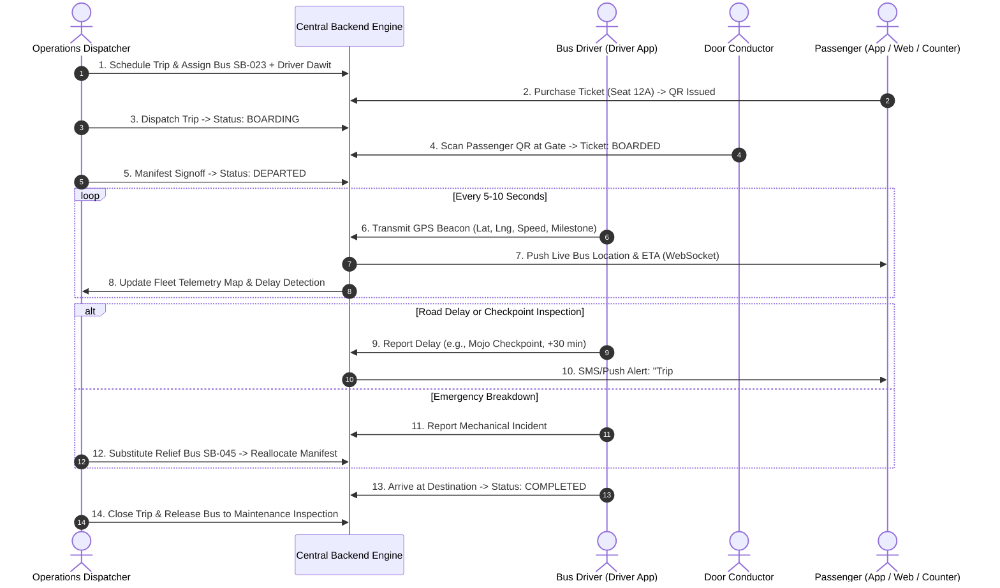

# Ethiopian Intercity Bus Platform — Master Development Roadmap & Operational Blueprint

> **System Core Directive**:
>
> $$\mathbf{TRIP} \longrightarrow \mathbf{SEGMENTS} \longrightarrow \mathbf{SEAT\ INVENTORY} \longrightarrow \mathbf{RESERVATION} \longrightarrow \mathbf{BOOKING} \longrightarrow \mathbf{PAYMENT} \longrightarrow \mathbf{TICKET} \longrightarrow \mathbf{BOARDING}$$
>
> *Every operational subsystem (Dispatch, Driver, GPS, Fleet, Maintenance, Finance) attaches to this core transaction pipeline.*

---

## 1. Master Architecture & Status Matrix

The complete 32-step journey from initial business validation to multi-company SaaS expansion is structured across five sequential operational layers:

```text
┌────────────────────────────────────────────────────────────────────────┐
│                        LAYER 1: FOUNDATION (01 - 08)                   │
│   Validation · Requirements · RBAC · ERD Schema · Docker · API Contract│
│   Status: [ COMPLETED & VERIFIED: 100% ]                               │
├────────────────────────────────────────────────────────────────────────┤
│                     LAYER 2: CORE BOOKING ENGINE (09)                  │
│   Segment Inventory · Concurrency Hold · Server Pricing · Webhooks     │
│   Status: [ COMPLETED & VERIFIED: 100% ]                               │
├────────────────────────────────────────────────────────────────────────┤
│                 LAYER 3: OMNICHANNEL CHANNELS (10 - 12)                │
│   Passenger App (Flutter) · Web Portal · Agent POS · Shift Cash Float  │
│   Status: [ COMPLETED & VERIFIED: 100% ]                               │
├────────────────────────────────────────────────────────────────────────┤
│                 LAYER 4: FIELD OPERATIONS & FLEET (13 - 18)            │
│   Operations Dispatch · Driver App · GPS Tracking · Fleet · Fuel       │
│   Status: [ IN PROGRESS / ACTIVE SPRINT ]                              │
├────────────────────────────────────────────────────────────────────────┤
│                 LAYER 5: ENTERPRISE & EXPANSION (19 - 33)              │
│   Finance Ledger · Executive Dashboard · Support · Pilot · Production  │
│   Status: [ SCHEDULED ]                                                │
└────────────────────────────────────────────────────────────────────────┘
```

---

## 2. Operational Phased Breakdown

### Phase 01–08: Foundation & Systems Architecture (Completed)
- **Business Domain**: Calibrated for Ethiopian intercity transit topology (Addis Ababa, Hawassa, Bahir Dar, Gondar, Dessie, Jimma, Dire Dawa).
- **Relational Schema**: 30+ normalized Prisma models with constraints (`TripSegmentSeat`, `CashShift`, `Ticket`, `Boarding`, `PaymentEvent`, `AuditLog`).
- **Security & RBAC**: 10 distinct operational roles (`SUPER_ADMIN`, `DISPATCHER`, `TICKET_AGENT`, `DRIVER`, `CONDUCTOR`, `FINANCE`, etc.).

### Phase 09: Master Booking Engine (Completed)
- Multi-hop segment seat materialization ($N \times M$).
- Atomic 5-minute reservations preventing double booking under concurrent load.
- Authoritative server-side pricing (`PricingService`) with zero client trust.
- Telebirr & Chapa payment gateway integrations with idempotent webhook retries.

### Phase 10: Passenger Mobile Application (Completed)
- Built with **Flutter + Riverpod 3**, Dio HTTP client, and GoRouter across 14 routed screens.
- Offline QR boarding pass viewer with encrypted security tokens.
- 100% unit and widget test pass rate (`apps/mobile_app/test/booking_flow_test.dart`).

### Phase 11 & 12: Public Web & Agent Terminal System (Completed)
- Next.js counter terminal (`AgentCounterPOS.tsx`) and REST API endpoints.
- Cash drawer float lifecycle: opening float, cash sales, refunds, and blind end-of-shift reconciliation with overage/shortage variance analysis.
- 80mm ESC/POS thermal ticket receipt generation and door gate QR scanning.

---

## 3. The Next Horizon: Operations & Dispatch Center (Phase 13–15)

The platform transitions from a ticketing platform into the bus company's **operational control center**.



---

## 4. Key Subsystem Implementation Specifications

### A. Component 13: Operations & Dispatch Center
* **Control Dashboard**: Single-pane overview of today's scheduled departures, active highway trips, boarding status, delays, and arrivals.
* **Manifest Signoff**: Before departure, the dispatcher locks the manifest, verifying that boarded passenger count matches ticketing records.
* **Incident Management**: Workflow to trigger emergency assistance, rerouting, or bus substitution when mechanical or road obstacles occur.

### B. Component 14: Driver Application
* **Duty Schedule**: Driver authenticates and receives their assigned bus plate, route stops, and departure time.
* **Live Manifest**: View manifest with stop-by-stop passenger dropoffs and emergency contact information.
* **Trip Controls**: One-tap triggers for `START TRIP`, `ARRIVED AT STOP`, `REPORT DELAY`, and `COMPLETE TRIP`.

### C. Component 15: GPS & Live Tracking
* **Beacon Transmission**: Drivers transmit location coordinates, speed, and heading every 5 seconds.
* **Corridor Milestones**: Automated detection of highway progress points (e.g., Kality Gate $\to$ Tulu Dimtu Toll $\to$ Mojo Junction $\to$ Batu $\to$ Hawassa).
* **Speed Monitoring**: Real-time alerts for speeds exceeding 80 km/h on Ethiopian expressways.

### D. Component 16–18: Fleet, Maintenance, & Fuel Control
* **Fleet Roster**: Tracking mileage, insurance renewal dates, periodic technical inspection certificates, and active status (`AVAILABLE`, `ON_TRIP`, `MAINTENANCE`, `GROUNDED`).
* **Work Orders**: Pre-trip and post-trip digital vehicle inspection logs. Mechanic work orders for tires, brake pads, and oil changes.
* **Fuel Logging**: Gallons/liters purchased, fuel station receipts, odometer reading, and fuel economy calculations (km/L).

---

## 5. Master Roadmap Milestone Timeline

| Phase | Milestone Name | Key Target Deliverables | Verification Strategy |
| :---: | :--- | :--- | :--- |
| **01–08** | **Foundation & Architecture** | Relational DB, RBAC, Docker, API structure | Schema migration & `test:phase1` |
| **09** | **Booking Engine** | Multi-hop inventory, hold locks, webhooks | `test:engine` & `test:booking:service` |
| **10** | **Passenger Mobile App** | Flutter + Riverpod 3 client, 14 screens | `test:mobile` (Flutter test suite) |
| **11–12** | **Agent & Terminal System** | Cash float shift, POS thermal receipt, gate QR | `test:agent` |
| **13–15** | **Operations, Driver & GPS** | Dispatch console, driver app, live GPS ping | End-to-end dispatch telemetry test |
| **16–18** | **Fleet & Fuel Management** | Vehicle lifecycle, maintenance tickets, fuel logs | Vehicle maintenance audit suite |
| **19–20** | **Finance & Management** | Branch ledger, refund reconciliation, CEO KPIs | Financial balance verification |
| **21–25** | **Support, Offline, & Integrations** | SMS notifications, offline gate sync, APIs | Offline sync simulation |
| **26–28** | **Pilot Deployment** | 1 company (Abyssinia Bus), 2 branches, 10 buses | Real-world parallel run |
| **29–33** | **Production & Expansion** | Multi-corridor scaling, SLA monitoring | Continuous production telemetry |

---

## 6. Immediate Next Move

Proceed with **Component 13 (Operations & Dispatch Center)** and **Component 14/15 (Driver App & GPS Tracking)**:
1. Wire `OperationsDispatcher.tsx` and `DriverPortal.tsx` to the backend dispatch endpoints (`POST /trips/:id/dispatch`, `POST /trips/:id/assign-crew`, `POST /tracking/ping`, `POST /incidents`).
2. Add end-to-end test suite `test:dispatch` validating driver assignment, trip departure, milestone tracking, and delay broadcasts.
