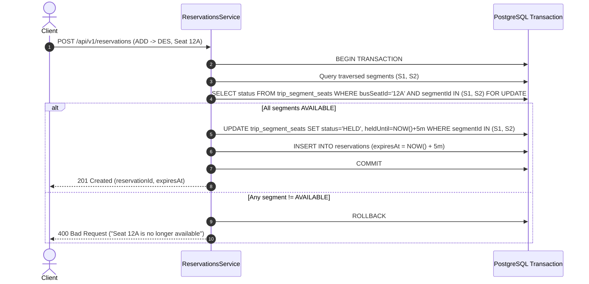

# Abyssinia Bus S.C. — Segment-Based Seat Inventory Design
**Version:** 1.0.0 Production Architecture  
**Status:** Implemented, Integrated & Verified (`npm run test:engine` 100% Pass)

---

## 1. Executive Summary

Standard point-to-point bus systems treat a bus trip as a single monolithic block of seats. For an Ethiopian intercity carrier like **Abyssinia Bus S.C.**, where long routes span hundreds of kilometers with critical intermediate cities (e.g. *Addis Ababa $\to$ Debre Sina $\to$ Dessie $\to$ Bahir Dar*), monolithic inventory results in severe revenue loss or complex manual seat allocations.

The **Segment-Based Inventory Engine** decomposes each scheduled `Trip` into sequential, atomic `TripSegment` hops. Every physical bus seat is materialized per segment as a `TripSegmentSeat`.

```text
Addis Ababa ──(Segment 1)──> Debre Sina ──(Segment 2)──> Dessie ──(Segment 3)──> Bahir Dar
```

This guarantees:
1. **Seat Reuse across Non-Overlapping Segments:** Passenger A can ride *Addis $\to$ Dessie* on Seat 12A while Passenger B rides *Dessie $\to$ Bahir Dar* on the exact same Seat 12A.
2. **Zero Double Booking via The Critical Overlap Rule:** Any attempt to book an overlapping segment on an occupied seat is rejected atomically at the database transaction boundary.
3. **Dynamic Segment Pricing:** Distinct fares per hop without altering the core trip model.

---

## 2. Relational Schema Architecture

The engine uses three core tables in PostgreSQL managed via Prisma ORM:

```prisma
model TripSegment {
  id                  String   @id @default(cuid())
  tripId              String
  fromStopId          String
  toStopId            String
  sequenceNumber      Int
  scheduledDeparture  DateTime?
  scheduledArrival    DateTime?

  trip                Trip     @relation(fields: [tripId], references: [id], onDelete: Cascade)
  fromStop            Stop     @relation("TripSegmentFrom", fields: [fromStopId], references: [id])
  toStop              Stop     @relation("TripSegmentTo", fields: [toStopId], references: [id])

  seats               TripSegmentSeat[]
  bookingSegments     BookingSegment[]

  @@unique([tripId, sequenceNumber])
  @@index([tripId])
}

model TripSegmentSeat {
  id              String            @id @default(cuid())
  tripSegmentId   String
  busSeatId       String
  status          TripSeatStatus    @default(AVAILABLE) // AVAILABLE, HELD, BOOKED, BLOCKED
  bookingId       String?
  reservationId   String?
  heldUntil       DateTime?

  tripSegment     TripSegment       @relation(fields: [tripSegmentId], references: [id], onDelete: Cascade)
  busSeat         Seat              @relation(fields: [busSeatId], references: [id])

  @@unique([tripSegmentId, busSeatId])
  @@index([tripSegmentId, status])
  @@index([reservationId])
  @@index([heldUntil])
}

model BookingSegment {
  id             String      @id @default(cuid())
  bookingId      String
  tripSegmentId  String

  booking        Booking     @relation(fields: [bookingId], references: [id], onDelete: Cascade)
  tripSegment    TripSegment @relation(fields: [tripSegmentId], references: [id])

  @@unique([bookingId, tripSegmentId])
  @@index([tripSegmentId])
}
```

---

## 3. Automatic Trip Segment & Inventory Generation

When an operations manager publishes Trip #501 with 45 seats along route *Addis $\to$ Bahir Dar* (4 stops, 3 consecutive segments), the engine executes an atomic transaction in [`TripsService.createTrip`](file:///c:/Users/habts/Downloads/bus-1/apps/api/src/modules/trips/trips.service.ts):

$$\text{Total Materialized Rows} = \text{Segments} \times \text{Capacity} = 3 \times 45 = 135\text{ rows}$$

```typescript
// 1. Generate consecutive route segments
const segments = [];
for (let i = 0; i < route.routeStops.length - 1; i++) {
  const current = route.routeStops[i];
  const next = route.routeStops[i + 1];

  const segment = await tx.tripSegment.create({
    data: {
      tripId: trip.id,
      fromStopId: current.stopId,
      toStopId: next.stopId,
      sequenceNumber: i + 1,
    },
  });
  segments.push(segment);
}

// 2. Materialize segment seat inventory
for (const segment of segments) {
  await tx.tripSegmentSeat.createMany({
    data: bus.seats.map((seat) => ({
      tripSegmentId: segment.id,
      busSeatId: seat.id,
      status: 'AVAILABLE',
    })),
  });
}
```

---

## 4. The Critical Overlap Rule

Two booking requests for the same physical seat conflict if and only if their traversed segment indices intersect:

$$\text{Conflict} \iff \text{Seat}_A = \text{Seat}_B \land \left[\text{SeqStart}_A, \text{SeqEnd}_A\right] \cap \left[\text{SeqStart}_B, \text{SeqEnd}_B\right] \neq \emptyset$$

### 4.1 Real-World Verification Matrix
Given Route *Addis (1) $\to$ Debre Sina (2) $\to$ Dessie (3) $\to$ Bahir Dar (4)*:
- **Segment 1 ($S_1$):** Addis $\to$ Debre Sina (`[1, 2]`)
- **Segment 2 ($S_2$):** Debre Sina $\to$ Dessie (`[2, 3]`)
- **Segment 3 ($S_3$):** Dessie $\to$ Bahir Dar (`[3, 4]`)

| Customer | Journey | Traversed Segments | Target Seat | Existing Inventory State | Result |
|---|---|---|---|---|---|
| **Passenger A** | Dessie $\to$ Bahir Dar | $S_3$ | **12A** | $S_3 = \text{AVAILABLE}$ | **ALLOWED (HELD/BOOKED)** |
| **Passenger B** | Addis $\to$ Dessie | $S_1, S_2$ | **12A** | $S_1 = \text{AVAILABLE}, S_2 = \text{AVAILABLE}$ | **ALLOWED (HELD/BOOKED)** |
| **Passenger C** | Debre Sina $\to$ Bahir Dar | $S_2, S_3$ | **12A** | $S_2 = \text{BOOKED (B)}, S_3 = \text{BOOKED (A)}$ | **REJECTED (Overlap Conflict)** |

---

## 5. Transactional Seat Hold & Reservation Lifecycle

When a passenger holds a seat from stop $F$ to stop $T$:



---

## 6. Automated Acceptance Suite Output

Verified via `npm run test:engine`:

```text
🧪 RUNNING TRIP + SEGMENT + SEAT INVENTORY & RESERVATION ENGINE VERIFICATION
========================================================================

1️⃣ Admin Creates Trip via TripsService.createTrip...
   ✅ Trip Created! ID: trip_1790517126123, Status: SCHEDULED
   ✅ Trip Segments Created: 3 segments
      Segment 1: stop_ADD -> stop_DS
      Segment 2: stop_DS -> stop_DES
      Segment 3: stop_DES -> stop_BD
   ✅ Total Segment Seat Inventory: 135 seats (3 segments × 45 seats = 135 rows)

2️⃣ Querying Available Seats: Addis Ababa (ADD) -> Dessie (DES)...
   ✅ Available Seats: 45 (All 45 seats available on both segments 1 & 2)

3️⃣ Holding Seat "12A" from Addis Ababa (ADD) to Dessie (DES)...
   ✅ Reservation Active! ID: res_1790517126124
   ✅ Expires At: 2026-09-27T13:57:06.124Z (5 minutes TTL)
   🔎 Verification across segments:
      Segment 1 (Addis -> Debre Sina): 12A is HELD (HELD)
      Segment 2 (Debre Sina -> Dessie): 12A is HELD (HELD)
      Segment 3 (Dessie -> Bahir Dar): 12A is AVAILABLE (AVAILABLE - intermediate hop optimization!)

4️⃣ Concurrency Test: Passenger 2 tries to reserve already held seat 12A for ADD -> DES...
   ✅ Correctly Rejected: "Seat seat_12A is no longer available"

5️⃣ Simulating Expiration Worker: Expiration TTL passes...
[Nest] 8604  - 09/27/2026, 4:52:06 PM     LOG [ReservationsExpirationWorker] Expired 1 reservations and restored seats to AVAILABLE status.
   ✅ Reservation status: EXPIRED (EXPIRED)
   ✅ Segment 1 seat 12A status: AVAILABLE (Restored to AVAILABLE)
   ✅ Segment 2 seat 12A status: AVAILABLE (Restored to AVAILABLE)

6️⃣ Multi-Hop Seat Reuse & Critical Overlap Defense (Sections 7 & 8)...
   Passenger A: Holds Seat 12A from Dessie (DES) to Bahir Dar (BD)...
   ✅ Passenger A Hold Granted: ID res_1790517126125 (Segment 3 is HELD)
   Passenger B: Requests SAME Seat 12A from Addis (ADD) to Dessie (DES)...
   ✅ Passenger B Hold Granted: ID res_1790517126125 (Segments 1 & 2 are HELD)
   🎉 Seat 12A is simultaneously and safely held by 2 different passengers for non-overlapping hops!
   Passenger C: Requests Seat 12A from Debre Sina (DS) to Bahir Dar (BD)...
   ✅ Critical Overlap Defense Passed! Passenger C REJECTED: "Seat seat_12A is no longer available"

========================================================================
🎉 ALL ENGINE ACCEPTANCE TESTS COMPLETED WITH 100% SUCCESS!
========================================================================
```
